# CAPÍTULO 8 - Relatórios
{: .no_toc }

O acompanhamento das ações de saúde que são realizadas no território é uma tarefa extremamente importante do cotidiano das equipes de Atenção Primária à Saúde. Esta atividade, além de auxiliar os trabalhadores a enxergar seu território, exprime o resultado do seu esforço, podendo ser potente ferramenta de reflexão e transformação do seu processo de trabalho.

## Sumário
{: .no_toc .text-delta }

- TOC
{:toc}

O módulo "Relatórios" permite que trabalhadores e gestores possam visualizar, de forma sintetizada e sistematizada, as ações de saúde realizadas no território. São vários tipos de relatórios, divididos em consolidados, produção e operacionais, e são utilizados por diferentes tipos de atores.

Nesta versão os relatórios são exibidos na barra lateral de navegação, oferecendo um caminho mais simples e rápido para cada relatório (Figura 8.1). Clicando na opção "Relatórios" o sistema apresenta a lista com todos os disponíveis, dependendo do tipo de acesso que o profissional ou gestor tenha. Caso haja dúvida em relação ao relatório, é possível acionar um balão de ajuda representado pelo símbolo  no canto superior direito de cada tela dos relatórios.

Figura 8.1 - Tela do Relatórios exibida com o perfil de profissional da equipe de AB
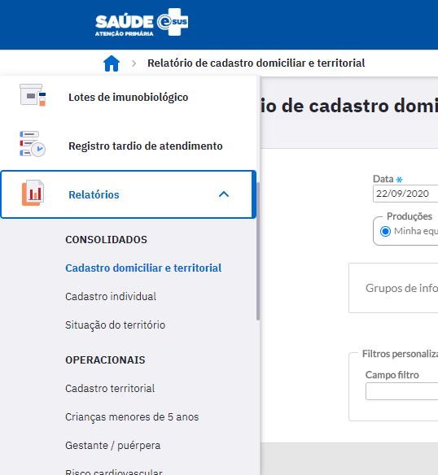
Fonte: SAPS/MS.

# 8.1 Administração dos relatórios

As opções de administração e configuração estão disponíveis APENAS para os perfis de administração da instalação. Para evitar o processamento desnecessário dos relatórios apenas o administrador da instalação, devidamente instruído, poderá utilizá- la.

## 8.1.1 Processamento

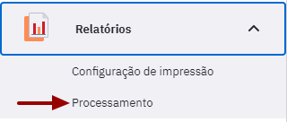

O processamento dos relatórios é um processo diário e incremental iniciado a meia- noite (0h) do próximo dia, a partir dos itens registrados ou enviados por meio do sistema. Este processo é ativado sempre que o usuário clica em Gerar/Transmitir os dados para envio ao SISAB, ver Seção 3.6.3.2.

Nesta funcionalidade, conforme podemos ver na Figura 8.2, é possível Marcar para reprocessamento  ou forçar o processamento  dos dados dos relatórios do sistema. A primeira funcionalidade permite que os dados dos relatórios, mesmo os dados que já foram processados, sejam reprocessados junto ao fluxo automático do sistema. A segunda funcionalidade força o processamento a ser executado de imediato.

>  **ATENÇÃO**: a funcionalidade de "Forçar o processamento" pode ser um tanto dispendioso para a performance do PEC, a depender do tamanho da base de dados, podendo gerar lentidão para os outros usuários. Portanto, sempre que possível utilize a opção "Marcar para reprocessamento".

Figura 8.2 - Tela Processamento de Relatórios exibida somente com o perfil de administrador

Fonte: SAPS/MS.

## 8.1.2 Configuração da Impressão

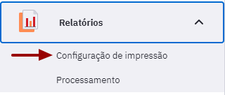

Para evitar que consultas muito grandes criem uma carga exagerada no servidor da aplicação, por meio desta funcionalidade é possível configurar o fator que determinará quantos grupos de informações podem ser selecionados ao mesmo tempo, e ainda o período máximo, em meses, que poderá ser definido como intervalo para filtrar em cada relatório.  

Figura 8.3 - Tela de Configuração de Impressão exibida somente com o perfil de administrador

Fonte: SAPS/MS.

>  **DICA**: o fator de carga no sistema, em relação à geração de um relatório, está relacionado com a capacidade de processamento do computador que está sendo utilizado, bem como com a quantidade de registros dentro do sistema/instalação. Caso a geração de relatórios prejudique o desempenho do sistema, opte por uma configuração com fatores menores.

Após finalizar a configuração clique em Salvar  para ativar a nova configuração.

# 8.2 Nível de Agregação das Informações

O Sistema e-SUS APS, como sistema de gerenciamento de dados e informações da Atenção Básica, traz grande avanço no que diz respeito à segurança, sigilo e confidencialidade dos dados de saúde dos cidadãos. Isso quer dizer que apenas os profissionais que participam do atendimento ao cidadão têm acesso aos seus dados de saúde.

Atualmente, os relatórios do e-SUS APS disponibilizam informações agregadas, por meio dos relatórios consolidados e de produção, além dos relatórios operacionais, com informações individualizadas (Figura 8.1). A seguir uma breve explicação sobre os agrupamentos dos relatórios no sistema:

- **Relatórios consolidados**: são os relatórios que permitem uma visualização da situação cadastral consolidada, de acordo com a data selecionada, permitindo ao usuário ver a informação mais atual até aquele momento. Ver seção 8.3 para mais detalhes sobre os relatórios.

- **Relatórios de produção**: são os relatórios que permitem uma visualização agregada das informações, tais como: o atendimento individual, odontológico, domiciliar (SAD), atividade coletiva, procedimentos, entre outros, bem como relatórios de resumo de produção. Ver seção 8.4 para mais detalhes sobre os relatórios.

- **Relatórios operacionais:** são os relatórios que apresentam as informações individualizadas e identificadas da situação de saúde dos cidadãos do território. Estes relatórios são acessados apenas pelos trabalhadores das Unidades Básicas de Saúde, pois trazem dados relacionados ao cuidado individual do cidadão. Esta medida serve para proteger a individualidade e o direito à privacidade dos usuários do SUS, da mesma forma que é preservado o sigilo durante a relação trabalhador da saúde e usuário do serviço. Ver seção 8.5 para mais informações os relatórios disponíveis.

## 8.2.1 Perfis de acesso e Filtros disponíveis

Para a geração dos relatórios estão disponíveis diversos tipos de filtros de acordo com o tipo de perfil utilizado pelo usuário, obedecendo o seu papel na estrutura da saúde no município. Os relatórios consolidados e de produção possuem estrutura de filtros iguais como descrito a seguir.

O gestor municipal, seja ele o próprio secretário, coordenador da Atenção Básica ou outros profissionais que fazem parte da equipe de gestão, terá opções de visualização no âmbito de todo o município. Desta forma, é possível utilizar filtros para a totalização dos dados nos relatórios em relação ao "Período", "Unidade saúde", "Equipe", "Profissional" e "Categoria Profissional", como mostra a Figura 8.4.

Figura 8.4 - Tipos de filtro de gestor municipal

Fonte: SAPS/MS.

>  **NOTA**: as opções "Profissional" e "Categoria profissional" [não podem] ser utilizadas em conjunto. É possível filtrar as informações do relatório por profissional **[ou]** por uma categoria profissional.

O perfil de coordenador da UBS terá acesso apenas a dados do serviço de saúde sob sua gestão. É possível utilizar filtros para a totalização dos dados nos relatórios de acordo com as vinculações de unidade de saúde e equipe de saúde registradas no CNES. Estão disponíveis os filtros "Período", "Equipe", "Profissional" e "Categoria Profissional", como mostra a Figura 8.5.

Figura 8.5 - Tipos de filtro de coordenador de UBS

Fonte: SAPS/MS.

Já os trabalhadores de saúde têm acesso aos relatórios, porém apenas aos dados produzidos por sua equipe. É possível utilizar, para a totalização dos dados nos relatórios, os filtros "Período", "Minha equipe" ou apenas "Minhas produções", como mostra a Figura 8.6.

Figura 8.6 - Tipos de filtro de trabalhador de saúde

Fonte: SAPS/MS.

Outra novidade para os filtros disponíveis é possibilidade de extrair relatórios analíticos  e da série histórica  nos relatórios de produção. Já nos relatórios consolidados, além da série histórica é possível extrair o mensal  no relatório de situação do território, que será abordado mais adiante. A estrutura dos filtros segue o mesmo padrão dos descritos anteriormente, com a diferença que nos relatórios da série histórica, o período pode ser escolhido entre os últimos 3 meses, últimos 6 meses, últimos 12 meses ou simplesmente selecionar o período que deseja extrair os relatórios.

## 8.2.2 Grupo de Informações Disponíveis para Impressão

Os relatórios consolidados e de produção, tem um modelo padronizado para ativar ou desativar os grupos de informações a serem disponibilizados no impresso do relatório. Conforme vemos na Figura 8.7, usando como exemplo o relatório de Atividades Coletivas, podemos fazê- lo por meio da seleção do checkbox correspondente ao grupo de informações do relatório.

Figura 8.7 - Tipo de seleção dos grupos de informação

Fonte: SAPS/MS.

Para configurar o impresso do relatório realize os passos a seguir:

1.Abra a opção de seleção dos grupos de informação clicando no botão de dropdown .

2.Marque ou desmarque o checkbox, conforme a necessidade. Caso o checkbox esteja marcado , o grupo será mostrado no impresso, caso contrário , o grupo não será mostrado.

Todos os grupos de informações vem ativados por padrão nos relatórios. Utilize as opções Selecionar Todos  e Limpar , para marcar todos os grupos de informação ou desmarcar todos os grupos, respectivamente.

## 8.2.3 Filtros personalizados

As opções de filtros personalizados possibilitam ao usuário filtrar as informações do relatório. Para usar filtros personalizados realize os passos a seguir:

Passo 1. Em "Filtros personalizados" selecione na opção "Campo filtro" a informação que deseja obter e clique em adicionar .

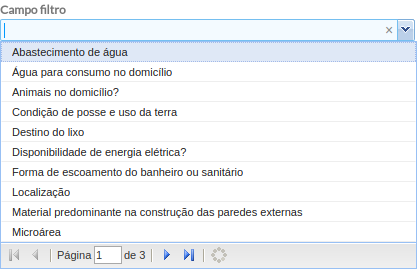

Passo 2. Ao selecionar um dos itens do "Campo filtro", serão apresentadas outras opções de filtro.

Passo 3. Selecione o(s) iten(s) desejado(s), clicando marcando cada checkbox do item que irá filtrar o relatório. No caso em destaque, selecione para "Destino do lixo" o item "Céu aberto" , por exemplo, para filtrar os cadastros onde os domicílios tem lixo a céu aberto.

Passo 4. Para filtrar outros itens para compor um mesmo relatório, basta seguir os passos anteriores.

- Caso queira remover um filtro, basta excluir o item do campo "filtro personalizado", usando o botão "Excluir" .

# 8.3 Relatórios Consolidados

Figura 8.8 - Tela do Relatórios consolidados exibida com o perfil de profissional da equipe de AB

Fonte: SAPS/MS.

Os relatórios consolidados trazem o estado atual do registro para um determinado conjunto de informações. Estes seguem o modelo padrão de estruturação dos relatórios, porém o usuário ao invés de selecionar um período, selecionará a data limite para consolidação dos dados.

Figura 8.9 - Tela do Relatório Consolidado de Cadastro Individual
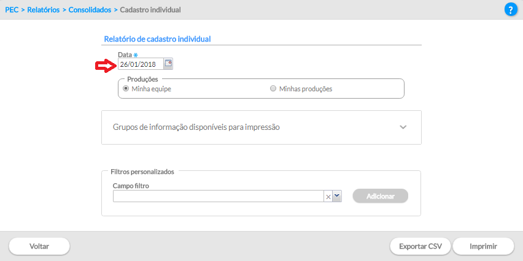
Fonte: SAPS/MS.

## 8.3.1 Relatório consolidado de Cadastro domiciliar e territorial

Este relatório reflete o consolidado do estado atual do cadastro domiciliar e territorial, contém as informações registradas por meio das fichas de Cadastro domiciliar e territorial, bem como do Aplicativo do e-SUS APS Território, quando este estiver sendo utilizado.

Figura 8.10 - Tela do Relatório de cadastro domiciliar e territorial exibida com o perfil de profissional de saúde
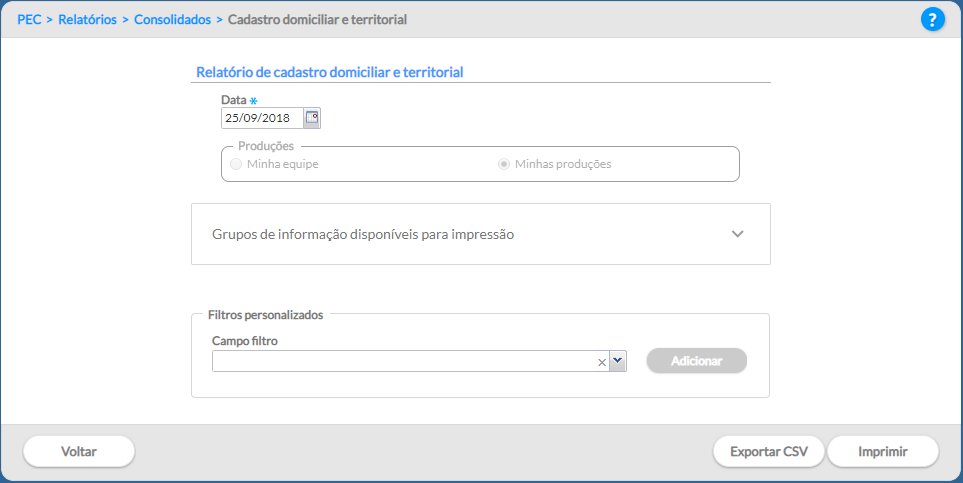
Fonte: SAPS/MS.

Para gerar o relatório de cadastro domiciliar e territorial primeiro o usuário do sistema deve escolher a data limite para a consolidação dos dados no campo "Data" .

Os relatórios poderão ser gerados a partir dos "grupos de informações disponíveis para impressão" ou pela opção "filtros personalizados". as variáveis do grupo de informação são:

- Tipo de imóvel

- Condições de moradia

- Situação de moradia / Posse da terra

- Localização

- Tipo de domicílio

- Condição de posse e uso da terra

- Tipo de acesso ao domicílio

- Material predominante na construção das paredes externas

- Disponibilidade de energia elétrica

- Abastecimento de água

- Água para consumo no domicílio

- Forma de escoamento do banheiro ou sanitário

- Destino do lixo

- Animais no domicílio

- Famílias - Renda familiar

No filtro personalizado são apresentados as variáveis consolidadas que informam os dados sobre o abastecimento de água, água para consumo no domicílio, animais no domicílio, condição de posse e uso da terra, destino do lixo, disponibilidade de energia elétrica, forma de escoamento do banheiro ou sanitário, localização, material predominante na construção das paredes externas, microárea, qual animal no domicílio, recusa de cadastro, renda familiar (salário mínimo), situação de moradia, tipo de acesso ao domicílio, tipo de domicílio e tipo de imóvel.

Após selecionar as variáveis desejadas para gerar o relatório basta clicar no botão "Exportar CSV" ou "Imprimir".

As variáveis apresentadas possibilitam a realização de uma análise inicial da situação de saúde do território de atuação das equipes de Atenção Básica, com a finalidade de construção de estratégia de enfrentamento das condicionalidades e dos determinantes sociais que afetam a qualidade da saúde da população assistida.

>  NOTA: Para mais informações sobre as variáveis e as opções de filtro, consulte o Manual de Preenchimento das Fichas do CDS sobre a Ficha de Cadastro Domiciliar e Territorial.

## 8.3.2 Relatório consolidado de Cadastro Individual

Este relatório reflete o consolidado do estado atual do cadastro individual, contém as informações registradas por meio da ficha de Cadastro Individual, bem como do Aplicativo do e-SUS APS Território, quando este estiver sendo utilizado.

Figura 8.11 - Tela do Relatório de cadastro individual exibida com o perfil de profissional da equipe de AB

Fonte: SAPS/MS.

Para gerar o relatório de cadastro individual primeiro o usuário do sistema deve escolher a data limite para a consolidação dos dados no campo "Data" .

Os relatórios poderão ser gerados a partir dos "grupos de informações disponíveis para impressão" ou pela opção "filtros personalizados". As variáveis do grupo de informação são :

- Dados gerais

- Identificação do usuário / cidadão

- Faixa etária

- Sexo

- Raça / Cor

- Etnia

- Nacionalidade

- Informações sociodemográficas

- Relação de parentesco com o responsável familiar

- Ocupação

- Qual é o curso mais elevado que frequenta ou frequentou

- Situação no mercado de trabalho

- Crianças de 0 a 9 anos, com quem fica

- Orientação sexual

- Identidade de gênero

- Deficiência

- Outras informações sociodemográficas

- Tipo de saída do cidadão do cadastro

- Condições / Situações de saúde gerais

- Sobre seu peso, você se considera

- Doença respiratória

- Doença cardíaca

- Problemas nos rins

- Cidadão em situação de rua

- Tempo em situação de rua

- Quantas vezes se alimenta ao dia

- Qual a origem da alimentação

- Tem acesso à higiene pessoal

No filtro personalizado são apresentados outras variáveis consolidadas que informam os dados sobre o cidadão que estão presentes na ficha de cadastro individual.

Após selecionar as variáveis desejadas para gerar o relatório basta clicar no botão "Exportar CSV" ou "Imprimir".

As variáveis apresentadas podem complementar a análise da situação de saúde do território de atuação das equipes de Atenção Básica, com a finalidade de construção de estratégia de enfrentamento das condicionalidades e dos determinantes de saúde que afetam a qualidade de vida da população assistida. A variável "Dados Gerais" apresentará a quantidade de "cidadãos ativos" e "saída de cidadão do cadastro". O primeiro refere- se ao cidadãos que permanecem vinculados ao território e o segundo aos cidadãos que foram cadastrados, mas que não estão mais vinculados ao território.

>  NOTA: Para mais informações sobre as variáveis e as opções de filtro, consulte o Manual de Preenchimento das Fichas do CDS sobre a Ficha de Cadastro Individual.

## 8.3.3 Relatório da Situação do Território

O relatório consolidado da situação do território apresenta informações gerais sobre a área de atuação das equipes de saúde, reunindo dados sobre o cadastro do cidadão, condições gerais do domicílio, situação sociodemográfica e pessoas em situação de rua, sendo um conjunto de informação necessária para o planejamento das ações de saúde do território.

Neste relatório é possível avaliar a situação do território para uma competência específica ou avaliar a evolução dos dados do território para um período escolhido. Para isso, escolha entre os tipos de relatório  ou de , conforme as figuras a seguir, respectivamente:

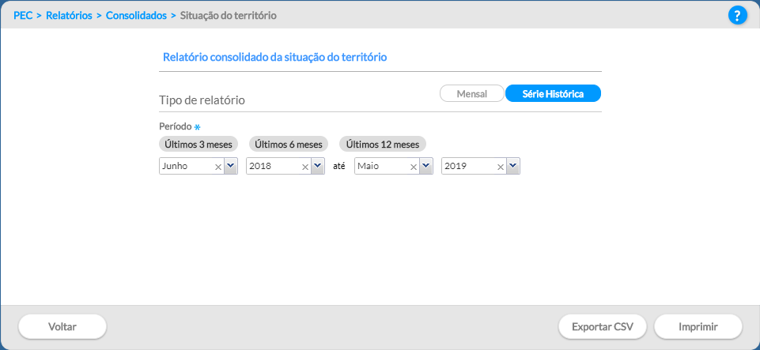

# 8.4 Relatórios de Produção

Os relatórios de produção trazem os dados (eventos) agregados em um determinado período, orientados pelo bloco de informação dentro do sistema. Os blocos de informações são organizados de forma similar ao formato de envio dos registros ao SISAB. Atualmente os blocos disponíveis são:

- Atendimento domiciliar

- Atendimento individual

- Atendimento odontológico individual

- Atividade coletiva

- Avaliação de elegibilidade e admissão

- Marcadores de consumo alimentar

- Procedimentos

- Procedimentos consolidados

- Resumo de produção

- Síndrome neurológica por Zika / Microcefalia

- Visita domiciliar e territorial

- Vacinação

Figura 8.12 - Tela de Relatório de produção exibida com o perfil de profissional da equipe de AB

Fonte: SAPS/MS.

Os relatórios de produção apresentam novidades para os filtros disponíveis, sendo possível extrair relatórios analíticos  e da série histórica .

Nas seções seguintes são detalhados cada bloco de informação.

## 8.4.1 Atendimento domiciliar

Este relatório contabiliza os dados referentes aos atendimentos domiciliares dentro do período determinado, tendo como fonte de informação as Fichas de Atendimento Domiciliar ou do Aplicativo e-SUS AD, que são de uso exclusivo do Serviço de Atenção Domiciliar (SAD).

Figura 8.13 - Tela do Relatório de atendimento domiciliar exibida com o perfil de profissional da equipe de AB
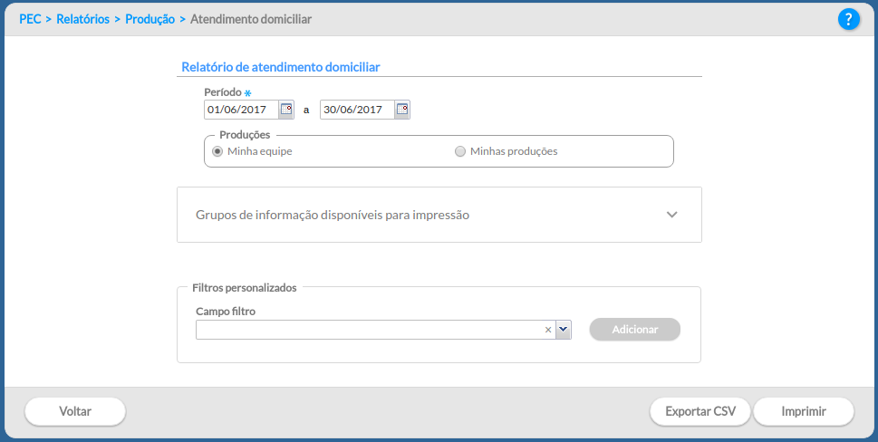
Fonte: SAPS/MS.

Para gerar o relatório de atendimento domiciliar primeiro o usuário do sistema deve escolher o período que gostaria de consultar.

Os relatórios poderão ser gerados a partir dos "grupos de informações disponíveis para impressão" ou pela opção "filtros personalizados". As variáveis do grupo de informação são :

- Resumo de produção

- Turno

- Sexo

- Faixa etária

- Local de atendimento

- Modalidade AD

- Tipo de atendimento

- Condições avaliadas

- Condições avaliadas (CID10)

- Condições avaliadas (CIAP2)

- Conduta / Desfecho

- Procedimentos

- Outros procedimentos (SIGTAP)

No filtro personalizado são apresentados outras variáveis consolidadas que informam os dados sobre o atendimento domiciliar e que estão presentes na ficha de atendimento domiciliar.

Após selecionar as variáveis desejadas para gerar o relatório basta clicar no botão "Exportar CSV" ou "Imprimir".

> {width="0.3906255468066492in" height="0.33203083989501314in"} NOTA: Para mais informações sobre as variáveis e as opções de filtro, consulte o Manual de Preenchimento das Fichas do **CDS** sobre a **Ficha de Atendimento Domiciliar**.

## 8.4.2 Atendimento individual

Este relatório contabiliza os dados referentes aos atendimentos individuais dentro do período determinado, tendo como fonte de informação às Ficha de atendimento individual e os Atendimentos realizados no PEC.

Figura 8.14 - Tela do Relatório de cadastro individual exibida com o perfil de profissional da equipe de AB

Fonte: SAPS/MS.

Para gerar o relatório de atendimento individual primeiro o usuário do sistema deve escolher o período que gostaria de consultar.

Os relatórios poderão ser gerados a partir dos "grupos de informações disponíveis para impressão" ou pela opção "filtros personalizados". As variáveis do grupo de informação são:

- Resumo de produção

- Dados gerais

- Turno

- Sexo

- Faixa etária

- Local de atendimento

- Tipo de atendimento

- Atenção domiciliar

- Racionalidade em saúde

- Criança - Aleitamento materno

- NASF / Polo

- Conduta / Desfecho

- Encaminhamento

- Problemas / Condições avaliadas

- Problemas / Condições avaliadas - Doenças transmissíveis

- Problemas / Condições avaliadas - Rastreamento

- Problemas / Condições avaliadas - Outros CIAP2

- Problemas / Condições avaliadas - Outros CID10

- Exames solicitados e avaliados

- Exames - Triagem neonatal

- Outros exames solicitados e avaliados (código do SIGTAP)

No filtro personalizado são apresentados outras variáveis consolidadas que informam os dados sobre o atendimento e que estão presentes na ficha de atendimento individual.

Após selecionar as variáveis desejadas para gerar o relatório basta clicar no botão "Exportar CSV" ou "Imprimir".

>  NOTA: Para mais informações sobre as variáveis e as opções de filtro, consulte o Manual de Preenchimento das Fichas do **CDS** sobre a **Ficha de Atendimento Individual**.

## 8.4.3 Atendimento odontológico individual

Este relatório contabiliza os dados referentes aos atendimentos odontológicos individuais dentro do período determinado, tendo como fonte de informação as Fichas de atendimento odontológico individual e os Atendimentos odontológicos realizados no PEC.

Figura 8.15 - Tela do Relatório de cadastro individual exibida com o perfil de profissional da equipe de AB

Fonte: SAPS/MS.

Para gerar o relatório de atendimento odontológico primeiro o usuário do sistema deve escolher o período que gostaria de consultar.

Os relatórios poderão ser gerados a partir dos "grupos de informações disponíveis para impressão" ou pela opção "filtros personalizados". As variáveis do grupo de informação são:

- Resumo de produção

- Dados gerais

- Turno

- Sexo

- Faixa etária

- Local de atendimento

- Tipo de atendimento

- Tipo de consulta

- Vigilância em saúde bucal

- Procedimentos

- Outros procedimentos (SIGTAP)

- Fornecimento

- Conduta / Desfecho

- Encaminhamento

- Problema/ Condições avaliadas

- Condições avaliadas (CID10)

- Condições avaliadas (CIAP2)

No filtro personalizado são apresentados outras variáveis consolidadas que informam os dados sobre o atendimento e que estão presentes na ficha de atendimento odontológico.

Após selecionar as variáveis desejadas para gerar o relatório basta clicar no botão "Exportar CSV" ou "Imprimir".

>  NOTA: Para mais informações sobre as variáveis e as opções de filtro, consulte o Manual de Preenchimento das Fichas do **CDS** sobre a **Ficha de Atendimento Individual Odontológico**.

## 8.4.4 Atividade coletiva

Este relatório contabiliza os dados referentes às atividades coletivas dentro do período determinado, tendo como fonte de informação os registros das Fichas de atividade coletiva.

Figura 8.16 - Tela do Relatório de atividade coletiva exibida com o perfil de profissional da equipe de AB

Fonte: SAPS/MS.

Para gerar o relatório de atividades coletivas primeiro o usuário do sistema deve escolher o período que gostaria de consultar.

Os relatórios poderão ser gerados a partir dos "grupos de informações disponíveis para impressão" ou pela opção "filtros personalizados". As variáveis do grupo de informação são:

- Resumo de produção

- Número de participantes

- Turno

- Programa Saúde na Escola

- Atividade

- Público alvo

- Temas para saúde

- Práticas em saúde

- Outros procedimentos coletivos

- Temas para reunião

O número de participantes nas atividades coletivas está disponível neste relatório. Os Participantes identificados, correspondem aos participantes que tiveram seu número de CNS registrado, já o Total de participantes corresponde ao número de participante informados. Ainda é possível utilizar os filtros personalizados para refinar o relatório.

No filtro personalizado são apresentados outras variáveis consolidadas que informam os dados sobre a atividade e que estão presentes na ficha de atividade coletiva.

Após selecionar as variáveis desejadas para gerar o relatório basta clicar no botão "Exportar CSV" ou "Imprimir".

>  NOTA: Para mais informações sobre as variáveis e as opções de filtro, consulte o Manual de Preenchimento das Fichas do **CDS** sobre a **Ficha de Atividade Coletiva**.

## 8.4.5 Avaliação de elegibilidade e admissão

Este relatório contabiliza os dados referentes às avaliações de elegibilidade e admissão dentro do período determinado, tendo como fonte de informação as Fichas de avaliação de elegibilidade e admissão, bem como os registros de avaliação de elegibilidade do Aplicativo e-SUS AD. Estes instrumentos são de uso exclusivo do SAD.

Figura 8.17 - Tela do Relatório de atividade coletiva exibida com o perfil de profissional da equipe de AB

Fonte: SAPS/MS.

Para gerar o relatório de avaliação de elegibilidade e admissão primeiro o usuário do sistema deve escolher o período que gostaria de consultar.

Os relatórios poderão ser gerados a partir dos "grupos de informações disponíveis para impressão" ou pela opção "filtros personalizados". As variáveis do grupo de informação são:

- Resumo de produção

- Turno

- Dados gerais

- Etnia

- Sexo

- Raça / Cor

- Nacionalidade

- Faixa etária

- Procedência

- Condições avaliadas

- CID- 10

- Conclusão / Destino

- Destino elegibilidade

- Motivo inelegibilidade

- Cuidador

No filtro personalizado são apresentados outras variáveis consolidadas que informam os dados sobre esta avaliação e que estão contidas na ficha de avaliação de exigibilidade e admissão.

Após selecionar as variáveis desejadas para gerar o relatório basta clicar no botão "Exportar CSV" ou "Imprimir".

>  NOTA: Para mais informações sobre as variáveis e as opções de filtro, consulte o Manual de Preenchimento das Fichas do **CDS** sobre a **Ficha de Avaliação de Elegibilidade e Admissão** do SAD.

## 8.4.6 Marcadores de consumo alimentar

Este relatório contabiliza os dados referentes aos marcadores de consumo alimentar dentro do período determinado, tendo como fonte as fichas de Marcadores de consumo alimentar.

Figura 8.18 - Tela do Relatório de marcadores de consumo alimentar exibida com o perfil de profissional da equipe de AB

Fonte: SAPS/MS.

Para gerar o relatório de marcadores de consumo alimentar primeiro o usuário do sistema deve escolher o período que gostaria de consultar.

Os relatórios poderão ser gerados a partir dos "grupos de informações disponíveis para impressão" ou pela opção "filtros personalizados". As variáveis do grupo de informação são:

- Resumo de produção

- Faixa etária

- Sexo

- Local de atendimento

- Crianças menores de 6 meses

- Crianças de 6 a 23 meses

No filtro personalizado são apresentados outras variáveis consolidadas que informam os dados sobre estes marcadores e que estão contidas na ficha de marcadores de consumo alimentar.

Após selecionar as variáveis desejadas para gerar o relatório basta clicar no botão "Exportar CSV" ou "Imprimir".

>  NOTA: Para mais informações sobre as variáveis e as opções de filtro, consulte o Manual de Preenchimento das Fichas do **CDS** sobre a ficha **Marcadores de Consumo Alimentar**.

## 8.4.7 Procedimentos

Este relatório contabiliza os dados referentes aos procedimentos dentro do período determinado, tendo como fonte as Fichas de procedimentos ou os registros de procedimentos no PEC.

Figura 8.19 - Tela de Relatório de procedimentos exibida com o perfil de profissional da equipe de AB

Fonte: SAPS/MS.

Para gerar o relatório procedimentos primeiro o usuário do sistema deve escolher o período que gostaria de consultar.

Os relatórios poderão ser gerados a partir dos "grupos de informações disponíveis para impressão" ou pela opção "filtros personalizados". As variáveis do grupo de informação são:

Os grupos de informações disponíveis para impressão e as opções de campos para filtros personalizados são:

- Resumo de produção

- Turno

- Faixa etária

- Sexo

- Local de atendimento

- Dados gerais

- Procedimentos / Pequenas cirurgias

- Teste rápido

- Administração de medicamentos

- Outros procedimentos (SIGTAP)

No filtro personalizado são apresentados outras variáveis consolidadas que informam os dados sobre os procedimentos e que estão contidas na ficha de procedimentos.

Após selecionar as variáveis desejadas para gerar o relatório basta clicar no botão "Exportar CSV" ou "Imprimir".

>  NOTA: Para mais informações sobre as variáveis e as opções de filtro, consulte o Manual de Preenchimento das Fichas do **CDS** sobre a **Ficha de Procedimentos**.

## 8.4.8 Procedimentos consolidados

Este relatório contabiliza os dados referentes aos procedimentos consolidados dentro do período determinado, tendo como fonte as Fichas de procedimentos e os registros de procedimentos no PEC.

Figura 8.20 - Tela de Relatório de procedimentos consolidados exibida com o perfil de profissional da equipe de AB

Fonte: SAPS/MS.

Para gerar o relatório procedimentos consolidados primeiro o usuário do sistema deve escolher o período que gostaria de consultar.

Os relatórios poderão ser gerados a partir dos "grupos de informações disponíveis para impressão" ou pela opção "filtros personalizados".

O filtro personalizado apresenta todas as variáveis que aparecem no relatório de procedimentos consolidados e que podem ser gerados de forma isoladas, tais como os totais de aferição de PA, temperatura, coleta de material para exame laboratorial, curativo simples, glicemia capilar, medição de altura e medição de peso.

Após selecionar as variáveis desejadas para gerar o relatório basta clicar no botão "Exportar CSV" ou "Imprimir".

>  NOTA: Para mais informações sobre as variáveis e as opções de filtro, consulte o Manual de Preenchimento das Fichas do **CDS** sobre a **Ficha de Procedimento**, especialmente sobre o bloco de procedimentos consolidados.

## 8.4.9 Resumo de produção

Este relatório contabiliza a produção de todos os registros realizados por tipo de ficha.

Figura 8.21 - Tela de Resumo de produção exibida com perfil de profissional da equipe de AB

Fonte: SAPS/MS.

Para gerar o relatório de resumo de produção primeiro o usuário do sistema deve escolher o período que gostaria de consultar.

Após a escolha do período basta clicar em "Exportar CSV" ou "Imprimir" para gerar o relatório de resumo de produção.

Figura 8.22 - Exemplo do Relatório de Resumo de Produção
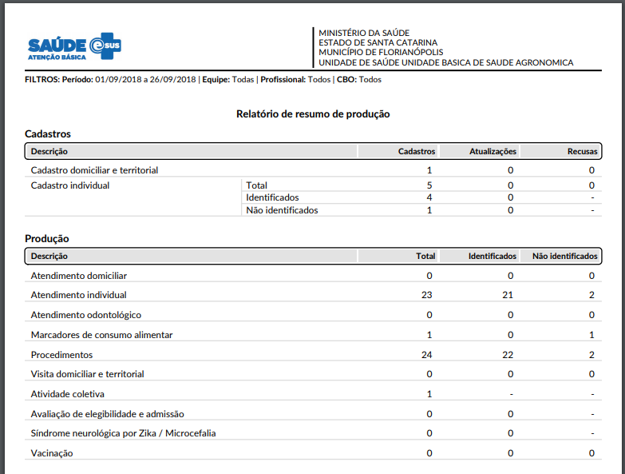
Fonte: SAPS/MS.

Os registros nas fichas onde é informado o CNS do cidadão são apresentados como \"Identificados\", já os registros sem CNS são os \"Não identificados\". Ou seja, por meio desse relatório pode- se monitorar o percentual de ações que ficam vinculadas ao prontuário do cidadão e aquelas que terão apenas finalidade estatística. Idealmente se espera que o máximo de registro sejam identificados.

Ainda é possível identificar a quantidade de novos cadastros, atualização dos cadastrados e recusa de cadastro.

## 8.4.10 Síndrome neurológica por Zika / Microcefalia

Este relatório contabiliza os dados referentes aos atendimentos de síndrome neurológica por Zika / Microcefalia dentro de um período determinado , tendo como fonte de informação os registros da Ficha complementar de Síndrome neurológica por Zika / Microcefalia, bem como os atendimentos no PEC.

Figura 8.23 - Tela do Relatório da ficha complementar - Síndrome neurológica por Zika/Microcefalia exibida com perfil de profissional da equipe de AB.

Fonte: SAPS/MS.

Para gerar o relatório da ficha complementar primeiro o usuário do sistema deve escolher o período que gostaria de consultar.

Os relatórios poderão ser gerados a partir dos "grupos de informações disponíveis para impressão" ou pela opção "filtros personalizados". As variáveis do grupo de informação são:

- Resumo de produção

- Turno

- Resultado de Teste do olhinho (Reflexo vermelho)

- Resultado de Exame de fundo de olho (02.11.06.010- 0 - Fundoscopia)

- Resultado de Teste da orelhinha - PEATE (02.11.07.027- 0 - Potencial evocado auditivo para a triagem auditiva)

- Resultado de US transfontanela (02.05.02.017- 8 - Ultrassonografia transfontanela)

- Resultado de Tomografia computadorizada (02.06.01.007- 9 - Tomografia computadorizada do crânio)

- Resultado de Ressonância magnética (02.07.01.006- 4 - Ressonância magnética de crânio)

Após selecionar as variáveis desejadas para gerar o relatório basta clicar no botão "Exportar CSV" ou "Imprimir".

>  NOTA: Para mais informações sobre as variáveis e as opções de filtro, consulte o Manual de Preenchimento das Fichas do **CDS** sobre a **Ficha complementar** de Síndrome neurológica por Zika / Microcefalia.

## 8.4.11 Visita domiciliar e territorial

Este relatório contabiliza os dados referentes às visitas domiciliares dentro do período determinado, tendo como fonte de informação as Fichas de visita domiciliar e territorial ou o Aplicativo e-SUS APS Território.

Figura 8.24 - Tela do Relatório de visita domiciliar e territorial exibida com perfil de profissional da equipe de AB

Fonte: SAPS/MS.

Para gerar o relatório de visita domiciliar e territorial primeiro o usuário do sistema deve escolher o período que gostaria de consultar.

Os relatórios poderão ser gerados a partir dos "grupos de informações disponíveis para impressão" ou pela opção "filtros personalizados". As variáveis do grupo de informação são:

- Resumo de produção

- Turno

- Tipo de imóvel

- Faixa etária

- Sexo

- Visitas compartilhadas

- Motivo de visita

- Geral

- Busca ativa

- Acompanhamento

- Controle ambiental / vetorial

- Desfecho

No filtro personalizado são apresentados outras variáveis consolidadas que informam os dados sobre a visita dos agentes aos cidadãos do território de abrangência da equipe de AB e que estão contidas na ficha de visita domiciliar e territorial.

Após selecionar as variáveis desejadas para gerar o relatório basta clicar no botão "Exportar CSV" ou "Imprimir".

>  NOTA: Para mais informações sobre as variáveis e as opções de filtro, consulte o Manual de Preenchimento das Fichas do **CDS** sobre a **Ficha de Visita Domiciliar e Territorial**.

## 8.4.12 Vacinação

Este relatório contabiliza os dados referentes a administração dos imunobiológicos dentro de um período determinado, tendo como fonte de informação as Fichas de vacinação ou por meio do registro no PEC.

Figura 8.25 - Tela do Relatório de vacinação exibida com perfil de profissional da equipe de AB

Fonte: SAPS/MS.

Para gerar o relatório de vacinação primeiro o usuário do sistema deve escolher o período que gostaria de consultar.

Os relatórios poderão ser gerados a partir dos "grupos de informações disponíveis para impressão" ou pela opção "filtros personalizados". As variáveis do grupo de informação são:

- Resumo de produção

- Turno

- Sexo

- Faixa etária

- Local de Atendimento

- Dados gerais

- Imunobiológico

- Estratégia

- Dose

- Lote

- Fabricante

No filtro personalizado são apresentados outras variáveis consolidadas que informam os dados sobre o registro de vacinação e que estão contidas na ficha de vacinação.

Após selecionar as variáveis desejadas para gerar o relatório basta clicar no botão "Exportar CSV" ou "Imprimir".

>  NOTA: Para mais informações sobre as variáveis e as opções de filtro, consulte o Manual de Preenchimento das Fichas do **CDS** sobre a **Ficha de Vacinação**.

### 8.4.12.1 Orientação para extração de relatórios de doses aplicadas para auxílio no cálculo de cobertura vacinal.

O relatório de vacinação apresenta informações agregadas dos registros de doses aplicadas por imunobiológicos.

Para a geração dos relatórios estão disponíveis diversos tipos de filtros de acordo com o tipo de perfil utilizado pelo usuário do sistema e-SUS APS.

Para a impressão com o perfil de gestor municipal (secretário de saúde, coordenador da Atenção Básica ou outros profissionais que fazem parte da equipe de gestão) existe a opção de visualização dos dados em todo o município. Desta forma, é possível utilizar filtros para a totalização dos dados nos relatórios em relação ao "Período", "Unidade saúde", "Equipe", "Profissional" e "Categoria Profissional", como mostra a Figura 1.

Figura 1 - Tipos de filtro de gestor municipal

>  **NOTA**: as opções "Profissional" e "Categoria profissional" [não podem] ser utilizadas em conjunto. É possível filtrar as informações do relatório por profissional **[ou]** por uma categoria profissional.

Para visualizar os dados referentes ao quantitativo de dose aplicadas referentes a um imunobiológico em um determinado período e local, siga os passos a seguir:

1.Escolha o "Período" e a "Unidade de saúde";

2.Utilize o campo "Filtros personalizados";

3.No "Campo filtro" selecione as variáveis que pretende usar para compor o relatório.

**Por exemplo:** Quantas doses de BCG foram aplicadas em crianças menores de 01 ano. Para isso basta selecionar as variáveis "imunobiológico", "Dose" e "Faixa etária" e incluir "BCG", "Dose" + "Revacinação" e "menos de 01 ano", respectivamente.

Figura 5. Filtros personalizados

4\. Se quiser extrair o relatório somente com as informações escolhidas nas variáveis, selecione as mesmas, no campo "Grupos de informações disponíveis para a impressão" (Figura 6).

Figura 6. Grupo de informação disponíveis para impressão

5\. Após a seleção das variáveis é possível extrair o relatório no formato .CSV ou simplesmente imprimi- lo.

6\. Pronto o relatório é apresentado conforme a figura abaixo.

# 8.5 Relatórios Operacionais

Os relatórios operacionais foram criados para auxiliar os trabalhadores das equipes de Atenção Básica no acompanhamento da situação de saúde dos usuários adscritos no território[^3]. Estes relatórios são acessados apenas pelos perfis de trabalhadores de saúde das equipes e coordenadores de UBS, tendo em vista as questões de segurança, privacidade e sigilo já tratadas no início deste capítulo.

Os quatro relatórios operacionais auxiliam a equipe a monitorar e acompanhar a situação de saúde dos cidadãos. Neste momento, cada um traz informações detalhadas dos indivíduos de acordo com a condição apresentada nos registros de saúde do e-SUS APS, seja por meio da Coleta de Dados Simplificada, seja por meio do Prontuário Eletrônico do Cidadão.

Nesta versão, estão disponíveis quatro tipos de relatórios operacionais, como mostra a Figura 8.26, abaixo:

Figura 8.26 - Tipos de relatório operacional
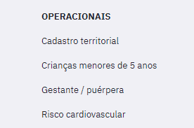
Fonte: SAPS/MS.

Cada relatório trata de linhas de cuidados diferentes, além do relatório de cadastro territorial. Falaremos sobre cada um com mais profundidade mais adiante.

Para a geração dos relatórios, os profissionais podem utilizar alguns filtros que ajudam a organizar a forma como as informações serão mostradas. Da mesma forma que os relatórios consolidados, os relatórios operacionais possuem filtros que dependem do tipo de perfil utilizado.

Há uma diferença entre os filtros utilizados no relatório de cadastro e nos relatórios por linha de cuidado. Por padrão, os Coordenadores de UBS tem acesso a estes relatórios por equipe caso haja mais de uma equipe vinculada à UBS. Os profissionais acessam apenas os dados em relatório operacional apenas daqueles cidadãos adscritos a sua equipe.

## 8.5.1 Relatório operacional de cadastro territorial

O Relatório Operacional de Cadastro Territorial traz informações essenciais sobre os cidadãos cadastrados no território por meio das fichas de Cadastro Individual e Cadastro Domiciliar da Coleta de Dados Simplificada (CDS). Nele, é possível visualizar os agrupamentos de indivíduos que compõem uma família, com seu responsável em destaque, os agrupamentos das famílias nos domicílios e os domicílios, de acordo com a microárea a que pertencem.

Para estes relatórios, é possível optar tanto pelo relatório "Cadastro territorial" , onde são apresentados a composição dos núcleos familiares organizados por microárea e logradouro (Figura 8.27), quanto pelo relatório "Inconsistências"  do cadastro territorial (Figura 8.29).

Para listar apenas o cadastro é necessário selecionar um INE (caso seja um Coordenador de UBS) e uma microárea[^4]. Caso estes campos fiquem em branco, será gerado um relatório com todos os cadastros relacionados a esta UBS. Caso seja selecionada a opção de inconsistências, serão habilitadas as situações de inconsistência, sendo obrigatória a seleção de pelo menos um item.

Figura 8.27 - Filtro do relatório operacional de cadastro

Fonte: SAPS/MS.

Ao selecionar o relatório de Cadastro Territorial, uma lista com informações sobre o território como microárea, endereço, dados de identificação e contato dos cidadãos serão exibidos, como mostra o exemplo da Figura 8.28.

Figura 8.28 - Exemplo de Relatório de Cadastro - Cadastro Territorial

Fonte: SAPS/MS.

O relatório de inconsistências permite a visualização do tipo de incoerência em relação ao cidadão, seu núcleo familiar, vínculo com responsável familiar e domicílio. Com estas informações, é possível realizar as adequações para manter a consistência do cadastro do território, permitindo maior fidedignidade nas informações em relação aos indivíduos, assim como, as famílias adscritas no território da equipe.

Ao selecionar a opção "inconsistências do cadastro territorial", oito inconsistências possíveis ficarão disponíveis, conforme é possível visualizar na figura 8.29, sendo relacionadas ao domicílio, a família e aos cidadãos individualmente.

Figura 8.29 - Tela do Relatório de Cadastro - Inconsistências
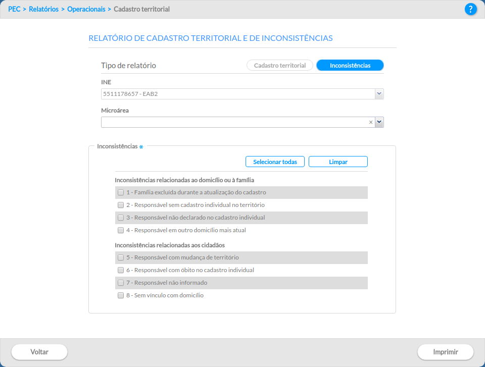
Fonte: SAPS/MS.

A impressão deste relatório apresentará dois blocos distintos por INE e microárea: cidadãos com dados inconsistentes e domicílios com dados inconsistentes. Cada bloco apresenta os dados de identificação do cidadão ou do domicílio inconsistente, acrescido da identificação do tipo de inconsistência, como mostra o exemplo na Figura 8.30.

Figura 8.30 - Exemplo de Relatório de Inconsistência do Cadastro Territorial

Fonte: SAPS/MS.

### 8.5.1.1 Critérios de Inclusão e Exclusão do relatório de Cadastro Territorial

Ao observar o relatório de Cadastro Territorial deve- se estar atento aos critérios de inclusão e exclusão dos registros exibidos no relatório, tal como segue:

- Inclusão:

- As fichas de cadastro domiciliar e cadastro individual devem pertencer ao mesmo CNES da lotação do profissional;

- As famílias devem estar cadastradas de acordo com as regras de composição do núcleo familiar, identificadas a partir do CNS do Responsável Familiar.

- As informações das fichas de cadastro com a data mais atual são exibidas da seguinte forma:

 - Caso sejam ​dados gerais​, considerar a informação mais atual, independente da equipe que a registrou;

 - Caso sejam dados não globais​, considerar a informação mais atual, da equipe que a registrou.

- Considerar somente as fichas de cadastro domiciliar que possuem \"Tipo de imóvel\" igual a \"01 - Domicílio\";

- Exclusão:

- Não deve ter sido informado na ficha de cadastro individual os campos \"mudança de território\" ou \"óbito\";

- Famílias não devem estar cadastradas de acordo com Regras de inativação do núcleo familiar;

- Cidadãos não devem estar cadastrados com inconsistências

### 8.5.1.2 Critérios de Inclusão do relatório de Inconsistência

Ao observar o relatório de Inconsistências deve- se estar atento aos critérios de inclusão no relatório, tanto em relação ao cadastro individual do cidadão, quanto para o núcleo familiar ao qual ele
pertence, tal como segue:

- **Relacionado ao Núcleo Familiar:**

**Inconsistência identificada: Família excluída durante a  atualização do cadastro (1)**. Esta inconsistência é observada  quando a atualização do cadastro domiciliar não possuir mais o  registro da família cadastrada na última visita.

*Como resolver?* Para remover a inconsistência deve- se registrar o CNS do Responsável Familiar em um Cadastro Domiciliar, vinculando a família a um domicílio.

**Inconsistência identificada: Responsável sem cadastro individual (2)**. Esta inconsistência é observada quando não existe uma ficha de cadastro individual para o responsável familiar, com CNS, indicado na ficha de cadastro domiciliar.

*Como resolver?* Para remover a inconsistência deve- se cadastrar o Responsável Familiar informando o CNS na ficha de cadastro individual.

**Inconsistência identificada: Responsável não declarado no cadastro individual (3)**. Esta inconsistência é identificada quando no cadastro individual do responsável familiar, o campo \"Responsável familiar\" é marcado como \"Não\" ou está em branco.

 *Como resolver?* Para remover a inconsistência, a ficha de cadastro individual do responsável deve ser atualizada, registrando \"Sim\" no campo de \"Responsável familiar\".

**Inconsistência identificada: Responsável em outro domicílio mais atual (4)**. Esta inconsistência é observada quando o responsável familiar está sendo cadastrado em outro domicílio.

*Como resolver?* Para remover a inconsistência será necessário atualizar o domicílio anterior, marcando a opção \"Mudou- se\" no grupo \"Famílias\", onde o CNS do Responsável Familiar está referido.

- **Relacionado ao Cidadão:**

**Inconsistência identificada: Responsável com mudança de território (5).** Esta inconsistência é observada quando o cadastro individual do cidadão possui o campo \"CNS do responsável familiar\" com CNS de um responsável com mudança de território.

*Como resolver?* Para que a inconsistência não ocorra, é necessário informar o \"CNS do responsável familiar\" cujo cadastro individual não possua a informação da mudança de território.

**Inconsistência identificada: Responsável com óbito no cadastro individual (6).** Esta inconsistência é observada quando o cadastro individual do cidadão possui o campo \"CNS do responsável familiar\" com CNS de um responsável com óbito.

*Como resolver?* Para que a inconsistência não ocorra, é necessário informar o \"CNS do responsável familiar\" cujo cadastro individual não possua a informação do óbito.

**Inconsistência identificada: Responsável não informado (7).** Esta inconsistência é identificada quando o cadastro individual do cidadão não possui seu responsável familiar informado, ou seja, o campo \"CNS do responsável familiar\" está vazio e o campo \"Cidadão é o responsável familiar?\" foi respondido como \"Não\" ou encontra- se em branco.

 *Como resolver?* Para que a inconsistência não ocorra, é necessário manter o campo \"Cidadão é o responsável familiar?\" como \"Não\" e informar um CNS do responsável familiar que possua cadastro individual no mesmo território.

**Inconsistência identificada: Sem vínculo com domicílio (8):** Esta inconsistência é observada quando o cidadão não está vinculado a um domicílio cadastrado. Nesse caso existem as seguintes inconsistências adicionais.

**Cidadão com responsável sem cadastro individual:** O cadastro do cidadão está com o campo \"Cidadão é o responsável familiar?\" marcado como \"Não\" e o CNS indicado no campo \"CNS do responsável familiar\" não possui cadastro individual.

*Como resolver?* Para que a inconsistência não ocorra, é necessário manter o campo \"Cidadão é o responsável familiar?\" como \"Não\" e informar um CNS do responsável familiar que possua cadastro individual no mesmo território.

**Responsável sem domicílio:** O cadastro do cidadão está com o campo \"Cidadão é o responsável familiar?\" marcado como \"Sim\", declarando- o como responsável. Porém, não há domicílio cadastrado com seu respectivo CNS.

*Como resolver?* Para que a inconsistência não ocorra, é necessário cadastrar um domicílio informando o mesmo CNS do cidadão (campo \"CNS do cidadão\" no cadastro individual) no grupo \"Famílias\" do respectivo domicílio.

**Cadastro individual com responsável declarado sem domicílio:** O cadastro do cidadão está com o campo \"Cidadão é o responsável familiar?\" marcado como \"Não\" e não há domicílio cadastrado com o CNS do responsável familiar.

*Como resolver?* Para que a inconsistência não ocorra, é necessário cadastrar um domicílio informando o mesmo CNS do responsável (campo \"CNS do responsável familiar\" no cadastro individual) no grupo \"Famílias\" do respectivo domicílio.

**Cadastro individual sem CNS e declarado como responsável:** O cadastro do cidadão está com o campo \"Cidadão é o responsável familiar?\" marcado como \"Sim\", declarando- o como responsável. Porém, o campo \"CNS do cidadão\" está vazio.

*Como resolver?* Para que a inconsistência não ocorra, é necessário informar um CNS válido no campo \"CNS do cidadão\".

## 8.5.2 Relatório operacional de gestantes e puérperas

O Relatório Operacional de Gestantes/Puérperas permite o acompanhamento das mulheres que estão nesta condição. Comporão esta lista, aquelas que tiveram algum registro de condição de saúde relacionado à gestação nos instrumentos de captação de dados clínicos (PEC ou CDS), de acordo com a quantidade e qualidade do preenchimento destes instrumentos.

Para o relatório de gestantes/puérperas, são utilizados filtros diferentes do relatório de cadastro. Para o coordenador da UBS, serão disponibilizadas as opções de filtragem por "INE/Equipe" e "Microárea". Caso deseje listar todas as microáreas do seu território basta deixar este campo em branco (Figura 8.31).

Figura 8.31 - Filtro do relatório operacional de gestantes/puérperas - coordenador da UBS

Fonte: SAPS/MS.

>  NOTA: os profissionais de saúde, sem perfil de coordenação, irão observar que o filtro INE estará desabilitado, mas poderão utilizar o filtro "Microárea" para selecionar uma microárea específica.

Prioritariamente, as **gestantes cadastradas** no território da equipe comporão este relatório, devendo estar **vinculadas a um responsável familiar**, *e este*, **vinculado a um domicílio do território**. Contudo, é possível verificar se há alguma gestante sendo acompanhada, mas que está fora da área de cobertura da equipe. O relatório oferece à equipe dados relacionados à DUM, DPP, IG, informações relacionadas à última consulta pré- natal (data da última consulta e situação vacinal), status do VDRL, além da data de outras consultas e visita domiciliar realizada pelo ACS, como observado na imagem a seguir.

Figura 8.32 - Exemplo de Relatório Operacional de Gestante/Puérpera

Fonte: SAPS/MS.

## 8.5.3 Relatório operacional de crianças menores de 5 anos

O Relatório Operacional de Crianças Menores de 5 Anos oferta aos profissionais de saúde informações importantes para o acompanhamento das crianças residentes no território de abrangência da UBS. Tais informações são coletadas por meio do registro de ações de saúde, tanto do Prontuário Eletrônico do Cidadão quanto da Coleta de Dados Simplificada.

Para o relatório de crianças menores de 5 anos são utilizados filtros diferentes dos outros relatórios. Para o coordenador da UBS, serão disponibilizadas as opções de filtragem por "INE", "Microárea" e por CID10. Para selecionar todas as microáreas este campo deve ficar em branco. O filtro baseado no CID10 pode auxiliar o acompanhamento de crianças em situações específicas, como as identificadas com a Síndrome Neurológica por Zika/Microcefalia, ou outras situações que podem ser identificadas por meio da CID10 (Figura 8.33).

Figura 8.33 - Tela do Relatório de crianças menores de 5 anos - perfil de coordenador da UBS
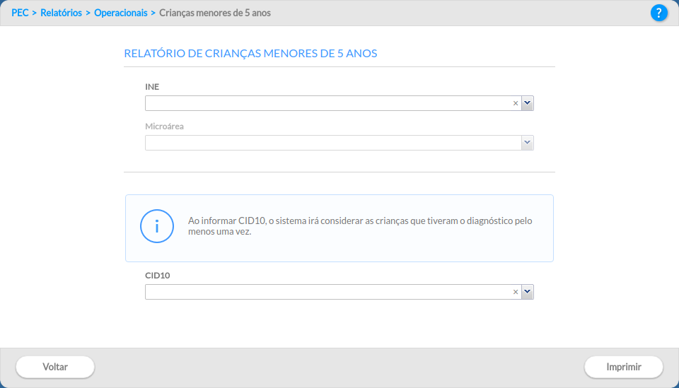
Fonte: SAPS/MS.

>  NOTA: os profissionais de saúde, sem perfil de coordenação, irão observar que o filtro INE estará desabilitado, mas poderão utilizar o filtro "Microárea" para selecionar uma microárea específica, bem como um CID10.

Prioritariamente, as **crianças menores de 5 anos cadastradas no território** da equipe comporão este relatório, devendo estar **vinculadas a um responsável familiar**, *e este*, **vinculado a um domicílio no território**. Entretanto, é possível verificar se há alguma criança sendo acompanhada, mas que está fora da área de cobertura da equipe. O relatório oferece à equipe dados relacionados a realização da consulta na primeira semana de vida, se foram avaliados os testes da triagem neonatal (pezinho, orelhinha e olhinho), última consulta odontológica, última visita do ACS e os registros da última consulta de puericultura (tipo de aleitamento, status de imunização, últimas medições de perímetro cefálico, peso, altura e estado nutricional), como mostra a imagem a seguir.

Figura 8.34 - Exemplo de Relatório Operacional de Crianças menores que 5 anos

Fonte: SAPS/MS.

## 8.5.4 Relatório operacional de risco cardiovascular

O Relatório Operacional de Risco Cardiovascular mostra à equipe informações sobre a situação de saúde dos usuários que, de alguma forma, se enquadram num estado que apresente risco ao desenvolvimento de doenças cardiovasculares. A presença de usuários neste relatório, depende de alguns fatores de risco coletados nos instrumentos de registro do e-SUS APS, seja no Prontuário Eletrônico do Cidadão, seja na Coleta de Dados Simplificada.

Neste relatório são utilizados os seguintes filtros: o coordenador da UBS terá a sua disposição as opções de filtragem por "INE/Equipe" e "Microárea" . Caso deseje listar todas as microáreas do seu território basta deixar este campo em branco (Figura 8.35).

Figura 8.35 - Tela do Relatório de Risco Cardiovascular - perfil de coordenador da UBS

Fonte: SAPS/MS.

>  NOTA: os profissionais de saúde, sem perfil de coordenação, irão observar que o filtro INE estará desabilitado, mas poderão utilizar o filtro "Microárea" para selecionar uma microárea específica.

Os **cidadãos em risco cardiovascular**, **cadastrados no território** da equipe, comporão este relatório devendo estar **vinculados a um responsável familiar**, *e este*, **vinculado a um domicílio no território**. Todavia, é possível verificar se há algum cidadão sendo acompanhado, mas que está fora da área de cobertura da equipe. O relatório oferece à equipe, dados relacionados a presença de diagnóstico ou informação auto referida de hipertensão arterial sistêmica, diabetes, tabagismo, último IMC, data do atendimento em que foi realizada a consulta para rastreamento de risco cardiovascular e a data da última consulta para condições que ampliam o risco cardiovascular, além da consulta odontológica e da última visita domiciliar realizada pelo ACS.
Os critérios de inclusão do cidadão neste relatório são:

- Resposta afirmativa no questionário autorreferido de condições da Ficha de Cadastro Individual para os itens \"Tem hipertensão arterial?\"; \"Tem diabetes?\"; \"Teve AVC/derrame?\"; \"Teve infarto?\"; \"Tem doença cardíaca/do coração?\"; \"Tem ou teve problemas nos rins?\"; \"Está fumante?\".

- CID e/ou CIAP informado(s) no atendimento PEC ou na Ficha de Atendimento Individual de acordo com o Quadro 8.1 abaixo;

- Opções \"Hipertensão arterial\"; \"Diabetes\"; \"Obesidade\"; \"Tabagismo\" marcada na Ficha de Atendimento Individual;

Figura 8.36 - Exemplo de Relatório Operacional de risco cardiovascular

Fonte: SAPS/MS.

Quadro 8.1 - Códigos CIAP2 e CID10 para o Relatório de Risco Cardiovascular

|Condição|CIAP2|CID10|
|- |- |- |
|Hipertensão Arterial (HAS)|K86, K87|I10, P292, K766, I270, I272, que contenha o código I13, que contenha o código I15|
|Diabetes (DIA)|T90, T89|que contenha o código E10, que contenha o código E11, que contenha o código E12, que contenha o código E13, que contenha o código E14, que contenha o código O24, E232, N083, N251, P700, P702|
|Tabagismo|P17|Z720
|Obesidade|T82|que contenha o código E66|
|AVC|K89, K90, K91|G45, G46, I60, que contenha o código I61, I62, que contenha o código I63, I64, I65, I66, que contenha o código I67 (exceto I674), I68, I69|
|Infarto|K75, K78|que contenha o código I21, que contenha o código I22, que contenha o código I23, I241, I48|
|Doença Cardíaca|K74, K76, K77, K79, K80, K82, K83, K84, K99|I20, I240, I249, I25, I50, I47, I49, I27, I28, I34, I35, I36, I37, I31, que contenha o código I42 (exceto I424), I43, I44, I45, I46, I51, I52, O903, I71, I72, I77, I780, I788, I789, I79, I85, I86, I871, I879, I890, I98, I99, M30, M31, R57, T063|
|Doenças Renais|U70, U71, U72, U75, U76, U77, U78, U79, U80, U85, U88, U90, U95, U98, U99|N10, N11, N12, N151, N159, N30, N390, A560, A562, A590, B374, N34, C64, C65, C67, C66, C68, D30, D099, D091, D41, S370, S371, S372, S373, T190, T191, T283, Q60, Q61, Q62, Q63, Q64, N00, N01, N03, N04, N05, N07, N08, N14, N150, N158, N16, N392, 20, N21, N22, N391, R80, R81, R82, N06, N13, N17, N18, N19, N25, N26, N27, N28, N29, N31, N32, N33, N35, N36, N37, N398, R392, T198, T199, Z905, Z906|
|Rastreamento Risco Cardiovascular|K22|Z136, Z824|

Fonte: SAPS/MS.

[^3]: Segundo a Política Nacional de Atenção Básica (BRASIL, 2011), "adscrição de usuários" é um processo de vinculação de pessoas e/ou famílias e grupos a profissionais/equipes, com o objetivo de ser referência para o seu cuidado.

[^4]: Em caso de re- territorialização, os logradouros, domicílios ou cidadãos que fiquem fora da área de cobertura da equipe poderão ser identificados com o status "Fora de Área", sendo identificados desta forma nos relatórios e no filtro "microárea".
