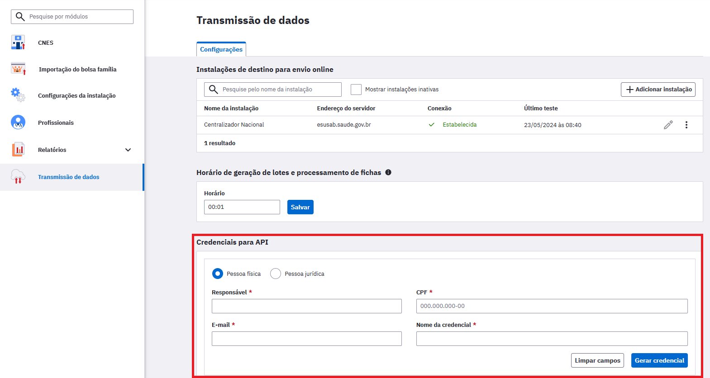

<head>
    
</head>

# API de transmissão de fichas (Sistemas Próprios ou Terceiros para o PEC e-SUS APS)

{: .atencao }
Essa funcionalidade é voltada exclusivamente para municípios que utilizam sistemas próprios ou terceiros.

## MANUAL PRELIMINAR

A partir da versão **5.3.19** é possível enviar os registros via API. Para isso, é necessário que a instalação do PEC possua HTTPS configurado e que o Administrador da Instalação gere credencias para que os sistemas próprios ou terceiros enviem os lotes para a instalação.

### Requisito obrigatório - Acesso ao PEC e-SUS APS por endereço de domínio via protocolo HTTPS

Manuais desta habilitação:

Configuração automatizada pelo PEC e-SUS APS: [LINK](https://saps-ms.github.io/Manual-eSUS_APS/docs/Apoio%20a%20Implanta%C3%A7%C3%A3o/HTTPS_Automatizado/)

Configuração manual:
- Servidores WINDOWS: [LINK](https://saps-ms.github.io/Manual-eSUS_APS/docs/Apoio%20a%20Implanta%C3%A7%C3%A3o/Certificado_Https_Windows/)
- Servidores LINUX: [LINK](https://saps-ms.github.io/Manual-eSUS_APS/docs/Apoio%20a%20Implanta%C3%A7%C3%A3o/Certificado_Https_Linux/)

### Geração da credencial

Como Administrador da Instalação, através da lateral é possível acessar o módulo de “Transmissão de dados”. No final da página existe uma nova seção “Credenciais para API”, criada para gerar as credenciais dos sistemas que irão enviar dados via API.

A geração da credencial deve ser feita pelo Administrador da Instalação, sendo necessário informar os seguintes dados dos integradores:

- Para cadastro de "Pessoa física" o registro deve conter as seguintes informações da pessoa que será responsável pela integração: Nome, CPF, e-mail e nome da credencial;

- Para cadastro de "Pessoa jurídica" o registro deve conter as seguintes informações da pessoa que será responsável pela integração: Nome, CNPJ, e-mail e nome da credencial.

Após realizar o cadastro de um integrador, o sistema deve gerar o usuário e a senha que serão utilizados na autenticação da API. 

> Observação: É possível que seja criada mais de uma credencial e todas elas podem estar ativas ao mesmo tempo.

{: .atencao }
Ao gerar uma credencial, o usuário e a senha serão exibidos uma única vez, então, tenha certeza de guardá-los devidamente, pois não é possível recuperar um usuário e senha gerados. Caso o usuário e a senha sejam perdidos, é necessário inativar a credencial e gerar uma outra.

### Endpoints, variáveis e respostas da API

{: .nota }
Os municípios são responsáveis por desenvolver e manter o script que realizará os envios de fichas via API. Lembrando que recomendamos salvar o erros retornados pela API, caso seja necessário fazer alguma correção no modelo de dados enviados.

A API possui dois endpoints disponíveis:

**[url_instalacao]/api/recebimento/login**

**[url_instalacao]/api/v1/recebimento/ficha**

O endpoint "**/api/recebimento/login**" deve ser utilizado para realizar a autenticação do envio através da requisição do tipo POST. Sendo aceitas as variáveis "usuario" e "senha", as respostas possíveis são:
- Resposta de sucesso: a API deve retornar um cookie chamado "**JSESSIONID**". Esse cookie deve ser enviado em requisições futuras como forma de autenticação;
- Resposta de erro: deve ser retornado um código e mensagem do erro.

O endpoint "**/api/v1/recebimento/ficha**" deve ser utilizado para realizar o envio das fichas através da requisição do tipo POST. 

{: .nota }
O valor da variável deve ser um arquivo serializado em binário e o nome desse arquivo deve ser "uuid da ficha" +".esus". Segue um exemplo de ficha nomeada corretamente: "**0000007-cfdd9b1b-2c4d-4759-b254-76564ec219f3.esus**"

As respostas possíveis para o endpoint "**/api/v1/recebimento/ficha**" são:

- Respostas de sucesso: deve ser retornado o status **200**;
- Resposta de erro: deve ser retornado um código e uma mensagem do erro. Informando quais informações devem ser corrigidas para que a ficha seja aceita.

Sugere-se que o erro retornado pela API seja armazenado pelo próprio integrador, possibilitando assim correção de fichas que foram enviadas com erro.
 
### Fluxograma para entendimento do funcionamento da API

### Visualização das fichas recebidas via API

As fichas enviadas via API podem ser visualizadas pelo Administrador Municipal no módulo “Transmissão de dados”.

### Dicionário de dados

Relação de endpoint, tipos de requisição e parâmetros:

Relação de endpoint e possíveis respostas:

**FIM** 

1ª versão. Atualizado em 18 de novembro de 2024.