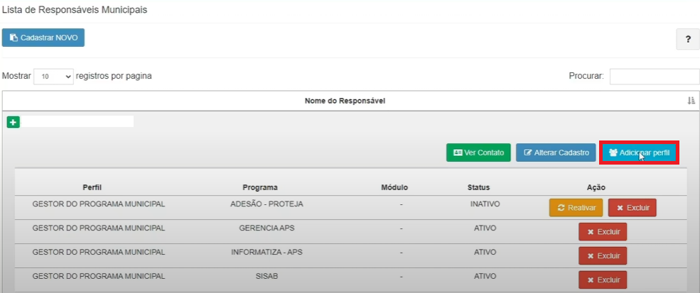
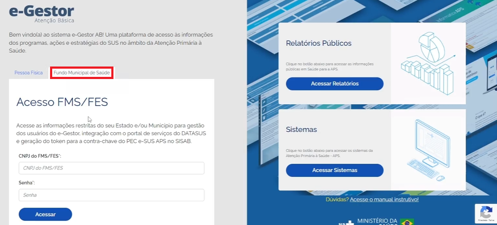
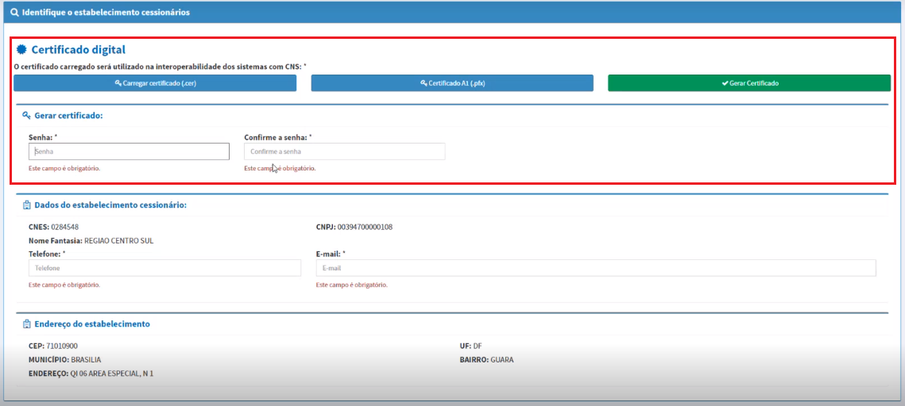
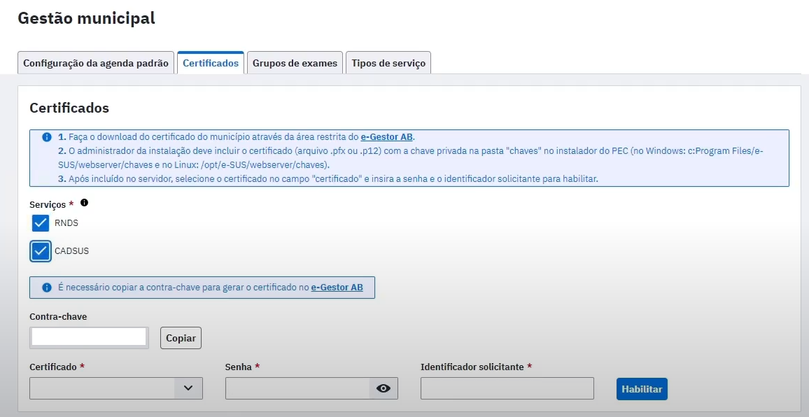
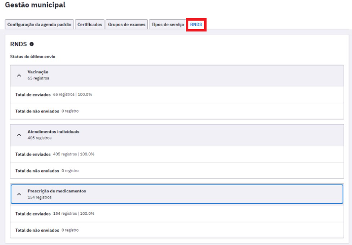
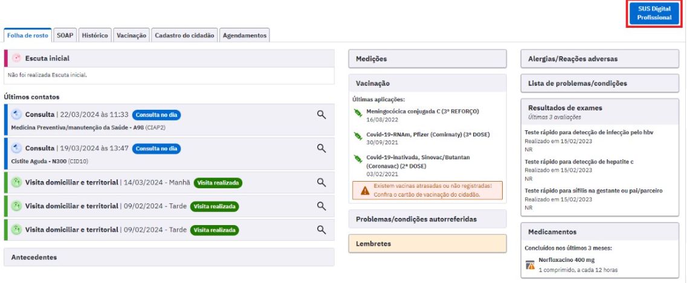

# Fluxo de geração do certificado digital no e-Gestor AB para o e-SUS APS:

<video width="800" height="520" controls="controls" poster="capa_RNDS.png">
  <source src="https://docs.pipz.com/central-de-ajuda/learning-center/guia-basico-de-markdown#open" type="video/mp4">
</video>

<a href="https://saps-ms.github.io/Manual-eSUS_APS/infografico.pdf">Download Infográfico</a>

 

# Geração do certificado digital no e-GESTOR AB:

Este instrutivo visa orientar os gestores e técnicos responsáveis pela Estratégia e-SUS APS a habilitarem o Certificado Digital no e-SUS APS para envio de registros e acesso a RNDS via SUS Digital Profissional e também habilitar a primeira etapa para ativação da interoperabilidade com o CADSUS no módulo de cadastro do Cidadão.

Vale ressaltar que para habilitar por completo a interoperabilidade entre o e-SUS APS e o CADSUS, após este processo, é necessário ativar o acesso via HTTPS a Instalação do PEC e também o método de login via gov.br, com tutoriais presentes nessa sessão de manual (Apoio a Implantação).

### Municípios que NÃO possuem certificado digital A1

Quando o município ou Distrito Federal que utilizam o PEC não possuir certificado digital do tipo A1, o **Administrador Municipal** da instalação PEC deverá seguir os seguintes passos:

Acessar o ambiente restrito do portal [e-Gestor Atenção Básica](https://egestorab.saude.gov.br/paginas/login.xhtml/) com Login e Senha do **gestor municipal**;

No perfil **Gestor da Atenção Básica**, vá em **Gerenciar Usuários**;

No nome do **Gestor da Atenção Básica** ou da **Referência Técnica do e-SUS APS**, vá em **Adicionar perfil**;

Em **Perfis de acesso**, selecione o programa **Implantação e-SUS APS** e o perfil de acesso **Gestor do Programa Municipal**;

Agora, faremos login novamente na área restrita do e-Gestor AB, mas com o acesso do Fundo Municipal de Saúde (FMS), com CNPJ e senha;

Selecione o perfil "TOKEN PARA IMPLANTAÇÃO e-SUS APS";

Preencha o formulário com os dados do usuário responsável pela geração do token (CPF e Nome) e selecione o Estabelecimento de saúde onde o token será utilizado para autenticação, em seguida clique em "Gerar Token". Todos os tokens gerados serão exibidos na aba "Tokens gerados".

{: .atencao }
[**ATENÇÃO**] A validade do token é até às 23:59h do dia de sua geração. Após esse período é automaticamente desativado, não sendo mais possível utilizá-lo.

{: .nota }
O responsável (CPF) por gerar o token no e-Gestor AB deverá ser o mesmo a realizar a solicitação de credenciamento no e-GESTOR AB.

Após obter o **Token** copie a **Contra Chave** no sistema e-SUS APS com PEC no módulo "Gestão Municipal" na aba "Configuração RNDS, conforme a figura 3.11.4.

De posse do **token** gerado no sistema e-Gestor AB e a **Contra Chave** copiada no sistema e-SUS APS com PEC, proceda na solicitação de credenciamento no e-GESTOR AB, para obter permissão de acesso a RNDS e APROVAÇÃO para produção. 

Após realizar o credenciamento faça o download do certificado gerado.

### Municípios que POSSUEM certificado digital A1

O município ou Distrito Federal que possua certificado digital A1 também deverá gerar o token no e-Gestor AB e copiar a Contra Chave do PEC para preehimento dos campos abaixo:

{: .atencao }
[**ATENÇÃO**] Não carregue o 'certificado .cer'. O tipo de arquivo gerado não é compatível com o sistema.

### Realizando solicitação de credenciamento no e-GESTOR AB:

Ao logar no e-GESTOR AB com o perfil de gestor municipal, selecione o programa Implantação e-SUS APS:

Na tela seguinte, serão exibidas informações diversas relativas as credenciais geradas, termo de uso, certificado disponível e solicitação de nova credencial, conforme pode ser visto na imgem abaixo:

Clicando em  será solicitado ao integrador, informar o token e contra-chave para seguimento no processo de credenciamento:

Após validação dos dados na tela acima, será apresentado ao solicitante o formulário de credenciamento abaixo:

Na área de Certificado Digital, caso tenha um certificado próprio, importe-o conforme a extensão .CER ou .PFX. Caso não tenha um certificado próprio, clique em gerar certificado e cadaste uma senha:

Siga com o preenchimento dos dados do formulário, informando o telefone de contato e e-mail da gestão responsável.

Em "Indique um estabelecimento filho", informe os estabelecimentos que ficarão vinculados ao CNES pai:

Depois indique os dados do gestor responsável:

E as informações do sistema solicitante:

Ao clicar em  será exibida a tela de aceite dos termos de uso, conforme pode ser visto abaixo:

Ao clicar em "Confirmar e avançar", será realizada a conclusão de solicitação de credenciamento no e-GESTOR AB e o integrador estará formalmente apto para integração a RNDS via e-SUS APS PEC. 

Na tela de credenciais geradas, será possível ter acesso ao ID do solicitante e ao certificado que deverá ser informado no PEC.

### Criando a pasta de "chaves" no sistema

A partir do momento que o Certificado Digital foi gerado no e-Gestor, será necessário que o Administrador da Instalação, de posse do certificado (.pfx ou .p12), cadastre na aplicação. Será necessário criar a pasta “chaves” e incluir o arquivo (.pfx ou .p12) nesta pasta. A depender do sistema operacional o administrador da instalação deverá proceder da seguinte forma:

Se o sistema operacional for **Windows** - Acesse a pasta:

C:\ProgramFiles\e-SUS\webserver\chaves

Inclua o arquivo (.pfx ou .p12) na pasta “chaves”.

Se o sistema operacional for **Linux** - Acesse o repositório com o comando:

cd /opt/e-SUS/webserver/

Crie a pasta “chaves” utilizado o comando:

sudo mkdir chaves

Inclua o arquivo (.pfx ou .p12) na pasta “chaves”.

### Cadastrando o Certificado Digital no e-SUS APS PEC

Nesta etapa o administrador municipal acessa a instalação PEC com login e senha para habilitar o acesso do PEC à RNDS por meio do módulo “Gestão Municipal”. Neste módulo, na aba “Configuração RNDS”, o administrador municipal selecionará o certificado - previamente inserido pelo administrador da instalação na pasta “chaves” da instalação PEC - informará a senha do certificado e o identificador do solicitante obtido no e-GESTOR, no momento em que a solicitação de credenciamento é homologada para o acesso a RNDS.

Após a habilitação, poderão ser observados os registros enviados a RNDS em Gestão Municipal, RNDS.

Na tela de atendimento do cidadão, realizado por profissional de nível superior no PEC, será apresentado o novo botão **SUS Digital Profissional** com link de acesso a RNDS externamente ao PEC, conforme a imagem abaixo:

Vale destacar que para acessar ao prontuário do Cidadão na RNDS, o profissional deve possuir seu login gov.br no nível **prata** ou **ouro**.

