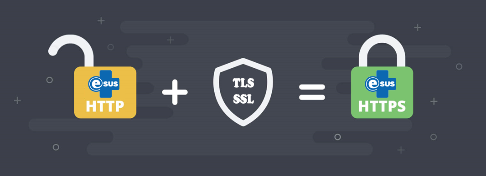
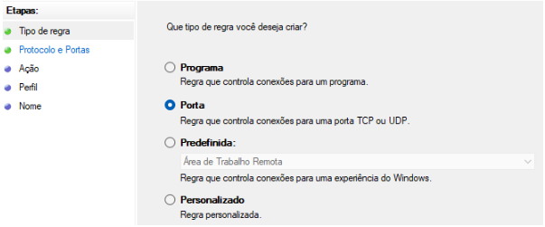
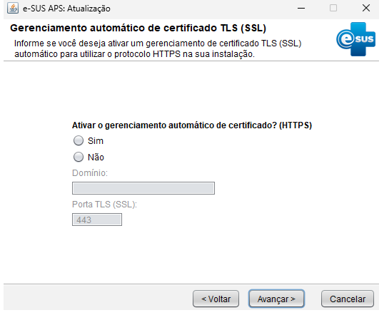
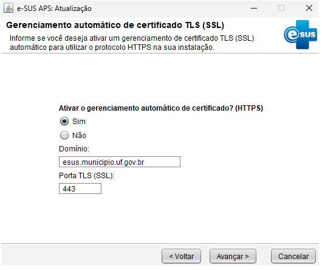
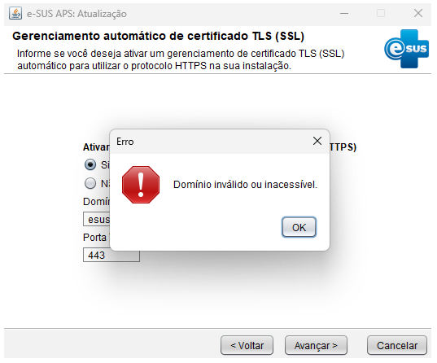
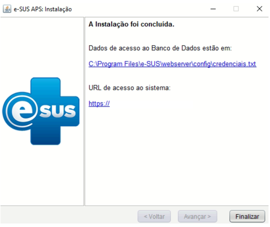
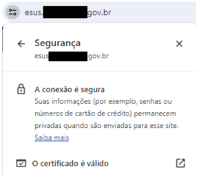
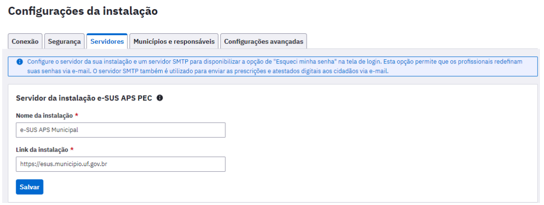

Geração do Certificado TLS (SSL) e habilitação do protocolo HTTPS de forma automatizada pelo PEC e-SUS APS

A geração e renovação do Certificado TLS (SSL) / HTTPS no PEC se tornou bem mais fácil, sendo agora gerenciado pela própria aplicação de maneira totalmente automatizada. 

A partir da versão X do PEC e-SUS APS, o próprio instalador do sistema questionará se você deseja utilizar/gerar um certificado TLS (SSL) na sua instalação e, para isso, você precisará fornecer apenas o domínio e a porta que o PEC utilizará para este protocolo.

Você sabia? Um certificado TLS/SSL é um arquivo digital usado para autenticar a identidade de um site ou serviço na internet e criptografar a comunicação entre o navegador do usuário e o servidor web. TLS (Transport Layer Security) é o sucessor do SSL (Secure Sockets Layer), mas ambos são frequentemente referidos de maneira combinada, visto que o SSL é um protocolo mais antigo e menos seguro que o TLS. Em resumo, um certificado TLS/SSL desempenha um papel fundamental na segurança da comunicação na internet, protegendo a privacidade dos usuários e garantindo que eles estejam se comunicando com sites legítimos e confiáveis.

ATENÇÃO

-	A Instalação que já possui Certificado TLS (SSL) gerado e HTTPS habilitado por outros métodos (Certbot, ZeroSSL, etc) poderá sem nenhum problema utilizar a nova funcionalidade automatizada do PEC e-SUS APS, desde que observados os requisitos obrigatórios para a funcionalidade, que serão detalhados na sequência. Para estas Instalações, é possível que este tutorial seja seguido a partir da Etapa 2;
-	Uma vez realizado o processo de geração do Certificado TLS (SSL) e habilitação do HTTPS pela Instalação/Atualização do PEC e-SUS APS, não será necessária qualquer outra configuração para a renovação do certificado, pois todo o processo é automatizado (geração e renovação);
-	Este processo não é necessário para quem já possui um proxy/apache/nginx com HTTPS parametrizado.

Assim sendo, precisamos destacar quais são os requisitos obrigatórios para que esta funcionalidade seja aplicada no sistema.

REQUISITOS OBRIGATÓRIOS

-	Sua Instalação do PEC e-SUS APS já deve possuir IP público para acesso externo;
-	Deve ser disponibilizado um domínio apontando para o IP público de acesso à sua instalação do e-SUS APS, sem indicar nenhuma porta, somente o IP. Se o seu município já tem o domínio próprio, basta solicitar que seja criado o subdomínio para sua Instalação de maneira gratuita. Exemplo que será utilizado neste tutorial: esus.municipio.uf.gov.br. Destaca-se que, posteriormente, caso o município tenha interesse em realizar a habilitação do login gov.br no e-SUS APS (Tutorial: LINK), é obrigatória a utilização de um domínio final “gov.br” por questões de segurança, conforme orientações da Secretaria de Governo Digital (SGD);
-	Assim como está a porta 8080 configurada, as portas de entrada 80 e 443 também devem ser liberadas pelo provedor. Também é necessário que estas mesmas portas sejam redirecionadas no roteador de borda para o IP na rede local da sua instalação do PEC e-SUS APS;
-	Verifique se o acesso remoto à administração do seu roteador está ativado, pois em muitos roteadores, esse acesso se dá pela porta padrão 80, dando assim conflito durante o processo de geração do certificado, que utiliza esta mesma porta. Recomenda-se que a porta de acesso remoto do roteador seja alterada (desde que não seja as opções 8080, 80 ou 443) ou o acesso seja desativado se não for possível alterá-la;
-	De forma geral, é necessário que as portas 80 e 443 estejam livres, sem outras aplicações utilizando-as, para que então seja possível a geração do certificado.

Etapa 1 – Liberando portas de acesso no firewall do sistema operacional

Sistema operacional WINDOWS

- Procure pelo termo “firewall” no menu Iniciar e selecione o ícone a seguir:

- No menu esquerdo, seleciona e opção “Regras de entrada” e clique em “Nova Regra…”.

- Habilite a porta “80” e “443” para entrada, utilizando os seguintes parâmetros:

- Em “Tipo de Regra”, marcar a opção “Porta” e clique em AVANÇAR.

- Em “Protocolos e Porta”, marcar a opção “TCP” e abaixo definir em “Portas locais específicas” digite “80,443” e clique em AVANÇAR.

- Em ”Ação”, marcar a opção ”Permitir a conexão” e clique em AVANÇAR.

- Em “Perfil”, selecione todos os tipos possíveis e clique em AVANÇAR.

- Em “Nome”, digite “esusaps” e clique em CONCLUIR.

Sistema operacional LINUX

Execute os comandos abaixo no terminal:

sudo iptables -A INPUT -p tcp --dport 80 -j ACCEPT
sudo iptables -A INPUT -p tcp --dport 443 -j ACCEPT

É importante ressaltar que o iptables é uma das ferramentas possíveis, mas pode variar dependendo da distribuição Linux e do gerenciador de firewall usado (como ufw para sistemas baseados em Ubuntu). Certifique-se de adaptar os comandos conforme necessário para o seu ambiente específico.

Etapa 2 – Gerando o Certificado TSL (SSL) e habilitando o acesso HTTPS no PEC e-SUS APS 

-	Instalação/Atualização em Windows ou Linux com modo gráfico:

A partir da versão 5.3.4, durante a Instalação/Atualização do sistema PEC e-SUS APS, após a etapa de realização do backup do banco de dados, o sistema apresentará a seguinte tela caso a aplicação não reconheça já ter o processo automatizado configurado anteriormente pela aplicação de Instalação/Atualização do sistema PEC e-SUS APS.

Observação: caso não seja desejado utilizar o certificado do PEC e-SUS APS ou a instalação já tem seu certificado próprio que se deseja ser mantido, basta clicar em “Não” durante a Instalação/Atualização e dar sequência normalmente no processo.

Para ativar o gerenciamento automático do certificado, ou seja, gerar o Certificado TLS (SSL) e habilitar o HTTPS no PEC e-SUS APS:

-	Marque “Sim”
-	Informe o domínio de acesso à sua Instalação do PEC (exemplo: esus.municipio.uf.gov.br)
-	Informe a porta de acesso ao protocolo HTTPS da sua Instalação do PEC (padrão: 443)
-	Clique em “Avançar”

Aguarde a validação das informações e conclusão do processo.

Se o processo for corretamente validado, a aplicação dará andamento às próximas etapas comuns da Instalação/Atualização do sistema.

Em caso de erro, a seguinte mensagem surgirá na tela:

Nestes casos, verifique se os requisitos obrigatórios para esta funcionalidade foram corretamente seguidos e corrija o que for necessário para assim realizar nova tentativa.

Após o término da Instalação/Atualização da versão, a tela final será assim apresentada, informando a URL de acesso à Instalação do PEC:

-	Instalação/Atualização sem modo gráfico (via terminal - linha de comando)

O processo é equivalente, neste caso, ao invés de executarmos o instalador do PEC, realizaremos o processo adotando alguns parâmetros durante a Instalação/Atualização da aplicação, neste caso, utilize a seguinte linha de comando:

java -jar eSUS-AB-PEC-VERSAO-SO64.jar -console -cert-domain=esus.municipio.uf.gov.br -url="jdbc:postgresql://localhost:5433/esus" -username="postgres" -password="exemplo123456"

Atenção para realizar as substituições corretas na linha de comando nos dados em vermelho:

-	VERSAO = trocar pela versão de acordo com o arquivo de Instalação/Atualização
-	SO = sistema operacional da instalação (opções de comando: Win ou Linux)
-	esus.municipio.uf.gov.br = informar o domínio de acesso ao PEC
-	5433 = porta padrão de acesso ao banco de dados do PEC (verificar no arquivo “credenciais”, se necessário)
-	esus = nome do banco de dados padrão do PEC (verificar no arquivo “credenciais”, se necessário)
-	postgres = usuário padrão do banco de dados do PEC (verificar no arquivo “credenciais”, se necessário)

- exemplo123456 = informar a senha do usuário “postgres” presente no arquivo “credenciais”

Observação: note que foi inserido um parâmetro novo: "-cert-domain", porém, ainda é possível inserir o parâmetro "-cert-port", neste caso, para especificar a porta. Quando não informado, ele utilizará a porta 443 que é indicada como padrão. Após isso, basta prosseguir com a Instalação/Atualização.

-	Teste de conexão segura

Com o processo concluído, sua Instalação do PEC e-SUS APS já está com o protocolo HTTPS configurado, podendo ser acessada, a partir de agora, pelo domínio configurado sem a necessidade de indicar a porta 443 ao fim do domínio (exemplo: https://esus.municipio.uf.gov.br).

Observe no navegador as características de uma conexão segura, conforme imagem abaixo:

-	Verificação do “Link da Instalação”

Com o HTTPS devidamente habilitado, verifique se o “Link da Instalação” foi alterado, apresentando agora o novo link de acesso à Instalação do PEC informado durante e Instalação/Atualização do PEC e-SUS APS. Para isso, faça login no PEC e-SUS APS com o acesso do Administrador da Instalação, vá em “Configurações da Instalação”, aba “Servidores” e verifique o campo “Link da instalação”.

Se o “Link da Instalação” não foi alterado, informe o domínio completo de acesso à instalação do PEC e clique em "Salvar”.

Observação: em caso de não ser possível alterar o “Link da Instalação”, realize a “Etapa extra” ao fim deste tutorial.

-	Disseminação do novo link de acesso ao PEC e-SUS APS

Informe o novo link de acesso da sua Instalação à todas as suas unidades que utilizam o PEC e-SUS APS e reconfigure todos os aplicativos da estratégia e-SUS APS com este novo link do servidor para sincronização (e-SUS Território, e-SUS AD, e-SUS Atividade Coletiva, e-SUS Vacinação, Gestão e-SUS APS).

ATENÇÃO: Após a habilitação do protocolo HTTPS, por motivos de compatibilidade entre o sistema operacional Android e o Certificado TLS (SSL), é importante ressaltar que apenas os aplicativos da estratégia e-SUS APS instalados em Android versão 7.1.2 ou superior conseguirão realizar sincronização com a Instalação.

Etapa extra - Configuração do arquivo “hosts”

É muito comum que, por motivos de configuração de rede/provedor, após a habilitação do protocolo HTTPS, o município não consiga alterar o “Link da Instalação” do servidor e nem consiga acessar o PEC e-SUS APS, pelo domínio, no próprio servidor da Instalação ou em sua rede local, conseguindo acessar somente com o endereço https://localhost (no próprio servidor da instalação) e https://IP-LOCAL-DO-SERVIDOR (exemplo: https://192.168.1.13) nos computadores da mesma rede. Assim sendo, apresentamos a seguinte solução.

ATENÇÃO: Para as unidades que acessam a Instalação do PEC e-SUS APS externamente à rede local do servidor, nenhuma ação de configurações do arquivo “hosts” é necessária.

WINDOWS

Procure o “Bloco de notas” do Windows no menu Iniciar, clique com o botão direito no ícone, e abra-o “Executando como administrador”.

Localize e abra o arquivo “hosts” no diretório “C:\Windows\System32\drivers\etc”

LINUX

Abra o terminal e digite a seguinte linha de comando: 

sudo nano /etc/hosts

PROCEDIMENTO A SER REALIZADO NO SERVIDOR DA INSTALAÇÃO DO PEC e-SUS APS

No fim do conteúdo do arquivo, adicione a seguinte linha e salve o arquivo:

127.0.0.1	esus.municipio.uf.gov.br

NOTA: Onde há esus.municipio.uf.gov.br, substitua pelo seu domínio da Instalação sem o https:// como prefixo.

PROCEDIMENTO A SER REALIZADO EM CADA COMPUTADOR DA MESMA REDE LOCAL DA INSTALAÇÃO DO PEC e-SUS APS

No fim do conteúdo do arquivo, adicione a seguinte linha e salve o arquivo:

IP-LOCAL-DO-SERVIDOR		esus.municipio.uf.gov.br

NOTA: Onde há IP-LOCAL-DO-SERVIDOR substitua pelo endereço de IP local, ou de rede, do seu servidor da Instalação (não é o IP público); onde há esus.municipio.uf.gov.br, substitua pelo seu domínio da Instalação sem o https:// como prefixo.

Como remover a parametrização do HTTPS ou trocar o domínio configurado automaticamente pelo PEC e-SUS APS?

WINDOWS

Localize no diretório a seguir e exclua o arquivo “ssl.properties”:

“C:\Program Files\e-SUS\webserver\certmgr\config”

LINUX:

Localize no diretório a seguir e exclua o arquivo “ssl.properties”:

“/opt/e-SUS/webserver/certmgr/config”

ATENÇÃO: no caso de necessidade de alteração de domínio de acesso ao PEC e-SUS APS, o processo é o mesmo. Após a exclusão do arquivo “ssl.properties”, para parametrizar novamente o Certificado TLS (SSL), basta iniciar o processo de atualização do sistema para realizar as configurações explicadas anteriormente neste tutorial. Assim sendo, recomenda-se realizar a alteração de domínio no momento de realizar nova atualização de versão do PEC e-SUS APS.

FIM.

