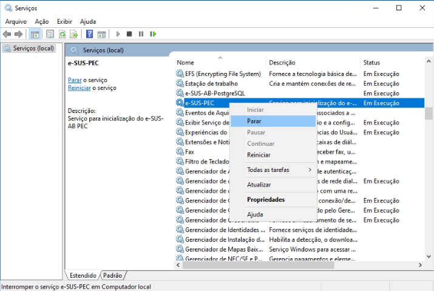
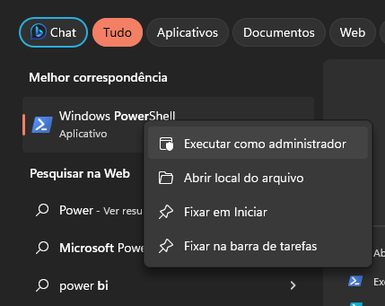
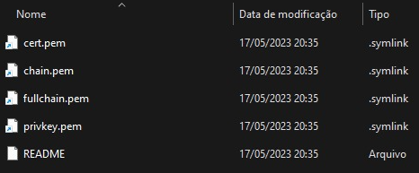
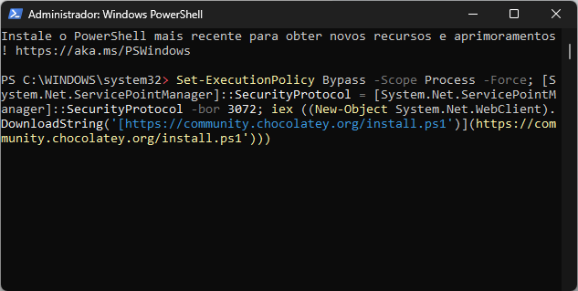

# Como incluir um certificado SSL (HTTPS) no e-SUS APS [WINDOWS]:
{: .no_toc }

Um certificado SSL é um certificado digital que autentica a identidade de um site e permite uma conexão criptografada. SSL significa Secure Sockets Layer, um protocolo de segurança que cria um link criptografado entre um servidor web e um navegador web.

Neste artigo, apresentaremos o passo-a-passo para inclusão de um certificado SSL no e-SUS APS (no Windows) e garantir ainda mais segurança no acesso à sua instalação. É válido ressaltar que o Let's Encrypt não emite certificados para endereços IP simples, apenas nomes de domínio. Para estes casos, você precisará registrar um nome de domínio para obter um certificado Let's Encrypt ou encontrar alguma outra certificadora que emita para endereços de IP simples.

É válido ressaltar que os passos abaixo de geração de certificado através do Let's Encrypt são apenas sugestões, neste caso, você poderá utilizar a certificadora que desejar para geração.

Neste caso, para que possamos gerar um certificado SSL através do próprio Let's Encrypt, precisamos nos atentar quanto:

- Necessidade de um DOMÍNIO, exemplo: www.municipio.esus.gov.br;
- Necessidade de um sistema operacional Windows 10, Windows Server 2019 (versão 1709) ou superiores;
- Liberação das portas 80 e 443;

Caso você já possua uma certificadora, passe para a etapa de "Parametrizando no PEC" deste artigo.

# Gerando um certificado SSL

  Caso ainda não possua um certificado SSL, mostraremos como obtê-lo usando o Certbot do Let's Encrypt, uma Autoridade Certificadora gratuita, automatizada e aberta, que fornece certificados digitais necessários para habilitar HTTPS em websites. O processo abaixo é destinado para instalações WINDOWS, porém, você poderá seguir o artigo Como incluir um certificado SSL (HTTPS) no e-SUS APS [LINUX] para instalações do tipo LINUX.

Caso já possua um certificado SSL, basta pular esta seção e ir para "Instalando o certificado SSL".

Como o PEC vem configurado para o protocolo HTTP na porta 8080 por padrão e o Certbot precisa que o servidor esteja rodando na porta 80 para funcionar, será necessário alterar essa configuração do e-SUS APS. Em PASTA_DE_INSTALACAO_eSUS/webserver/config, modifique o arquivo application.properties para adicionar a seguinte linha:

**server.port=80**

Após a inclusão, é necessário que o serviço do e-SUS APS seja reiniciado:

Você precisará dos seguintes pré-requisitos:

- Computador com Windows 10 ou superior instalado;
- e-SUS APS PEC rodando na porta 80, conforme informado anteriormente;
- e-SUS APS PEC com um domínio parametrizado, exemplo: esus.municipio.gov.br;

# Instalando o CertBot

 O primeiro passo é instalar o CertBot no Windows, que faremos através do próprio GitHub do CertBot. 

1. Você poderá fazer o download acessando esse link ou clicando na imagem abaixo:

2. Execute o instalador baixado, clique em NEXT, selecione o diretório de instalação e prossiga até finalizar;

3. Após a instalação do CertBot, pare o serviço do e-SUS APS PEC acessando a parte de "serviços" do Windows:

4. Abra o PowerShell do Windows em modo Administrador:

5. No console do PowerShell, você digitará a seguinte informação:

**certbot certonly --standalone**

- Após a execução, ele solicitará para que você coloque um e-mail que será o responsável pela parametrização.
- Será solicitado o aceite dos termos do Certbot, bastando pressionar "Y" para yes;

6. Após as parametrizações acima, ele questionará qual o nome do seu domínio, exemplo: "esus.bridge.ufsc.br";

7. Após a inserção do domínio, caso dê sucesso, aparecerá a seguinte mensagem:

- Qualquer tipo de problema identificado nessa parte, verifique as portas de conexão do seu servidor (80, 8080, 8443, 443);

8. Ele gerará 4 arquivos no diretório abaixo:

**C:\certbot\live\dominio\**

9. Ainda no PowerShell, execute o comando abaixo:

**Get-ExecutionPolicy**

- Caso apareça "RESTRICTED", você deveria rodar o seguinte comando:

**Set-ExecutionPolicy AllSigned**

10. Após os comandos acima, instale o "chocolatey" através do seguinte comando:

**Set-ExecutionPolicy Bypass -Scope Process -Force; [System.Net.ServicePointManager]::SecurityProtocol = [System.Net.ServicePointManager]::SecurityProtocol -bor 3072; iex ((New-Object System.Net.WebClient).DownloadString('https://community.chocolatey.org/install.ps1'))**

11. Instalado o "chocolatey", instalaremos o openssl através do seguinte comando:

**choco install openssl**

12. Depois de finalizar a instalação do openssl, você deverá fechar o PowerShell e abrir novamente em modo Administrador.

13. Navegue, pelas linhas de comando, até a pasta que seus arquivos .pem estão, neste caso, podendo utilizar o seguinte comando:

**cd C:\Certbot\live\SEUDOMINIO**

- Lembre-se de trocar a última pasta para aquela de seu domínio;

14. Já dentro da pasta, você digitará o comando para gerar a sua keystore através dos arquivos .pem:

**openssl**

15. Após digitar, aparecerá a informação de "OpenSSL >". Insira então a seguinte linha:

**pkcs12 -export -in fullchain.pem -inkey privkey.pem -out esusaps.p12 -name esus -CAfile chain.pem -caname esus**

16. Insira uma senha, anote-a que você utilizará posteriormente.

17. O certificado .p12 será criado na mesma pasta do Certbot. Copie o arquivo .p12 e coloque na pasta "config" do e-SUS APS PEC.

18. Após inserir o arquivo na pasta config, abra o arquivo application.properties novamente para parametrizarmos no PEC.

## Parametrizando no PEC

 Uma vez que você já possui o arquivo .p12 armazenado em uma keystore, agora, é necessário fazer com que o e-SUS APS utilize o certificado salvo na keystore. Em C:\Program Files\e-SUS\webserver\config\, modifique o arquivo application.properties, copiando as seguintes propriedades para o final do arquivo:

 

 É válido lembrar que você deverá colocar a SENHA parametrizada no passo 14 do openssl. Lembre de alterar também a porta do servidor que parametrizamos no início, de 80 para 443:

 

 O significado de cada propriedade pode ser observado a seguir:

- server.port: A porta que representa o protocolo HTTPS; utiliza-se como padrão a porta 443. Também é possível utilizar a porta 8443 (para sinalizar desenvolvimento ou homologação).

- server.ssl.key-store-type: Indica o tipo de Key Store. Caso o tipo seja .p12 (como neste tutorial), é necessário manter esta propriedade e após o = indicar que é PKCS12. Mas, se o tipo for JKS, essa propriedade pode ser omitida.

- server.ssl.key-store: Este é o caminho relativo ao .jar da aplicação (pec-bundle.jar) de onde se encontra a Key Store. Por exemplo, se a Key Store estiver dentro da pasta config como sugerido nos últimos passos, utilizar: server.ssl.key-store=config/esusaps.p12

- server.ssl.key-store-password: Senha indicada no momento da criação da Key Store.

- server.ssl.key-alias: "Apelido" indicado no momento da criação da Key Store.

- security.require-ssl: Propriedade que indica ao Spring se desejamos fazer uso do protocolo SSL.

 Após incluir essas propriedades no arquivo e salvá-lo, **é necessário reiniciar o serviço do servidor.** Pronto, o certificado SSL já deve ter sido incluído na sua instalação do e-SUS APS! Para confirmar que o processo funcionou, acesse a URL da instalação em seu navegador e procure pelo ícone de cadeado na barra de endereço.

