<head>
    <style>
        p{text-align:justify};
    </style>
</head>

# Habilitação do login GOV.BR no PEC e-SUS APS 

{: .nota }
Saiba mais sobre o que é o acesso GOV.BR: [LINK](https://www.gov.br/governodigital/pt-br/identidade/conta-gov-br)


Neste tutorial, explicaremos os passos necessários para habilitação da autenticação via login único GOV.BR no PEC e-SUS APS, que possibilitará a retomada da sincronização do PEC com os servidores do CADSUS (PIX/PDQ), possibilitando assim novas funcionalidades no módulo Cidadão, sendo elas: 

- Cadastrar cidadãos na base local por busca direta na base nacional do CADSUS, evitando retrabalho de digitação de informações e duplicações de cadastro; 

- Ao editar dados cadastrais de um cidadão no PEC e-SUS APS, edita-se também estes dados diretamente no CADSUS, como por exemplo, telefone de contato e endereço; 

- Gerar novo CNS válido diretamente pelo PEC e-SUS APS, como por exemplo para recém-nascidos, sem a necessidade de entrar no CADSUS para esta ação; 

- Durante a edição de um cadastro, será possível sincronizar o cadastro da base local com a base nacional do CADSUS para correção de dados digitados de maneira equivocada antes da integração com o login GOV.BR, como por exemplo, nome e data de nascimento. 

{: .atencao }
Antes de iniciar as etapas deste tutorial, vale destacar que para habilitação da autenticação via login único GOV.BR no PEC e-SUS APS, são obrigatórias duas habilitações anteriores. Verifique se já foram cumpridos os seguintes requisitos na sua Instalação do PEC e-SUS APS: 

**1º - Habilitação do certificado digital do e-Gestor AB com a opção CADSUS ativa**

Tutorial desta habilitação: [LINK](https://saps-ms.github.io/Manual-eSUS_APS/docs/Apoio%20a%20Implanta%C3%A7%C3%A3o/Certificado_eGestor/)

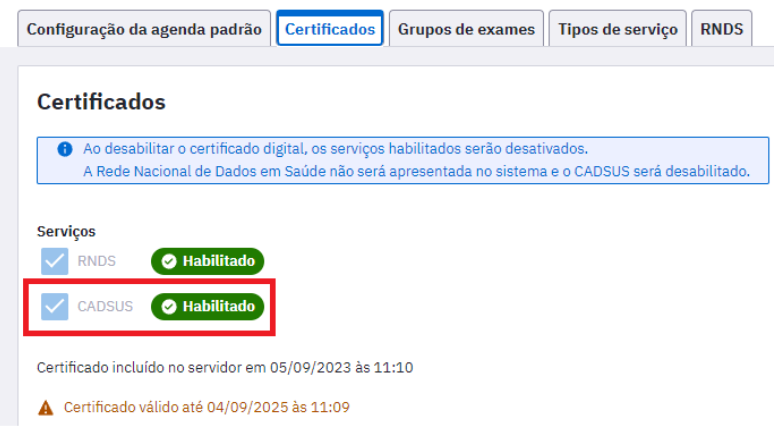

**2º - Acesso ao PEC e-SUS APS por endereço de domínio via protocolo HTTPS**

Tutorial desta habilitação: Servidores WINDOWS: [LINK](https://saps-ms.github.io/Manual-eSUS_APS/docs/Apoio%20a%20Implanta%C3%A7%C3%A3o/Certificado_Https_Windows/) / Servidores LINUX: [LINK](https://saps-ms.github.io/Manual-eSUS_APS/docs/Apoio%20a%20Implanta%C3%A7%C3%A3o/Certificado_Https_Linux/)

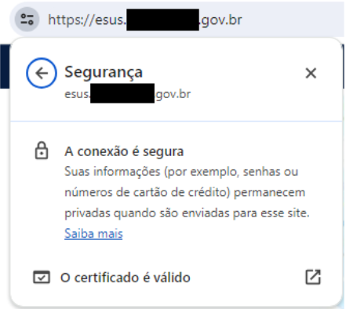

{: .atencao }
Conforme orientações da **Secretaria de Governo Digital (SGD)**, as integrações ao Login GOV.BR possuem como pré-requisito que o sistema a ser integrado deve estar hospedado em um domínio GOV.BR. Desta forma, apenas solicitações de integração que atendam essa premissa receberão chaves de produção para conclusão da integração.

## Etapa 1 - Adesão à Rede Nacional de Governo Digital 

{: .nota }
Saiba o que é a Rede Nacional de Governo Digital: [LINK](https://www.gov.br/governodigital/pt-br/estrategias-e-governanca-digital/rede-nacional-de-governo-digital) 

Inicialmente, verifique se seu município já realizou adesão à Rede Nacional de Governo Digital aqui: [LINK](https://www.gov.br/governodigital/pt-br/estrategias-e-governanca-digital/rede-nacional-de-governo-digital/adesoes-a-rede-nacional-de-governo-digital) 

> Observação: todos os estados já realizaram esta adesão. 

Se seu município já está com a adesão realizada, pule para a próxima etapa deste tutorial: **Etapa 2 - Solicitação da credencial de login único e habilitação do login gov.br no PEC e-SUS APS**. 

Para municípios que não se encontram listados, é necessário que o Prefeito(a) Municipal, como autoridade máxima do Poder Executivo municipal, com seu login GOV.BR, realize esta adesão conforme manual a seguir:

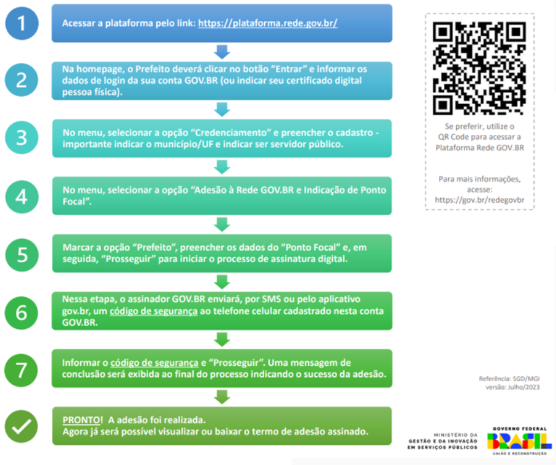

{: .nota }
- No passo 5, o “Ponto Focal” deverá ser um agente público municipal (preferencialmente um servidor público ou cargo comissionado) que atue na gestão da temática de Transformação Digital no município. Este agente público será o ponto de contato entre a Rede Nacional de Governo Digital e o município em caso de contatos futuros. 
- No passo 6, caso haja dificuldade no processo de assinatura digital do termo, veja este tutorial: [LINK](https://bit.ly/AssinaturaDigitalGov). Destacamos que só poderão assinar os usuários com nível de conta GOV.BR prata ou ouro. Para subir o nível da sua conta, veja este tutorial: [LINK](https://bit.ly/44satdh).

Com a adesão realizada, já é possível iniciar imediatamente a realização da próxima etapa. 

## Etapa 2 - Solicitação da credencial de login único e habilitação do login gov.br no PEC e-SUS APS 

Destacamos que todos os passos dos formulários a seguir deverão ser realizadas por um agente público municipal (preferencialmente um servidor público ou cargo comissionado) que atue na gestão da temática de Saúde Digital no município, de preferência a Referência Técnica responsável pela habilitação do login GOV.BR no PEC e-SUS APS. 

### 1ª PARTE

1º Passo: entre no site de solicitação do Serviço de Integração aos Produtos de Identidade Digital GOV.BR: **https://www.gov.br/governodigital/integrarprodutoid** 

2º Passo: clique no botão “Iniciar”; 

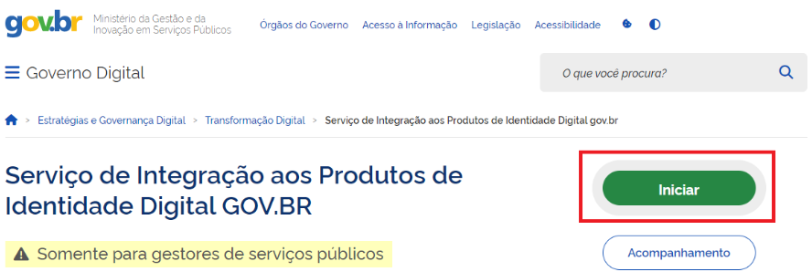

3º Passo: faça login com a conta GOV.BR do agente público municipal (preferencialmente um servidor público ou cargo comissionado) que atue na gestão da temática de Saúde Digital no município, de preferência a Referência Técnica responsável pela habilitação do login GOV.BR no PEC e-SUS APS; 

4º Passo: preencha os dados do solicitante e da Secretaria Municipal/Estadual de Saúde em “Dados do Órgão e do Solicitante”; 


> Observação: no campo ”CNPJ do órgão/entidade pública”, deve-se utilizar preferencialmente o CNPJ do município ou do Estado.

5º Passo: preencha dos dados do Responsável Negocial e do Responsável Técnico em “Dados Funcionais”;


> Observações:
- Marque a opção ”Responsável Negocial” se o processo está sendo realizado por um agente público municipal que não seja o Responsável Técnico pela habilitação ou marque a opção “Responsável Técnico” se o processo está sendo realizado pela Referência Técnica responsável pela habilitação; 
- Os números de “matrícula de ligação à administração pública” podem ser adquiridos, geralmente, pelos portais de transparência dos municípios/estados na sessão de servidores ou via contato direto com o setor de Recursos Humanos/Departamento Pessoal da administração local.

6º Passo: preencha o “Questionário” conforme imagem abaixo: 


7º Passo: em “Produto(s) de Identidade Digital de interesse”, preencha conforme imagem abaixo: 


8º Passo: em sequência, preencha os dados a seguir e clique em “adicionar dados na tabela”: 


9º Passo: preencha os campos abaixo conforme indicação: 


> Observações: 
- Em “Lista de IPs dos servidores”, digite o IP público da instalação do e-SUS APS 
- Em “Justificativa de acesso” digite por exemplo: “De acordo com sua categoria profissional, os usuários do e-SUS APS tem acesso a dados pessoais/sensíveis dos cidadãos cadastrados.” 
- Em “Volumetria anual estimada de usuários”, selecione a opção que mais se adeque a sua realidade, estimando a quantidade anual de acessos no sistema pelo login GOV.BR 
- Em Sazonalidade, pode-se preencher “N/A” ou o maior período de acesso ao e-SUS APS pelo login gov.br, como por exemplo “Segunda a sexta-feira, das 7 às 9h e das 13 às 15h.” 

10º Passo: preencha os campos abaixo conforme indicação: 


> Observações:

- Em “Chave Pública PGP do Responsável Técnico”, siga este tutorial ([LINK](https://acesso.gov.br/roteiro-tecnico/chavepgp.html#como-criar-um-par-de-chaves-pgp)) na primeira parte “Como criar um par de chaves PGP”, gere a chave com os dados do Responsável Técnico e anexe o arquivo *.asc neste campo. 

- Em “URL”(s) do retorno Homologação”, digite a seguinte informação, substituindo “SEU-DOMINIO” pelo domínio de acesso à sua Instalação do e-SUS APS, exemplo: 
```
https://SEU-DOMINIO/oauth2/authorization/govbr
```

- Em “URL única para página inicial do sistema Homologação”, digite o domínio de acesso à sua Instalação do e-SUS APS, substituindo “SEU-DOMINIO” pelo domínio de acesso à sua Instalação do e-SUS APS exemplo:
```
https://SEU-DOMINIO
```

- Em “URL(s) de Log Out (Homologação), digite seu domínio de acesso à sua Instalação do e-SUS APS com /logout ao fim, substituindo “SEU-DOMINIO” pelo domínio de acesso à sua Instalação do e-SUS APS exemplo: 
```
https://SEU-DOMINIO/logout
```

- Nas três datas previstas ao fim da imagem, estime o tempo da disponibilização do login gov.br para os profissionais que acessar a sua instalação do e-SUS APS, exemplo:  **Início do desenvolvimento**: data atual do preenchimento do formulário / **Homologação**: 10 dias após o preenchimento do formulário / **Disponibilização para a sociedade**: 20 dias após o preenchimento do formulário

11º Passo: aceite os termos e clique em “Enviar solicitação”, aguardando o prazo de até 10 dias úteis para retorno deste primeiro formulário, onde seu processo ficará com o status “(3) Análise/Aprovação”: 

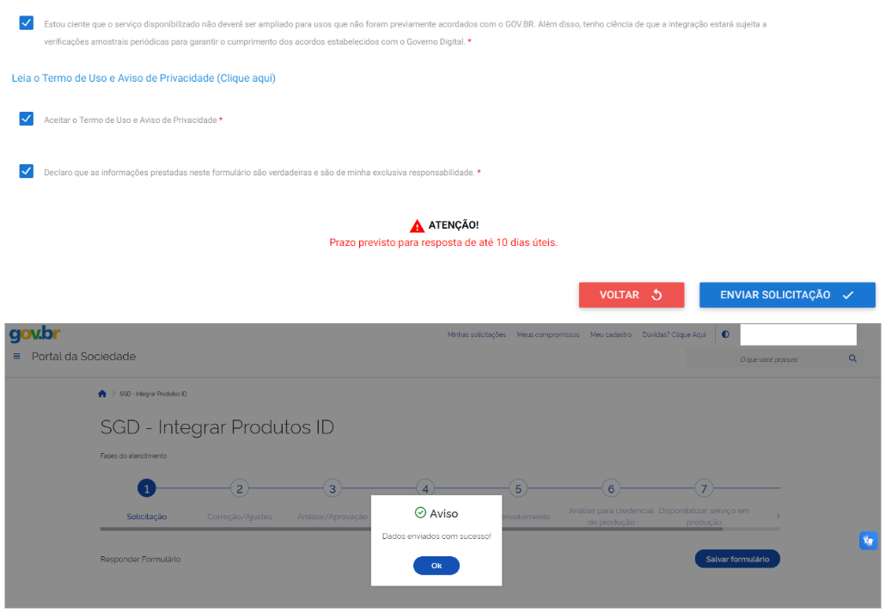

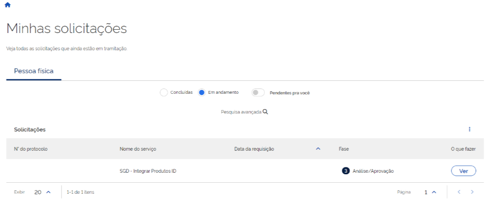

### 2ª PARTE

12º Passo: após conclusão do passo anterior, recomendamos que seja verificado nos próximos dias (pois o processo pode não demorar até 10 dias úteis) se o status do processo foi alterado. Para isso, entre no site de solicitação do Serviço de Integração aos Produtos de Identidade Digital GOV.BR: **https://www.gov.br/governodigital/integrarprodutoid**

13º Passo: clique no botão “Acompanhamento”; 

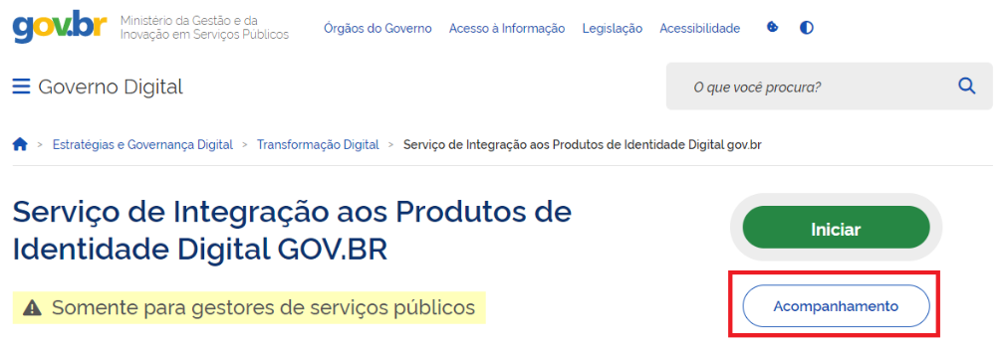

14º Passo: faça login com a mesma conta GOV.BR que o processo foi iniciado;

15º Passo: se houve alteração do status “(3) Análise/Aprovação” para outro, conforme imagem abaixo, clique em “Responder” para dar andamento no processo. Caso o status não se alterou, favor aguardar e continuar verificando dentro dos 10 dias úteis: 

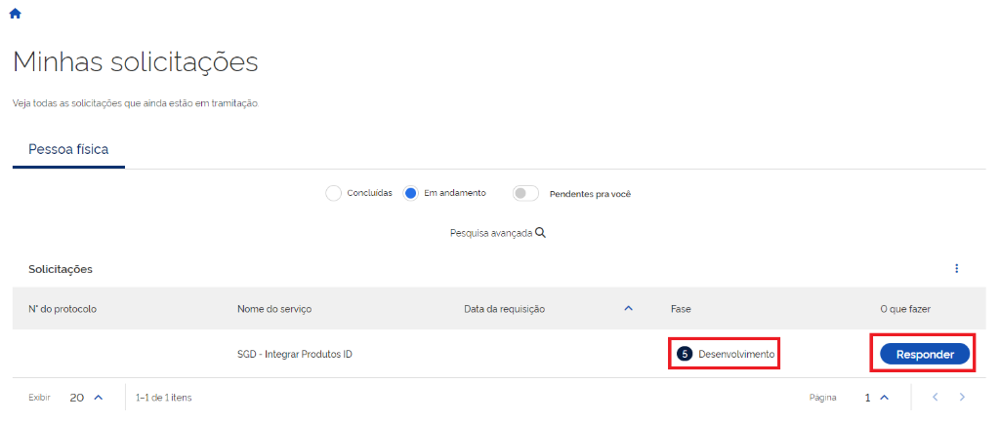

16º Passo: desça a página e procure pela sessão “Análise do Produto Homologação”:


17º Passo: em "considerações", copie o “client_id” e “secret” informados: 


18º Passo: no servidor da sua Instalação do e-SUS APS, vá no diretório indicado e edite o arquivo “application.properties”: 

- Servidor WINDOWS: C:\Program Files\e-SUS\webserver\config\

- Servidor LINUX: /opt/e-SUS/webserver/config/ 

19º Passo: adicione as seguintes linhas ao fim do arquivo e salve as alterações: 

```
bridge.security.oauth2.client.registration.govbr.client-id=SEU-CLIENT_ID 
bridge.security.oauth2.client.registration.govbr.client-secret=SEU-SECRET
```

> Observação: substituir onde há “SEU-CLIENT_ID” e “SEU-SECRET” pelas informações obtidas no 17º Passo. 

Exemplo:


20º Passo: reinicie o serviço da aplicação do e-SUS APS no servidor: 

- Servidor WINDOWS: no menu Iniciar, procure por “Serviços”, abra o sistema, procure pelo serviço “e-SUS-PEC", clique com o botão direito e vá em “Reiniciar”:

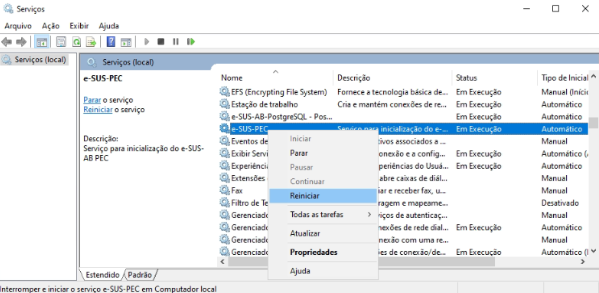

- Servidor LINUX: digite no console o comando: 

```
sudo systemctl restart e-SUS-PEC 
```

21º Passo: após reinicialização do serviço, abra sua Instalação do e-SUS APS em um navegador para observar que o botão do login GOV.BR já estará disponível:

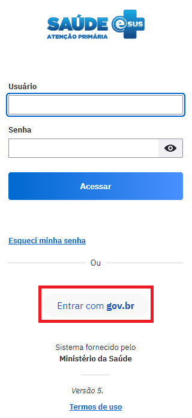 

22º Passo: clique com o botão direito no botão “Entrar com gov.br” e selecione “Copiar endereço do link”:

 

23º Passo: volte ao formulário de solicitação do login GOV.BR e procure pelos seguintes campos: 

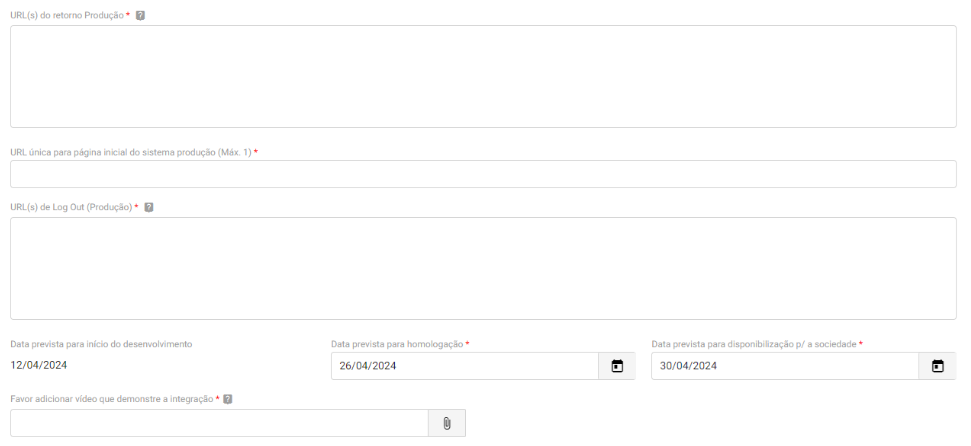

> Observações: 

- Em “URL(s) do retorno Produção” cole o endereço que você copiou no passo anterior, exemplo:
```
https://SEU-DOMINIO/oauth2/authorization/govbr
```

- Em “URL única para página inicial do sistema produção” digite o domínio de acesso da sua instalação do e-SUS APS, substituindo “SEU-DOMINIO” pelo domínio de acesso à sua Instalação do e-SUS APS, exemplo:
```
https://SEU-DOMINIO
```

- Em “URL(s) de Log Out (Produção)” digite seu domínio de acesso à sua Instalação do e-SUS APS com /logout ao fim, substituindo “SEU-DOMINIO” pelo domínio de acesso à sua Instalação do e-SUS APS exemplo:
```
https://SEU-DOMINIO/logout
```

- Caso necessário, altere as datas possíveis 

- Anexe um vídeo que demonstre a integração do login GOV.BR à sua Instalação do e-SUS APS seguindo as seguintes instruções:
```
(1) Abra sua Instalação do e-SUS APS no navegador
(2) Clique no botão “Entrar com gov.br”
(3) Faça login no sistema através da conta de qualquer usuário que tenha conta gov.br e acesso ao sistema
(4) Faça logout do sistema (sair da conta de usuário)
```

24º Passo: procure a sessão “Produto(s) de Identidade Digital de interesse” e digite em “Nome do Sistema (Produção): e-SUS APS, conforme imagem abaixo: 


25º Passo: vá ao fim do formulário em “Enviar dados/Dúvidas” e selecione a opção abaixo: 

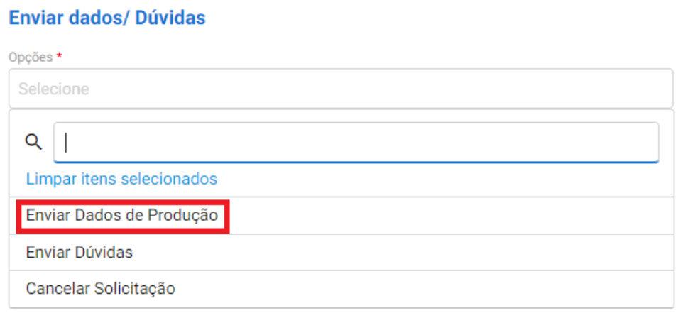

26º Passo: clique em “Enviar dados de produção” e a integração do login GOV.BR ao e-SUS APS foi concluída com sucesso!:


{: .atencao } 
- A opção de login gov.br funcionará paralelamente ao login convencional do sistema e-SUS APS, sendo possível acessar o sistema pelas duas opções. 

- Caso algum dado de produção foi preenchido de maneira equivocada, você receberá um retorno nos e-mails cadastrados no formulário para correção do problema. 

- Qualquer dúvida sobre este tutorial, abra um ticket em nosso canal de suporte do e-SUS APS: **https://esusaps.freshdesk.com** 

- Se seu processo de solicitação da credencial de login único do GOV.BR paralisou em alguma de suas etapas ou passou-se o prazo de 10 dias úteis e você não obteve retorno nem observou alteração de status no processo, entre em contato pelo seguinte e-mail: **integracaoid@economia.gov.br**, apresentando o número da sua solicitação e explicando detalhes do questionamento para a equipe responsável por este suporte. 

- Para dúvidas técnicas sobre o preenchimento de alguma etapa do formulário que nosso tutorial não contemplou, enviar para o seguinte e-mail: **integracao-acesso-govbr@economia.gov.br**

**FIM** 

1ª versão. Atualizado em 10 de maio de 2024.