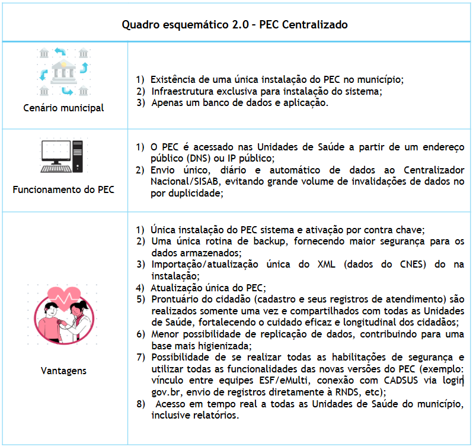
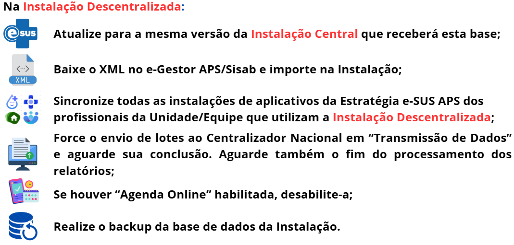
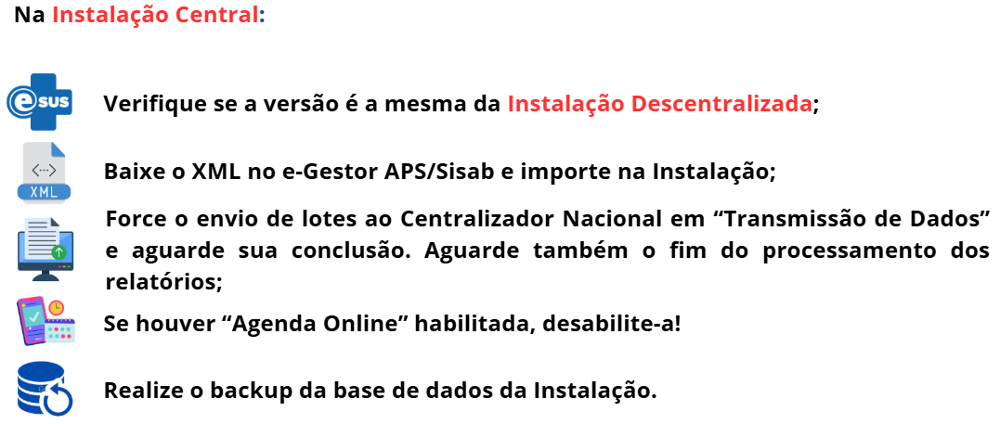
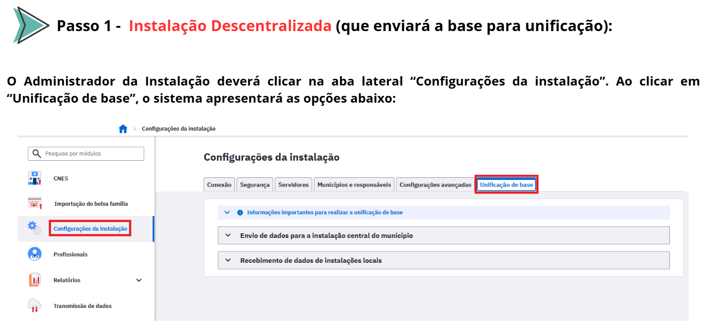
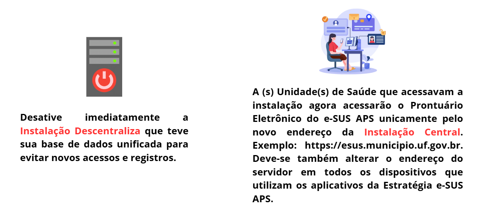
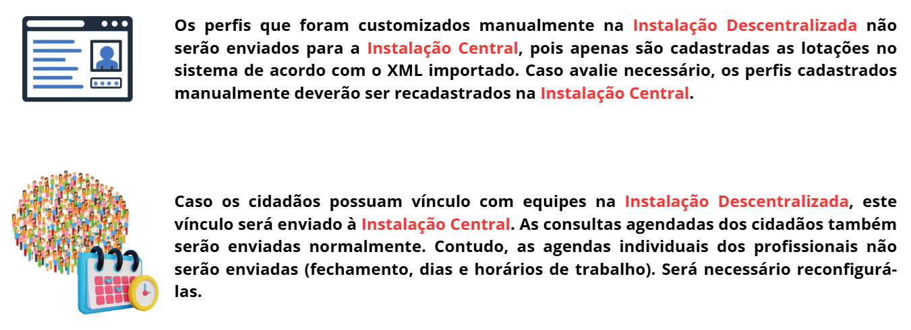
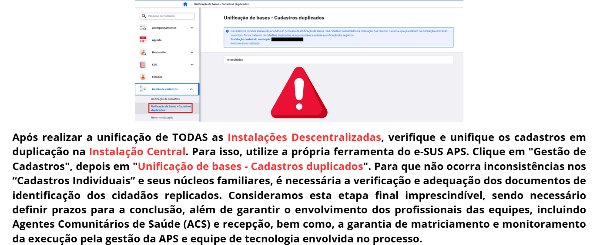

<head>
    
</head>

# **Unificação de Bases**

### 1. Introdução:

Considerando a necessidade de um cenário cada vez mais digital e interconectado para assegurar a qualidade e eficiência da Estratégia e-SUS APS, a Secretaria de Atenção Primária à Saúde (Saps) do Ministério da Saúde desenvolveu uma ferramenta inovadora que permite aos municípios ajustar suas conformações de cenários, assegurando o funcionamento a partir de uma única instalação do Prontuário Eletrônico do Cidadão (PEC e-SUS APS) em cada município.

Esta ferramenta consolida as bases descentralizadas do PEC (atualmente distribuídas entre diversas instalações locais em cada município) em uma estrutura única e centralizada. Esse avanço permite que todos os estabelecimentos de saúde integrem e implementem o conceito de Prontuário Eletrônico do Cidadão (PEC e-SUS APS) de forma unificada no âmbito municipal. 

Assim, independentemente de onde o cidadão receba atendimento, seu histórico clínico será acessível e completo, promovendo um cuidado contínuo e possibilitando decisões rápidas e precisas pela equipe de saúde que conduzirá o seu acompanhamento. 

### 2. Modalidades de instalação do PEC e-SUS APS (conceitos):

O Prontuário Eletrônico do Cidadão (PEC), poderá ser utilizado no município de duas formas: **PEC Centralizado** (instalação única) ou **PEC Descentralizado** (diversas instalações).

#### 2.1 PEC Descentralizado:

Na modalidade descentralizada, cada Unidade de Saúde possui o seu próprio Prontuário Eletrônico (PEC), NÃO compartilha dados no município e as informações ficam disponíveis apenas em cada Unidade de Saúde.

**Cenário com bases de dados descentralizadas:**

#### 2.2 PEC Centralizado:

Ao contrário da modalidade descentralizada, na arquitetura centralizada, uma única
instalação do PEC e-SUS APS é externa e compartilhada, podendo várias Unidades de Saúde terem acesso simultâneo e em tempo real a aplicação, para todos os registros do cidadão.

#### 2.3 Proposta de Cenário após unificação das bases:

Após a unificação das bases de dados, todas as Unidades de Saúde acessarão uma única
base de dados no município, com prontuário compartilhado: (Figura 2.0)

### 3. Quando NÃO utilizar uma Instalação Centralizada do e-SUS APS:

É importante ressaltar que apesar dos vários benefícios e vantagens da adoção do
Prontuário Eletrônico do Cidadão (PEC) na modalidade Centralizada, o seu uso em alguns
cenários, não é recomendado. Por exemplo:

▪ Ausência de infraestrutura adequada para garantir a eficiência do uso do PEC em todas as Unidades de Saúde;

▪ Ausência de equipe de TI com habilidades específicas para atender às demandas da
Estratégia e-SUS APS e garantir a eficácia da implementação e manutenção do sistema;

▪ Instabilidade na conexão de internet no município;

▪ A rede elétrica municipal apresenta quedas constantes;

▪ Ambientes que não tenham rotinas de backup automatizado implementadas;

▪ Locais com ausência de Política de Segurança da Informação (PSI).

Portanto, considere todas as situações acima, antes de efetivamente iniciar um
processo de unificação de bases para criação de uma estrutura centralizada do Prontuário Eletrônico do Cidadão (PEC).

### 4. Desejo unificar as bases de dados do meu município, o que fazer?

Os benefícios da unificação de bases são significativos para uma Atenção Primária mais digital e bem qualificada, no entanto, é crucial um planejamento assertivo para garantir a disponibilidade contínua do cenário e consistência dos dados.

Após a unificação das bases, qualquer reversão para o cenário anterior (descentralizado) exigirá uma infraestrutura descentralizada em cada Instalação do PEC, com requisitos computacionais robustos para suportar o volume total de dados resultantes dessa unificação.

{: .atencao }
- Considerando as boas práticas da Lei Geral de Proteção de Dados (LGPD/ Lei n° 13.709/2018), é importante salientar que a unificação de bases de dados é um processo crítico e envolve a manipulação de dados de diversos cidadãos, Unidades de Saúde e/ou municípios (Instalações Multimunicipais). É muito relevante considerar as melhores práticas de segurança da informação (PSI), com vistas a manutenção do sigilo e confidencialidade dos dados, para que se evite o vazamento de dados pessoais e sensíveis;
- Recomenda-se que, na Instalação Descentralizada, todas as doses de vacina com inconsistências identificadas no Relatório do SISAB de Vacinas Registradas no e-SUS APS sejam excluídas ou corrigidas antes de iniciar o processo de unificação das bases. Caso essa etapa não seja realizada, não será possível excluir doses registradas de origem PEC na Instalação Central, pois, a exclusão deve ocorrer na mesma instalação onde a dose foi registrada. No entanto, para doses de origem CDS, não há impedimentos para exclusão ou retificação após a unificação, podendo ser feito o processo via Vacinação do módulo CDS.

## 4.1 Prodecimentos a serem realizados antes do processo de Unificação de Bases

### 5. Etapas de Unificação de bases de dados no e-SUS PEC:

**Considerações importantes:**

Destaca-se que o processo de unificação de bases de dados foi desenvolvido para operar de forma remota, onde uma Instalação do PEC (Instalação
descentralizada que será unificada) remete dados para outra Instalação do PEC (Instalação Central que receberá os dados) a partir de um link de internet! Durante o processo de unificação, caso haja queda no link de internet ou interrupção de energia, o processo de unificação será interrompido e o processo deverá ser reiniciado, restaurando-se os backups da Instalação Descentralizada e da Instalação Central que foram realizados antes de iniciar o processo de unificação, para assim realizar uma nova tentativa.

Sempre que possível, considere preparar um ambiente na rede local da Instalação Central, com uma “instalação alternativa do PEC” para receber o backup das Instalações Descentralizadas, um por vez, e realizar a unificação dentro da mesma infraestrutura; tal ação permitirá maior agilidade, segurança e rapidez no processo de unificação das bases de dados e evitará transtornos advindos de quaisquer interrupções.

Também é altamente recomendado que o processo de unificação de bases seja realizado fora do horário de expediente das Unidades de Saúde ou, que no momento da unificação, nenhum profissional tenha acesso tanto à Instalação Central quanto à Instalação Descentralizada.

{: .atencao }
Não orientamos realizar o processo diretamente em ambiente de PRODUÇÃO! Considere realizá-lo sempre em HOMOLOGAÇÃO e, uma vez bem-sucedido, valide o êxito da unificação e, na sequência, realizar todo o processo em ambiente de PRODUÇÃO. 

**5.1 Fluxo Homologação e Produção no processo de Unificação de Bases (sugestão)**

Fonte: SAPS / UFMG (Educa e-SUS APS)

**5.2 Processo de Unificação de Bases no PEC**

{: .atencao }
Em caso de erro no processo, NÃO tente realizar nova tentativa. Abra um chamado no Canal de Suporte do e-SUS APS, enviando os arquivos “pec.log”, encontrado nos diretórios “e-SUS\webserver\logs” e o backup das duas instalações (Instalação Central e Instalação Descentralizada). Aguarde o retorno do chamado para a resolução do erro. Nesse ínterim, restaure nas Instalações os backups realizados antes de se iniciar todo o processo, evitando-se assim qualquer situação de inconsistência dos dados e inacessibilidade das Instalações.

Após realizada a unificação com sucesso, valide o êxito do processo e repasse o novo link de acesso da Instalação Central do PEC aos profissionais de saúde da(s) Unidade(s) que teve(tiveram) a(s) sua(s) base(s) unificada(s)!

Vale ressaltar que todos os profissionais que acessavam a Instalação Descentralizada terão suas senhas resetadas.

{: .dica }
Se a Instalação Central tem o serviço de SMTP ativado e os profissionais tem seus e-mails cadastrados corretamente no CNES municipal ou no Prontuário Eletrônico do e-SUS APS, basta que eles utilizem a opção “Esqueci minha senha” na tela de login para recuperar o acesso.

## 5.3 Processos a serem realizados após Unificações de Base
 

## Mais informações:

[**9º Webinário da série Atualiza e-SUS APS: Unificação de Bases de Dados**](https://www.youtube.com/watch?v=3iB9WMnq-i0)

**DOWNLOAD da apresentação técnica**: [LINK](downloads/apt_unifbases.pdf)

**FIM**

2ª versão. Atualizado em 26 de dezembro de 2024.