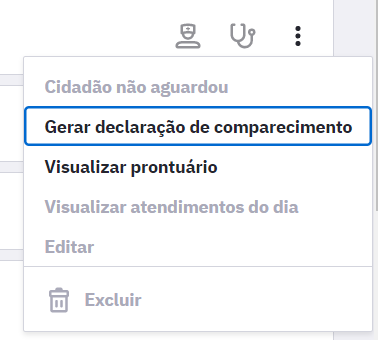
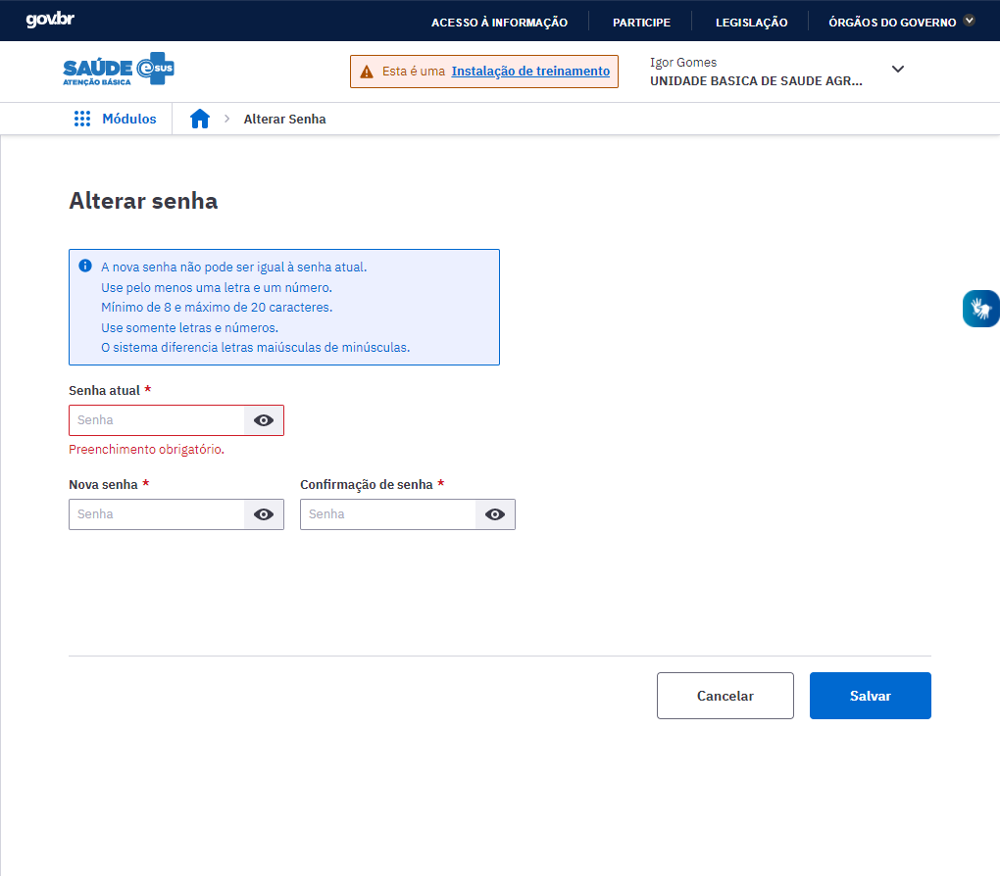
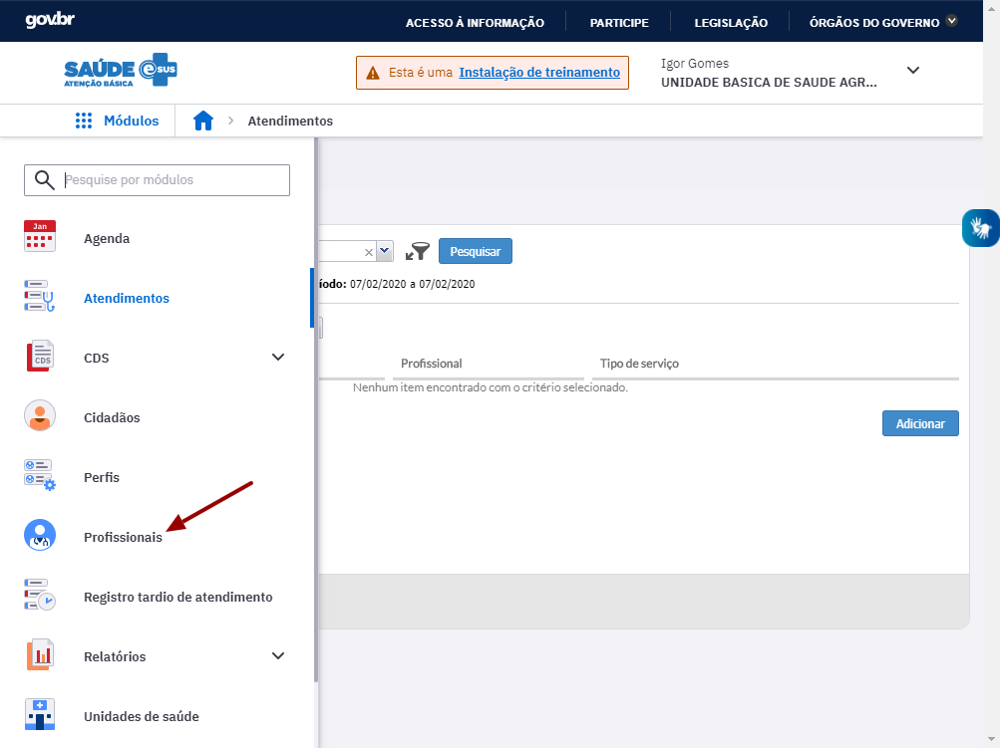
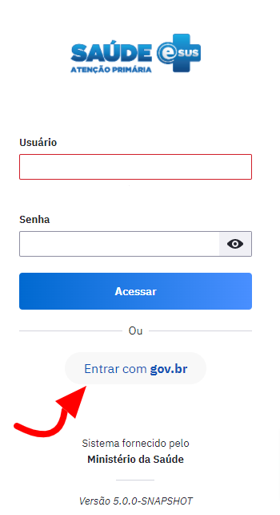
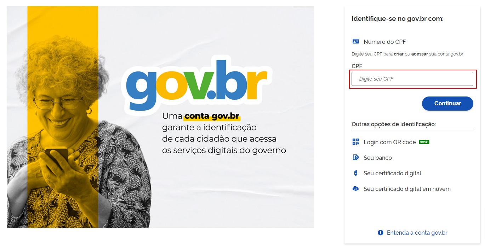
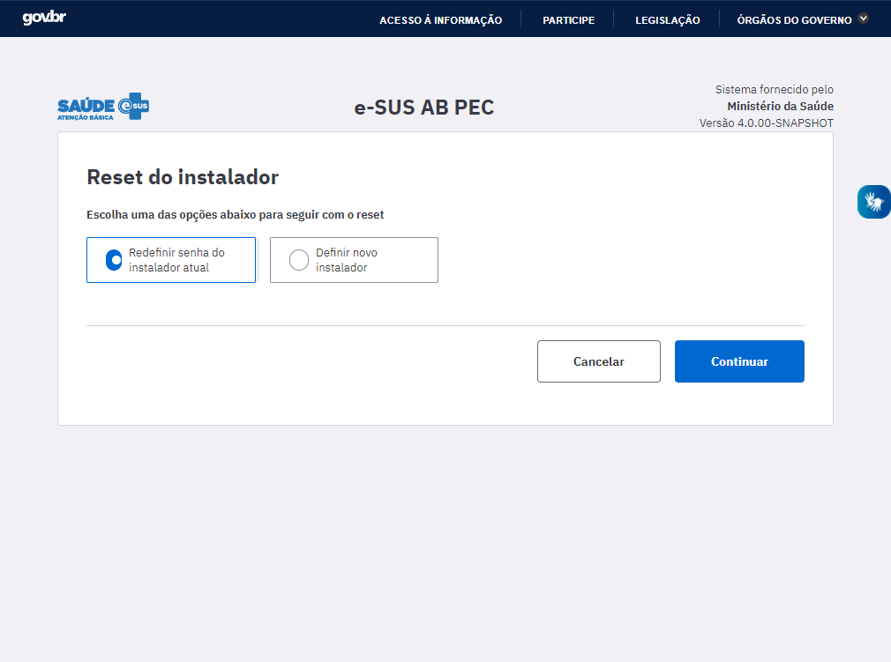
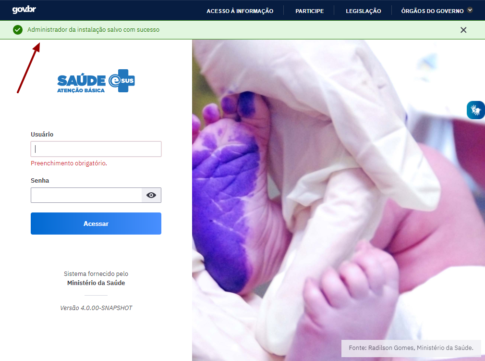
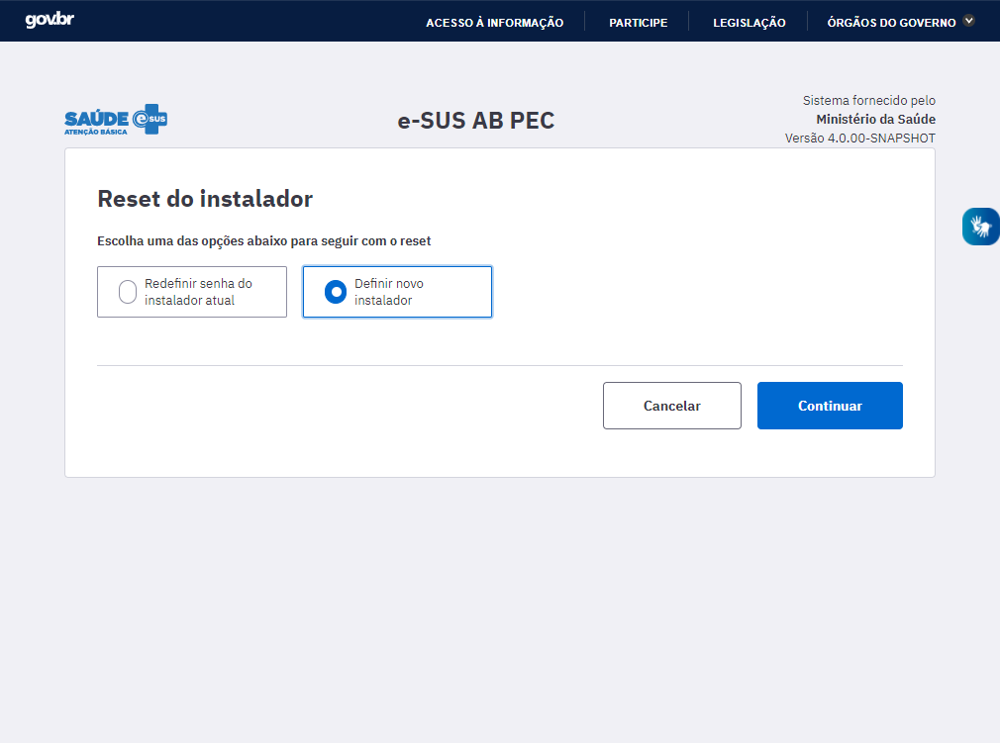

# CAPÍTULO 1 - Orientações Gerais sobre o Sistema
{: .no_toc }

Neste capítulo, abordaremos os conceitos e orientações iniciais para utilização do Sistema e-SUS APS com PEC.

## Sumário
{: .no_toc .text-delta }

- TOC
{:toc}

# 1.1 Versão do Sistema Usada neste Manual

Este manual foi elaborado usando como referência o Sistema com PEC em sua **versão 5.0**. O acesso às informações sobre o versionamento, versão de banco de dados, data de atualização e tipo de instalação (ver Capítulo 2) podem ser visualizados na opção "**Sobre**" (Figura 1.1), acessada no menu superior do sistema.

Figura 1.1 - Versão do Sistema com PEC

Fonte: SAPS/MS.

# 1.2 Organização e Componentes- Padrão do Sistema

Nesta seção, será apresentada a organização e o uso de componentes padrão encontrados em grande parte das funcionalidades do sistema.

## 1.2.1 Orientações Básicas de Navegação do Sistema

O Sistema e-SUS APS tenta aproveitar os melhores conceitos de aplicação em nuvens, buscando conciliar a organização de aplicações *desktop* com os recursos mais ágeis das aplicações *web*. A seguir, na Figura 1.2, serão apresentados alguns itens sobre navegação e organização das telas do sistema, detalhados no Quadro 1.1.

Figura 1.2 - Organização e navegação do sistema

Fonte: SAPS/MS.

Quadro 1.1 - Orientações básicas de navegação do sistema.

|Definições |Representação visual|
|--|--|
| **Navegação Estrutural** (na TI: *bread crumbs*): visualizada no canto superior esquerdo da tela, indica o caminho das telas visitadas, podendo voltar para a tela anterior.| |
| **Menu de Navegação Lateral:** possibilita ao usuário acesso mais rápido às principais funcionalidades disponíveis em  seu perfil.| |
| **Menu do usuário:** além de informar a identificação e Unidade Básica de Saúde (UBS) de lotação, possibilita ao usuário acesso mais rápido às funcionalidades gerais do sistema, tais como: Trocar acesso; Alterar senha; Links úteis; Novidades da versão; Sobre;  Termos de uso; Alterar módulo inicial; Sair.| |
| **Logo do Sistema:** clicando sobre a logo, o usuário acessa a página inicial do PEC. Se o usuário possuir mais de um perfil, serão exibidas as opções de acesso pelos perfis disponíveis (ver Figura 1.3).||

Fonte: SAPS/MS.

## 1.2.2 Orientações Básicas de Utilização do Sistema

No Quadro 1.2, são apresentadas algumas orientações gerais sobre os componentes padronizados no sistema.

Quadro 1.2 - Orientações básicas de utilização do sistema.

|Definições |Representação visual |
|-|-|
|**Campos obrigatórios**: são marcados com **\*** (asterisco) e devem ser obrigatoriamente preenchidos.| |
|**Campos obrigatórios não preenchidos:** ficam na cor vermelha.||
|**Campos quadrados:** (*checkbox*) são para a escolha de mais de uma opção.||
|**Campos em círculo** (*radio button*)**:** são de única escolha. **[ATENÇÃO]:** após selecionado, não será possível desvincular a escolha por uma das outras opções. Caso selecione por engano, será necessário cancelar o registro e reiniciar o processo.|  |
|**Data:** digite a data ou clique no símbolo no canto direito do campo, onde  aparecerá o calendário, com a  data atual selecionada. Para avançar/retroceder o  mês: clicar nas setas  ou ; Para avançar/retroceder o  ano: clicar sobre o mês  ou ano .||
|**Caixa de seleção:** ao digitar parte da palavra desejada, o sistema   automaticamente traz todos os registros que contêm a palavra, após selecione o item desejado.||
|**Orientação** (*hint)***:** ao passar o mouse sobre um campo/botão, o sistema mostrará breve descrição.| |
|**Paginação:** visualizada na  parte inferior da tela, indica   a quantidade de páginas:  · Para retroceder ou avançar:  clicar na seta   ou  , respectivamente; O número da página selecionada ficará em  destaque.| |
|**Opções de pesquisa:** acompanha todo campo de pesquisa quando este oferece  mais opção de consulta. |  |
|**Ocultar ações:** para melhor organização das ações exibidas em listagens. Algumas são ocultas quando excedam a três ações. E podem ser acessadas por meio do ícone .||
|**Ajuda de contexto:** Caso haja alguma dúvida o botão ajuda  localizado no canto superior direito traz mais informações sobre a funcionalidade. Ainda não disponível para todas as funcionalidades do sistema.| |

Fonte: SAPS/MS.

## 1.3 Controle de Acesso ao Sistema

O Sistema e-SUS APS controla o acesso dos usuários do PEC por meio de um identificador (***login***) e uma **senha de uso pessoal**, portanto, a entrada no sistema é pessoal e individual para cada usuário, conforme pode ser visualizado na Figura 1.3.

Figura 1.3 - Tela de acesso ao Sistema com PEC

Fonte: SAPS/MS

> **ATENÇÃO**: Cada profissional terá seu acesso, controle de permissões e controle de auditoria vinculado a seu login (CPF), devendo portanto, utilizar apenas seu login e senha pessoal para o uso do sistema.

A identificação para acesso (***login***) será controlada pelo próprio sistema, usando como padrão, o número do **CPF do profissional** cadastrado no PEC ou importado do sistema de Cadastro Nacional de Estabelecimentos de Saúde (CNES) (ver Seção 3.2). **O *login* é pessoal e intransferível**, pois busca garantir que os registros feitos no sistema sejam identificados pelo número do Cartão Nacional de Saúde (CNS) do profissional.

O controle da **senha** é pessoal e desde a **versão 4.0** foi reformulada para melhor atender a premissas de segurança e limitar o acesso não autorizado ao sistema! Para criação da senha, o gestor responsável deverá entrar na guia , localizar o profissional desejado informando o nome completo, CPF ou nº de CNS e clicar nos três pontos para redefinir a senha, conforme ilustração abaixo:

{: .nota }
A **senha padrão** para o primeiro acesso ao sistema mudou, NÃO sendo mais o nº do CNS e a palavra esus no final! Ex.: 210301884580006esus

Ao clicar em "Redefinir senha", o gestor poderá compartilhar o link ou QR CODE para que o próprio profisisonal possa cadastrá-la por conta própria:

Caso deseje, poderá cadastrar **senha provisória** e repassar ao profissonal para alterá-la no primeiro acesso:

Caso o usuário possua mais de um perfil serão exibidas as opções de acesso pelos perfis disponíveis.

Figura 1.4 - Tela de acesso aos perfis disponíveis ao usuário do sistema

Fonte: SAPS/MS

No primeiro acesso, após selecionar o perfil desejado, o sistema irá solicitar que o usuário escolha o módulo que deseja ver após acessar o sistema, como mostra a imagem a seguir:

Fonte: SAPS/MS

Para cada perfil será possível escolher o módulo inicial.

## 1.3.1 Como Criar/Alterar Sua Senha

Por padrão, o sistema vem configurado para o período de 6 meses para a redefinição da senha. Caso, o período da última atualização da sua senha seja superior a 6 meses, o sistema forçará o usuário a alterar a senha.

No entanto, a qualquer momento, é possível alterar a senha de acesso ao sistema, bastando clicar na opção "Alterar Senha" do **Menu do usuário**.

Fonte: SAPS/MS

Para proceder à alteração da senha, conforme a Figura 1.5, siga os passos:

1.**[digite a senha atual]:** informe a senha redefinida no primeiro acesso; 

2.**[digite a nova senha]:** defina a nova senha para uso pessoal, devendo ser diferente da senha anterior, conter somente letras e números (ao menos uma letra e um número), no mínimo de 08 (OITO) e máximo de 20 (VINTE) dígitos. Letras maiúsculas e minúsculas são diferenciadas. Esta será a senha utilizada a cada *login* no sistema, devendo ser mantida em sigilo;

3.**[confirme a nova senha]:** digite exatamente a mesma senha digitada no campo anterior.

Figura 1.5 - Tela para alterar/criar nova senha

Fonte: SAPS/MS

## 1.3.2 Esqueci Minha Senha, o que Faço?

O sistema possui um número máximo de tentativas consecutivas de login com autenticação inválida, por padrão, 10 (dez) tentativas é o número máximo, entretanto, o administrador do sistema poderá alterar essa quantidade. Ao atingir o número máximo o seu acesso estará bloqueado.

Quando o usuário, por qualquer motivo, esquecer a senha de acesso, deve solicitar ao administrador do sistema ou ao coordenador da UBS que a redefina. Ao redefiní-la, um link e QR CODE serão gerados para que o próprio profissional possa cadastrar nova senha e/ou o gestor responsável poderá fazê-lo de forma **provisória**, até que seja redefinida no primeiro acesso pelo profissional responsável. Para redefinir a senha, o administrador ou o coordenador devem executar os seguintes passos:

- Passo 1. Acessar o Módulo de Administração, clicando no botão "Administração";

Fonte: SAPS/MS

- Passo 2. Acessar a lista de profissionais, clicando no botão "Profissional";

- Passo 3. Na lista de profissionais, clique na opção "Redefinir senha"  do profissional desejado.

Fonte: SAPS/MS.

- Passo 4. Após clicar em "Redefinir Senha" será solicitada a confirmação da redefinição da **senha** para o número do **CNS** (senha padrão).

- Passo 5. Ao clicar no botão "Redefinir senha", o gestor poderá compartilhar o link ou QR CODE para que o próprio profisisonal possa cadastrá-la por conta própria:

Caso deseje, poderá cadastrar **senha provisória** e repassar ao profissonal para alterá-la no primeiro acesso:

Após a conclusão destes passos o usuário que teve a senha bloqueada deverá acessar o sistema utilizando a senha provisória repassada pelo gestor ou acessar o link ou QR CODE informados. No primeiro acesso o sistema solicitará ao usuário que troque a senha padrão por uma senha pessoal.

## 1.3.3 Autenticação via gov.br

{: .novidade }
A autenticação eletrônica via gov.br garente maior segurança da informação. A autenticação via gov.br utiliza o serviço de integração do Login Ùnico.

## 1.3.3.1 Como habilitar a autenticação via gov.br no PEC

**ADMINISTRADOR MUNICIPAL DO PEC**
Para habilitar a autenticação o município deve seguir o roteiro de integração de serviços ao Login Único do gov.br constante no [sitio eletônico do gov.br](https://manual-roteiro-integracao-login-unico.servicos.gov.br/pt/stable/solicitarconfiguracao.html).

Após seguir o passo a passo descrito no Manual de integração com o Login Único, o administrador municipal receberá um "ClientID" e ""ClientSecret". 

**ADMINISTRADOR DA INSTALAÇÃO**
De posse do "ClentID" e "ClientSecret" o adminstrador da instalação deve inserir os tokens no arquivo de configuração da instalação (application.properties). Nas váriaveis:

* "ClientID" deve ser inserido na váriavel "bridge.security.oauth2.client.registration.govbr.client-id";
* "ClientSecret" deve ser inserido na váriavel "bridge.security.oauth2.client.registration.govbr.client-secret".

{: .nota }
O botão de acesso por meio do gov.br na tela de login do PEC somente estará disponível após a inserção dos tokens no arquivo de configuração descrito acima. Alem disso, é necessário que os municípios utilizem o HTTPS nas instalações para que a comunicação com o gov.br aconteça.

Figura 1.6 - Tela de Login do PEC com o botão de acesso gov.br

Fonte: SAPS/MS

{: .atencao }
Caso a internet esteja desabilitada o botão do gov.br não será exibido

## 1.3.3.2 Fazendo login no PEC por meio do gov.br

Para realizar o acesso via gov.br basta clicar no botão indicado na figura acima e o profissional de saúde será redirecionado para o site do gov.br.

Figura 1.7 Tela de login do site gov.br

Fonte:SAPS/MS

{: .nota }
Para realizar o login via gov.br o usuário do sistema e-SUS APS com PEC deverá criar o seu acesso digitando o CPF. Para saber mais como criar a conta gov.br acesse esse [link](https://www.gov.br/governodigital/pt-br/conta-gov-br/conta-gov-br/)

Após criar o acesso ao gov.br basta digitar o CPF e senha na tela de login do site gov.br e o usuário do sistema será direcionado para o PEC.

{: .atencao }
Ao ser redirecionado para o PEC alguns cenários podem acontecer, tais como:
* Se o usuário não possui nenhuma lotação na instalação PEC que será usada, será exibido a seguinte mensagem: "Você não possui nenhum acesso habilitado. Entre em contato com o administrador do sistema para liberar o seu acesso.";
* Se o usuário tive no tempo de alterar a senha, neste caso o usuário será redirecionado para a tela de troca de senha;
* Se o usuário estiver com o acesso bloqueado, por excesso de tentativas de acesso, precisará solicitar a redefinição da senha.

## 1.3.4 Sou Administrador da instalação e esqueci a minha senha! O que fazer?

O administrador da instalação, ao se esquecer da senha, deverá:

1. acessar o endereço da aplicação http://enderecodaaplicacao/reset substituindo "enderecodaaplicacao" pelo endereço de internet onde está instalado o seu servidor; ou, caso seja em uma instalação na própria máquina, use http://localhost:8080/reset;

2. o sistema exibirá uma tela, conforme abaixo, onde será necessário selecionar a opção **redefinir a senha do instalador atual**. Após selecionar, clique no botão "Continuar";

Fonte: SAPS/MS.

3. Ao selecionar esta opção o sistema irá apresentar a tela a seguir solicitando o CPF do responsável pela instalação devidamente cadastrado na área do SISAB na Plataforma e-Gestor da SAPS https://egestorab.saude.gov.br/.

Fonte: SAPS/MS

4. o sistema gerará nova chave para que o administrador possa solicitar nova contrachave do PEC.

{: .nota }
Para mais informações sobre como **solicitar nova contrachave**, ver Seção 2.4.

5. após inserir a contra chave e clicar "Salvar" o sistema apresentará uma caixa de diálogo solicitando a criação da nova senha nos campos "Nova senha" e "Confirmar nova senha", seguindo as instruções abaixo:

- A nova senha não pode ser igual a senha anterior.

- Utilizar somente letras e números.

- Mínimo de 8 (oito) e máximo de 20 (vinte) caracteres.

- Obrigatória a inclusão de ao menos uma letra e um número.

- O sistema diferencia letras maiúsculas de minúsculas.

{: .atencao }
Não é possível definir uma senha fora do padrão mínimo de segurança estabelecido.

6. Feito isso o sistema irá confirmar a operação como mostra a imagem a seguir:

Fonte: SAPS/MS

## 1.3.5 Preciso definir um novo responsável pela instalação, o que devo fazer?

Para incluir um novo responsável pela instalação será necessário seguir os passos abaixo:

1. acessar o endereço da aplicação http://enderecodaaplicacao/reset substituindo "enderecodaaplicacao" pelo endereço de internet onde está instalado o seu servidor; ou, caso seja em uma instalação na própria máquina, use http://localhost:8080/esus/#/pec/reset;

2. o sistema exibirá uma tela, conforme abaixo, onde será necessário selecionar a opção **Definir novo instalador**. Após selecionar, clique no botão "Continuar".

Fonte: SAPS/MS

3. Ao selecionar esta opção o sistema irá apresentar os campos a seguir solicitando o CPF do novo responsável pela instalação devidamente cadastrado na área do SISAB na Plataforma e-Gestor da SAPS https://egestorab.saude.gov.br/. Clique em "Continuar" para prosseguir.

Fonte: SAPS/MS

4. Caso o novo responsável pela instalação já esteja presente na base de cadastro do CNES o sistema irá apresentar seus dados como mostra a imagem a seguir. Se desejar redefinir a senha marque a opção "Redefinir a senha atual".

Fonte: SAPS/MS

5. Caso o novo responsável pela instalação não esteja cadastrado na base do CNES será necessário preencher o formulário de identificação.

Fonte: SAPS/MS

6. Por fim, o sistema apresentará uma mensagem de confirmação da alteração e o novo responsável da instalação será levado à tela inicial e poderá acessar o sistema.

# 1.4 Pesquisa de satisfação do usuário

Essa nova função do sistema permite que os usuários do PEC avaliem a versão atual do sistema. A avaliação é apresentada uma única vez para cada versão, e isso ocorre 15 dias após o primeiro acesso do profissional ao PEC.

A avaliação é sucinta e apresenta uma única pergunta: "Quão satisfeito você está com a nova versão?", conforme imagem abaixo:

Fonte: SAPS/MS

O profissional deve selecionar um ícone entre "Muito Insatisfeito" a "Muito Satisfeito". Ainda é possível responder a pergunta: " O que você considera mais importante para sua avaliação?", essa é uma resposta descritiva. Depois é só clicar em enviar e será apresentada a mensagem

