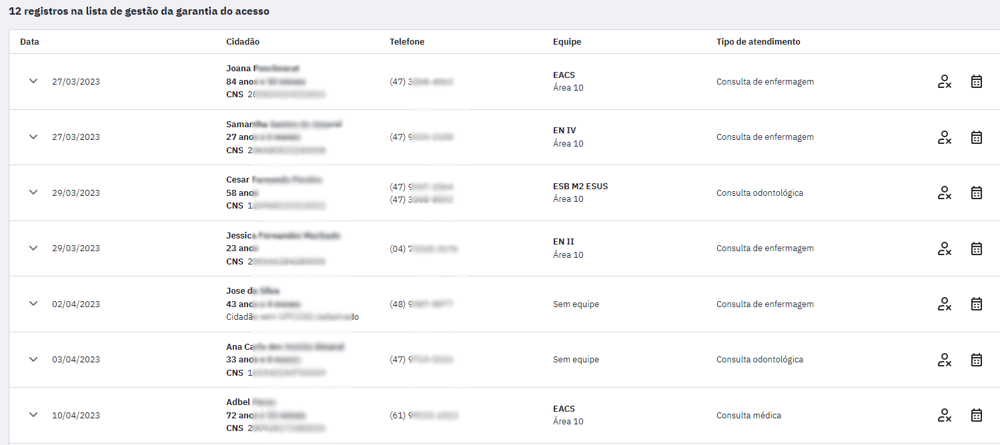
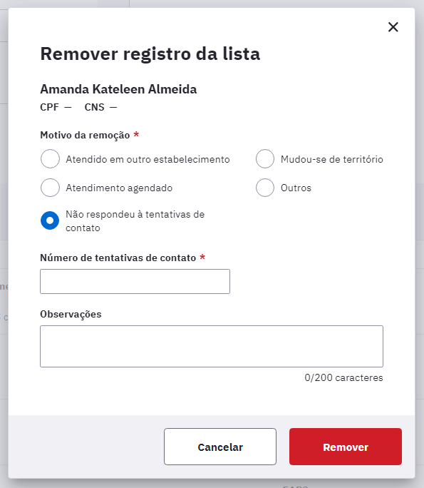
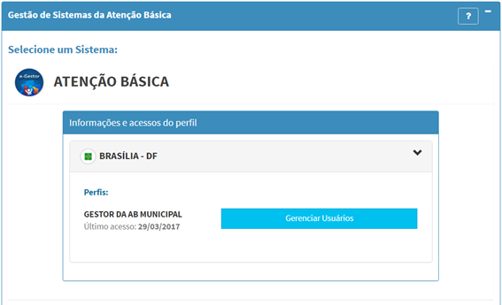
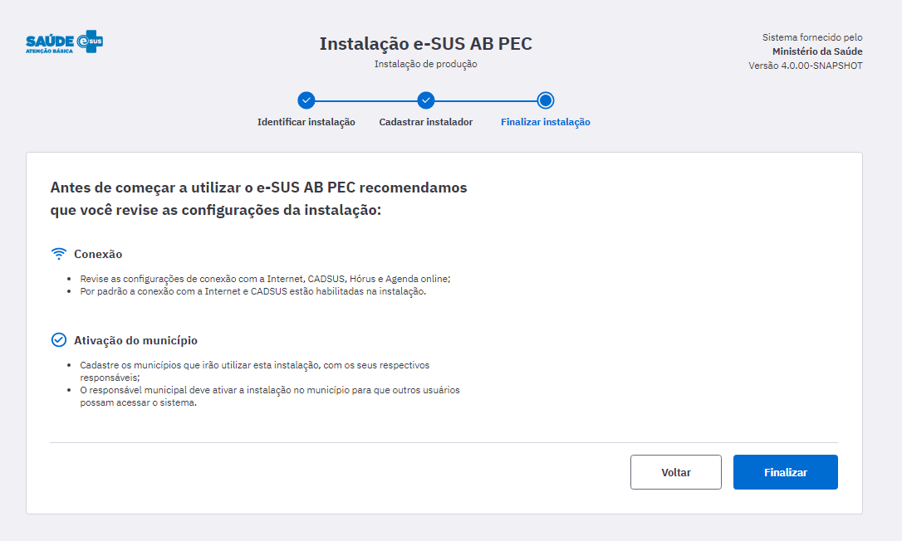
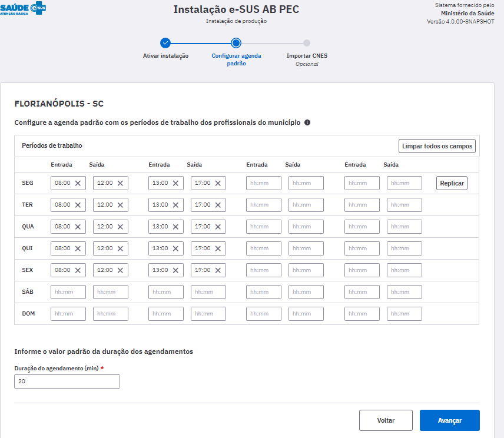
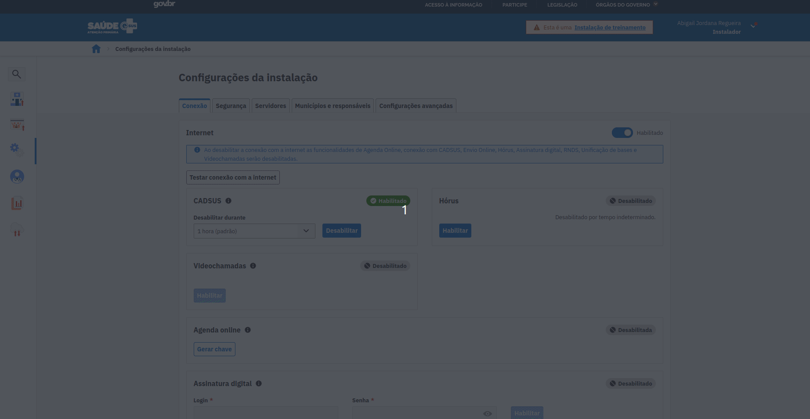

<head>
    
</head>

# CAPÍTULO 2 - Instalação do Sistema
{: .no_toc }

Neste capítulo, abordaremos as questões pertinentes ao processo de instalação do Sistema e-SUS APS.

## Sumário
{: .no_toc .text-delta }

- TOC
{:toc}

{: .nota }
Para ter maior entendimento sobre qual sistema ou cenário de implantação é mais adequado para o seu município, veja o **Manual de Implantação** do Sistema e-SUS Atenção Primária à Saúde (e-SUS APS), disponível em: http://aps.saude.gov.br/ape/esus/comoimplantar.

# 2.1 Sistema Operacional

O desenvolvimento do e-SUS APS é multiplataforma, ou seja, é possível ser instalado em diferentes sistemas operacionais (SO), inclusive distribuições GNU/Linux, como o Ubuntu Linux (www.ubuntu.org), que é um *software* livre, portanto sem custos de licença ou aquisição.

Atualmente, são desenvolvidos instaladores para as seguintes plataformas:

- Linux (Debian, Ubuntu, Red Hat e CentOS);

- Microsoft Windows.

A instalação na plataforma Microsoft Windows vem com pacote Java embutido, caso seja necessária uma instalação personalizada deve ser realizada a instalação do pacote <a href="https://www.oracle.com/java/technologies/downloads/#java8" target="_blank">Java 7</a>. Para plataformas Linux recomenda-se seguir as instruções do arquivo "LEIA-ME" incluso no arquivo (compactado) de instalação.

# 2.2 Banco de Dados

O Sistema e-SUS APS oferece suporte a alguns tipos de banco de dados. Por padrão, o Sistema com **CDS** vem com o banco de dados **H2** embutido em sua instalação; o Sistema com **PEC**, a partir da versão 2.0, vem com o banco de dados **PostgreSQL**.

**PostgreSQL** - a partir da versão 2.0, este banco vem configurado por padrão na instalação do sistema. Pode ser utilizado em UBS com servidor local ou para instalações centralizadas. **É recomendado para qualquer tipo de instalação**.

O banco de dados PostgreSQL é um *software* livre, portanto, sem custo de licença ou aquisição. Para mais informações acesse: http://www.postgresql.org/. É recomendado o uso da **versão 9.6 ou superior**.

{: .atencao }
**Banco H2** - desde a versão 2.0, o suporte ao Banco de Dados **H2** foi **descontinuado** para instalações do Sistema e-SUS APS com **PEC**, estando disponível apenas para o Sistema com CDS (Offline).

**Banco de Dados Oracle** - optando por este banco de dados, podem ser utilizadas as versões Oracle XE 11g, Oracle Standard Edition 11g ou Oracle Enterprise Edition 11g.

- Oracle XE: é gratuito e possui as seguintes **limitações** no seu uso:

- 10 GB de armazenamento em disco (*tablespace*);

- alocação de até 1 GB de memória RAM e

- utilização de um processador físico.

A principal **vantagem** do Oracle XE é pelo fato de não haver custo de licença;

Oracle Standard ou Enterprise: essa versão licenciada do *software* possui características variadas dependendo da modalidade adquirida. Para mais informações, acesse: http://www.oracle.com.

# 2.3 Requisitos Mínimos de Sistema

Nesta seção, apontamos alguns requisitos mínimos que devem ajudá-lo a estimar qual o *hardware* de computador que mais se adequa ao seu cenário.

## 2.3.1 Sistema com CDS *Offline*

O Sistema com CDS, na versão *stand-alone*, tem como requisitos mínimos para digitação (mínimo/recomendado):

- Sistema Operacional de 32 ou 64 bits;

- Memória RAM: 4GB - Barramento DDR3;

- Processador: Quad Core 2.0GHz ou superior;

- Disco:20GB.

## 2.3.2 Sistema com PEC

Para a instalação do Sistema com PEC, é necessário avaliar a quantidade de pessoas ou máquinas (prontuário ou centralizador), que estarão acessando ao mesmo tempo, o que deve influenciar na necessidade de memória RAM e do uso de processamento desse servidor. Portanto, abaixo seguem alguns exemplos de configurações, sugerindo o mínimo/recomendado:

**Exemplo 1** - **Centralizadores Municipais:**

**Exemplo 2** - **Centralizadores Estaduais:**

**Exemplo 3** - Servidor para **até 40** usuários:

**Exemplo 4**: Servidor para **até 100** usuários;

**Exemplo 5**: Servidor para **até 1.000** usuários:

**Exemplo 6**: Servidor para **até 2500** usuários:

**Exemplo 7**: Servidor para **até 4000** usuários:

# 2.4 SISAB e o e-Gestor AB

Para realizar a instalação do PEC no centralizador municipal/estadual ou do PEC multimunicipal, é necessário que o Gestor da Atenção Primária à Saúde realize o cadastramento prévio do gestor do e-SUS APS do Município/Estado para o acesso restrito no SISAB por meio do sistema e-Gestor AB.

O gestor do e-SUS APS no município e no distrito federal é o profissional responsável por acompanhar a implantação do Sistema e-SUS APS. Também fica sob responsabilidade dele o cadastro e controle do(s) gestor(es) técnico(s) responsável(is) pela instalação do Sistema e-SUS APS nas UBS e na própria Secretaria de Saúde.

## 2.4.1 Cadastro do Gestor da Atenção Primária à Saúde

O e-Gestor AB tem por objetivo centralizar os acessos dos usuários aos sistemas dos programas da Atenção Primária à Saúde (APS), desenvolvidos e gerenciados pelo Núcleo de Tecnologia da Informação - NTI do Departamento de Saúde da Família do Ministério da Saúde, permitindo organização e agilidade no acesso aos mesmos.

No e-Gestor, foi criado o perfil Gestor da APS. Este novo papel tem a responsabilidade de gerenciar os Gestores dos programas da APS (SISAB, PSE, Informatiza APS e outros) nos níveis Municipal, Distrital e Estadual. Segue abaixo os passos para a realização do cadastro do Gestor da Atenção Primária à Saúde:

- Passo 1. Acesse o endereço http://.egestorab.saude.gov.br e clique em acesso restrito.

Fonte: SAPS/MS

- Passo 2. Informe o CNPJ e a senha do Fundo Municipal ou Estadual de Saúde e clique em acessar.

{: .atencao }
a senha deverá ser digitada da mesma forma que foi registrada (considerando letras maiúsculas, minúsculas e caracteres especiais).

- Passo 3. Clique em "Cadastrar Novo".

- Passo 4. Informe o número do CPF e acione a opção "Buscar". Verifique se os dados estão atualizados e caso não estejam atualize-os e acione a opção "Salvar";

Por fim, o Gestor da Atenção Primária cadastrado terá seu acesso criado de forma automática e imediata, recebendo mensagem eletrônica com a senha e instruções de acesso.

## 2.4.2 Cadastro do Gestor do SISAB

O Gestor da Atenção Primária deve acessar o e-GestorAB com o CPF e a senha recebida por e- mail e cadastrar o Gestor do SISAB. O gestor do SISAB terá acesso para visualizar relatórios na área restrita, gerar contra chave do sistema e-SUS APS com PEC e cadastrar o Gestor Técnico (Técnico Responsável pela instalação do PEC).

Segue passo a passo para realizar o cadastro do Gestor do SISAB.

- Passo 1. No navegador digite http://www.egestorab.saude.gov.br e clique em acesso restrito;

Fonte: SAPS/MS

- Passo 2. Informe o CPF e a senha do Gestor da Atenção Primária e clique em acessar;

- Passo 3. Na tela inicial, na lista Gestão de Sistemas, clique em Atenção Básica. Selecione o município e clique na opção Gerenciar Usuários, no perfil Gestor da AB Municipal/Estadual;

- Passo 4. Na página inicial do perfil de Gestor da Atenção Primária, clique em "Cadastrar Novo" na lista de Responsáveis;

- Passo 5. Informe o número do CPF e acione a opção "Buscar". Verifique se os dados estão atualizados e caso não estejam atualize-os;

- Passo 6. Selecione o programa SISAB e o perfil de acesso GESTOR DO PROGRAMA MUNICIPAL/ESTADUAL. Clique em "Salvar";

Por fim, o Gestor do SISAB cadastrado terá seu acesso criado de forma automática e imediata, recebendo mensagem eletrônica com a senha e instruções de acesso.

## 2.4.3 Cadastro do Gestor Técnico (Técnico Responsável pela instalação do sistema e-SUS APS com PEC)

O Gestor do SISAB deve acessar o e-Gestor AB com o CPF e a senha recebida por e- mail e cadastrar o Gestor Técnico (Técnico Responsável pela instalação do e-SUS APS PEC). O Gestor Técnico terá acesso **apenas para gerar a contra chave** do sistema e-SUS APS com PEC.

Segue passo a passo para realizar o cadastro do Gestor Técnico:

- Passo 1. Na tela inicial, na lista Gestão de Sistemas, clique em SISAB. Selecione o município e clique na opção Gerenciar Usuários, no perfil Gestor do Programa Municipal/Estadual;

- Passo 2. Clique em "Cadastrar Novo" na lista de Responsáveis;

- Passo 3. Informe o número do CPF e acione a opção "Buscar". Verifique se os dados estão atualizados e caso não estejam atualize-os;

- Passo 4. Selecione o programa SISAB e o perfil de acesso GESTOR TÉCNICO. Clique em "Salvar";

Por fim, o Gestor Técnico cadastrado terá seu acesso criado de forma automática e imediata, recebendo mensagem eletrônica com a senha e instruções de acesso.

## 2.4.4 Gerar Contra Chave e Ativar Agendamento Online

O **Gestor do SISAB** e o **Gestor Técnico** (Técnico Responsável pela instalação do sistema e-SUS APS com PEC) podem gerar contra chave para instalação do sistema e-SUS APS PEC e ativação do módulo de agendamento online.

Segue passo a passo para geração da contra chave:

- Passo 1. Na tela inicial, após acessar o perfil desejado (Gestor do Programa Municipal ou Gestor Técnico), clique no botão Gerador de Contra Chave.

- Passo 2. Para a geração da contra-chave solicite ao Gestor de seu municipio que acesse o e-Gestor com o CNPJ e senha do FMS. Na opcao "Instalação/Atualização PEC e-SUS APS" é necessário selecionar o usuário autorizado a gerar a contra-chave. Um código de autenticação (token) será gerado e este código precisa ser informado no campo abaixo:
 
 

 
 
- Passo 3. Informe a chave apresentada na tela do PEC e clique em <mark>eSUSAB</mark> para gerar a contra chave de instalação.

- Passo 4. Será gerado o código da contra chave, o qual deverá ser informado na tela do PEC;

- Para habilitar ou desabilitar a sincronização dos dados da Agenda das Unidades de Saúde, realizados por meio da instalação local com PEC, no município com o Servidor de Agendamento Online do e-SUS APS, siga o passo 2 e clique em "AGENDAMENTO"..

# 2.5 Tipos de Instalação do Sistema

O sistema de *software* e-SUS APS com PEC pode ser instalado de (02) duas maneiras distintas, como veremos na Seção 2.6.4, conforme for a necessidade local, a saber:

- Centralizador;
- Prontuário.

Nesta seção, será descrito cada tipo de instalação e como devem ser utilizadas para melhor forma de troca de dados entre as instalações do município.

## 2.5.1 Instalação Tipo Centralizador

O tipo de instalação centralizador tem a função de reunir os dados de transmissão das instalações PEC e CDS do distrito federal, município, Estado ou região de saúde, fortalecendo uma organização hierárquica no fluxo da informação na esfera distrital/municipal/estadual e da produção de relatórios.

As principais funcionalidades do centralizador são:

- enviar dados: configuração de *link* para envio de dados para a base federal fica como padrão. Esta opção possibilita o envio também para um centralizador estadual ou outro;

- importar CDS/Registro de Atendimento Simplificado (RAS);

- relatórios: com dados compatíveis ao usuário gestor, onde as informações ficam agregadas desde a equipe até o consolidado municipal.

## 2.5.2 Instalação Tipo Prontuário

A instalação Prontuário Eletrônico do Cidadão pode ser utilizada em servidor nas UBS ou a partir de um servidor único no Município funcionando como a instância única de prontuário no ambiente municipal. Possibilita a importação de dados de outros sistemas, como o CDS, e os transmite para outros pontos, entre eles, por padrão, ao SISAB.

As principais funcionalidades do PEC são:

- módulo administração (descrito no capítulo 3);

- módulo cidadão (descrito no capítulo 4);

- agenda (descrita no capítulo 5);

- módulo atendimento (descrito no capítulo 6);

- módulo CDS (descrito no capítulo 7);

- relatórios (descritos no capítulo 8).

O Sistema e-SUS APS com PEC ainda apresenta a função de centralizador de informações, que permite importar ou digitar informações do Sistema com CDS, de forma que estejam integradas aos relatórios do sistema, bem como possam ser transmitidas ao SISAB.

# 2.6 Instalação e Configuração Inicial do Sistema

## 2.6.1 Download do Sistema

Para fazer o *download* do sistema para instalação, basta acessar o site do e-SUS APS, dentro do Portal da SAPS, por meio do endereço: http://aps.saude.gov.br/ape/esus/download

A partir da opção "Download do sistema", serão apresentadas duas opções de instaladores, Windows e Linux, ou ainda conforme sua necessidade (sistema de produção ou treinamento). Selecione a opção que mais se adapte à sua necessidade e siga os passos apresentados para fazer a instalação em seu sistema.

{: .nota }
o termo **sistema de produção** é usado para designar os sistemas que estão sendo usados pelas equipes de saúde para desenvolver as atividade do cotidiano, sem que este uso seja categorizado como para treinamento ou uso em homologação do sistema.

{: .atencao }
para realizar atividades de treinamento e capacitação dos profissionais da equipe de saúde, utilize sempre a **versão de treinamento** do Sistema e-SUS APS. Esta versão tem as mesmas funcionalidades da versão de produção, **porém ela garante que os dados NÃO serão enviados ao SISAB**.

## 2.6.2 Acessando o Sistema pela Primeira Vez

O sistema tem características particulares de um sistema *web*, portanto, ao instalá-lo, você estará instalando um servidor de aplicação *web*, no qual, ao finalizar a instalação, irá iniciar uma aplicação *web* em seu computador.

Para acessar o sistema, o usuário deverá abrir um navegador, preferencialmente o Google Chrome https://www.google.com.br/chrome/, e abrir o endereço: http://localhost:8080/esus/.

## 2.6.3 Ativando o Sistema e-SUS APS

Ao abrir o sistema por meio do navegador http://localhost:8080/esus/, será exibida uma tela similar à Figura 2.1, onde o sistema irá fazer a verificação e preparação do sistema para instalação.

Figura 2.1 - Tela de instalação do sistema no primeiro acesso

Fonte: SAPS/MS.

Após registrar o nome da instalação e escolher o tipo de instalação do sistema, conforme visto na Seção 2.5, é necessário registrar os dados do responsável pela instalação. Para tal, o responsável pela instalação, cadastrado conforme instruções da Seção 2.4.

Figura 2.2 - Tela de registro do responsável pela instalação.

Fonte: SAPS/MS.

Ao registrar o responsável o sistema irá finalizar a configuração inicial.

Figura 2.3 - Tela de revisão da configuração inicial.

Fonte: SAPS/MS.

## 2.6.4 Wizard de Configuração do município.

Ao concluir a primeira etapa de configuração do sistema, o responsável deverá indicar quais os municípios e responsáveis que utilizarão a mesma instalação.

A partir da versão 4.0 do sistema e-SUS APS com PEC, a instalação pode ser configurada para ser utilizada por mais de um município. Para adicionar outros municípios é necessário incluir um responsável municipal, que deverá ativar a instalação do seu município.

Os Municípios ativos na instalação compartilham apenas os dados de cadastro e prontuário de cidadão que foram cadastrados na instalação ou que foram enviados para ela.

Figura 2.3 - Tela de indicação do município e responsável.

Após registrar o responsável do município, é necessário ativar o sistema com uma chave para usá-lo em produção.

Para tal, o responsável pela instalação, cadastrado conforme instruções da Seção 2.4.

- passo 1: Informar contra chave gerada pelo SISAB;

Figura 2.2 - Detalhe da tela de instalação de ativação do sistema.

- passo 2: configuração do horário padrão da UBS. Esta etapa é opcional, podendo ser configurada posteriormente.

Figura 2.2 - Detalhe da tela de configuração do horário de funcionamento.

- passo 3: o administrador da instalação deverá importar o XML/CNES do município, disponível no portal e-GESTOR AB [[https://egestorab.saude.gov.br/]](https://egestorab.saude.gov.br/), para inserir os profissionais e unidades básicas na aplicação;

Fonte: SAPS/MS

# 2.7 Importação do Bolsa Família

Agora será possível importar um arquivo com os beneficiários do bolsa família de uma vigência específica para que eles sejam identificados em seus prontuários.

O arquivo poderá ser baixado no e-Gestor APS (SISAB), descompactado e importado no formato JSON pela funcionalidade "Importação do bolsa família", que pode ser acessada pelo menu lateral com o perfil de Administrador da Instalação, Administrador Municipal ou Gestor Municipal. 

Observação: Somente é possível importar um arquivo por vigência do Programa Bolsa Família.

Ao visualizar a folha de rosto de um cidadão que consta como beneficiário no arquivo importado da vigência mais atual, será apresentada uma sinalização de que ele é beneficiário do Programa Bolsa Família.

