<head>
    
</head>

# CAPÍTULO 4 - Cidadão
{: .no_toc }

Neste capítulo abordaremos as questões relacionadas ao gerenciamento do cadastro do cidadão, por meio do módulo "Cidadão".

## Sumário
{: .no_toc .text-delta }

- TOC
{:toc}

Todo cidadão, para ser atendido na UBS por meio do Sistema com PEC, ou seja, para ter um prontuário eletrônico ativo no sistema, deve possuir um cadastro ativo no sistema, independente deste cadastro estar ou não identificado pelo número do Cartão Nacional de Saúde (CNS) ou pelo Cadastro de Pessoas Físicas (CPF).

Figura 4.1 - Cartão Nacional de Saúde e Cadastro de Pessoas Físicas

Fonte: SAPS/MS.

Considerando as diferentes fontes de informações da base de cidadãos do Sistema e-SUS APS e das possibilidades de consultas integradas à base de Cadastramento Nacional de usuários do SUS (CADSUS), por meio do Cartão Nacional de Saúde (CNS), antes de realizar qualquer ação no cadastro de um cidadão, seja para consultar ou alterar os dados dele ou para cadastrar um novo cidadão, o sistema solicita que o usuário realize uma busca sobre a base local ou na base do CNS, quando houver conectividade. O cadastro realizado utilizando este módulo **é enviado para a base nacional do SISAB**, e portanto, **será contabilizado no cadastro do território**.

# 4.1 Busca pelo cidadão

Para iniciar a busca pelo cidadão, é necessário selecionar a opção “Cidadão” na aba lateral de navegação e inserir ao menos um dos seguintes dados, conforme é exibido na figura 4.2:

- Nome do cidadão;
- número do CNS do cidadão;
- número do CPF;
- Data de nascimento;
- Nome da mãe;
- Município de nascimento.

Figura 4.2 - Busca pelo Cidadão

Fonte: SAPS/MS.

Em caso de sucesso na busca pelo cidadão o resultado mostrará um cartão com informações do cidadão como nome, data de nascimento, número do CNS e CPF, sexo, nome da mãe, unidade de saúde responsável, telefone, município de nascimento e a data da última atualização do cadastro.

Figura 4.3 - Resultado da Busca Cidadão

Fonte: SAPS/MS.

É importante sinalizar que a busca pode retornar como resultado de cadastros "inativos", originados de versões anteriores do PEC. Neste caso o sistema apresentará este cadastro com a marcação , como mostra a Figura 4.4. 

Figura 4.4 - Marcação de cadastro inativo.

Fonte: SAPS/MS.

Esses cadastros podem ser reativados por meio da opção “reativar” no menu lateral direito.

O sistema sempre irá realizar uma busca na **base** de cadastro **local** e poderá trazer um ou mais resultados, restando ao profissional a escolha do cidadão que está sendo buscado. Caso não haja nenhum resultado, será realizada, automaticamente, a busca na base nacional do CADSUS.

Caso a busca seja muito genérica o sistema retornará uma mensagem de que muitos cadastros foram encontrados e irá solicitar o refinamento da busca para aproximar com mais fidedignidade os resultados que o profissional está esperando.

Figura 4.5 - Solicitação de refinamento da busca pelo cidadão

Fonte: SAPS/MS.

Caso a consulta à base nacional do CADSUS não retorne nenhum resultado o sistema apresentará a seguinte mensagem:

Neste caso será necessário **cadastrar um novo cidadão** (ver seção 4.3).

## 4.1.2 Busca na base nacional (CADSUS)

Ao fazer uma busca pelo cidadão, caso o mesmo não esteja disponível na primeira busca realizada na base local, será realizada automaticamente uma busca *on-line* na base nacional do CADSUS. Para isso, o servidor do Sistema e-SUS APS deve estar conectado a uma rede de Internet, ou seja, o sistema precisa ter conectividade com a Internet para acessar o serviço do CADSUS. O resultado será exibido indicando que o resultado foi buscado na "Base nacional", conforme exposto na figura 4.6.

Figura 4.6 - Resultado da Busca da Base Nacional

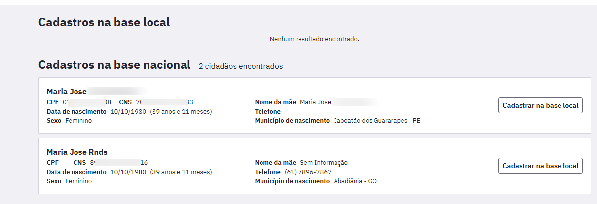

Fonte: SAPS/MS.

É possível que a consulta à base nacional seja desativada na instalação local pelo administrador do sistema por um determinado período de tempo. Neste caso o sistema apresentará a seguinte mensagem:

Quando a busca for realizada com parâmetros demográficos, o sistema não realizará uma busca automática na base nacional, caso a consulta retornar registros da base local. Portanto ao final da lista de resultados será apresentado o bloco Cadastros na base nacional. Caso o profissional deseje ampliar a busca, deve clicar no botão "Pesquisar na base nacional".

Figura 4.7 - Ampliar Busca na Base Nacional

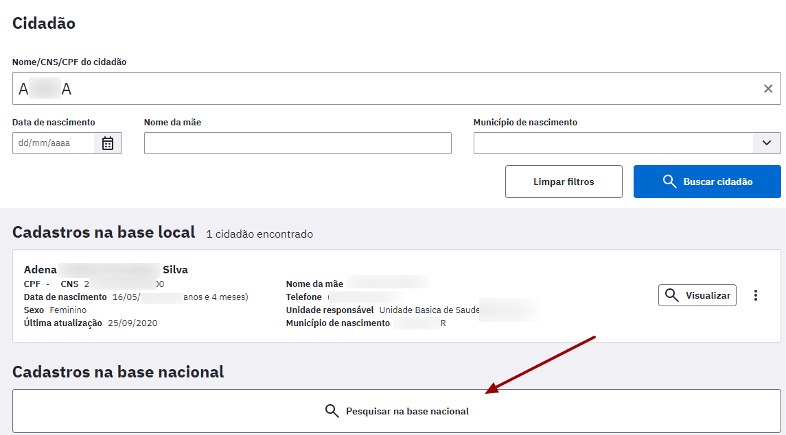

Fonte: SAPS/MS.

A busca ampliada será exibida pela listagem dos resultados da base local seguida dos resultados da base nacional, conforme podemos ver na figura 4.8.

Figura 4.8 - Resultado da Busca Ampliada na Base Nacional

Fonte: SAPS/MS.

# 4.2 Visualizar dados do cidadão

Ao realizar uma busca com resultado bem sucedido, será apresentado um cartão com os dados do cidadão. Estarão disponíveis algumas opções, como:

- Visualizar;
- Atualizar Cadastro;
- Ver agendamentos; e
- Excluir.

## 4.2.1 Visualizar

Esta opção permite acessar as informações de cadastro do cidadão, que podem ser de origem do cadastro realizado na base local ou do  CADSUS. O cabeçalho apresenta um resumo das informações, conforme a figura 4.9. 

Figura 4.9 - Visualização do cidadão

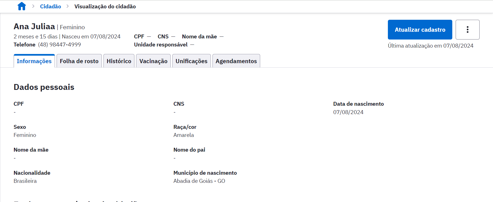

Abaixo do cabeçalho, além da aba de informações, são apresentadas também:

**Folha de rosto, histórico e vacinação:** obrigatório o registro de uma justificativa para o acesso a estas informações clínicas fora do momento do atendimento ou na ausência do cidadão na UBS. Esta justificativa fica gravada no banco de dados para uso posterior, no caso de auditoria em relação ao sigilo dos dados clínicos sensíveis do cidadão, garantindo assim a sua privacidade e segurança. Para mais informações sobre o prontuário, veja o Capítulo 6.

Figura 4.19 - Tela para justificar acesso ao prontuário

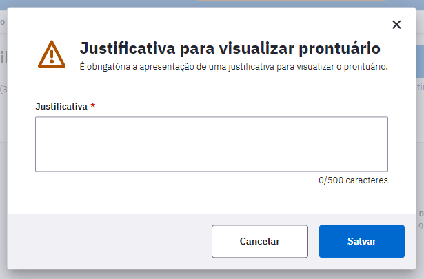

**Agendamentos:** nesta aba são apresentados todos os agendamentos realizados para aquele cidadão, conforme descrito no item abaixo, 4.2.3 Ver Agendamentos.

**Unificações:** possibilidade de visualizar se o cadastro já foi unificado alguma vez, quais os cadastros que foram unificados, data, hora e quem foi o responsável pela unificação;

## 4.2.2 Atualizar cadastro

Esta opção oferece a possibilidade de alterar algum dado do cidadão e sincronizá-lo com a base de dados do CADSUS. Ao realizar a atualização, clique em “Salvar” para que o sistema se conecte ao CADSUS e realize as alterações. Caso não haja conectividade o sistema irá apresentar um alerta de que não foi possível realizar a sincronização.

## 4.2.3 Ver agendamentos 

É possível visualizar a lista com as informações das vezes que o cidadão foi incluído na agenda da Unidade de Saúde, indicando data e hora do seu agendamento, nome do profissional, CBO e observações. Cada item é apresentado com uma indicação da situação do agendamento (Agendado, Não compareceu, Não aguardou e Atendimento realizado). Também é possível buscar por agendamentos através do filtro por período de data,visualizar agendamentos anteriores e de profissionas especificos, além de imprimir os comprovantes de agendamentos.

Figura 4.18 - Tela de Agendamentos do cidadão

Fonte: SAPS/MS.

# 4.3 Adicionar cidadão na base local

Como já mencionado anteriormente, neste capítulo, para realizar qualquer ação (agendamento, registro de atendimento, etc) sobre um cidadão, este precisa estar disponível na base local. Existem três formas de adicionar um cidadão à base local:

- cadastro realizado via CDS e aplicativo e-SUS Território;
- a partir da opção de adicionar na base nacional, via Módulo do Cidadão; ou
- a partir da opção de adicionar diretamente na base local, via Módulo do Cidadão.

## 4.3.1 Cadastro realizado via CDS ou App e-SUS Território

Os cadastros realizados no Módulo CDS, por meio das fichas de Cadastro Individual e Cadastro Domiciliar e Territorial são automaticamente importados para o módulo Cidadão do PEC, após finalizado o processo de digitação, processamento e envio das fichas.

{: .atencao }
o cidadão só será importado para o módulo cidadão após processamento das fichas na transmissão de dados. O processamento das fichas é automático, entretanto o servidor do sistema deve ficar ligado, conectado à internet, durante a noite (0h às 6h).

Veja mais em [Fluxo de Cadastro e Atualização pelo Aplicativo](https://saps-ms.github.io/Manual-eSUS_APS/docs/territorio/territorio_01/#15-fluxo-de-cadastro-e-atualiza%C3%A7%C3%A3o-pelo-aplicativo), [Preenchimento das Fichas de Cadastro Individual](https://saps-ms.github.io/Manual-eSUS_APS/docs/CDS/CDS_02/#21-cadastro-individual) e [Cadastro Domiciliar e Territorial](https://saps-ms.github.io/Manual-eSUS_APS/docs/PEC/PEC_07_cds/#722-cadastro-domiciliar-e-territorial).

## 4.3.2  Adicionar cidadão a partir da base nacional

Após realizar o processo de busca por um cidadão, caso o profissional localize o individuo nos cadastros da base nacional, poderá cadastrá-lo na base local a partir das informações contidas ali. Para tal, o profissional deverá selecionar o cidadão na lista de resultados por meio da opção
"Cadastrar na base local". 

Figura 4.9 - Cadastrar cidadão da Base Nacional na base local

O sistema exibirá a tela de adicionar cidadão com todos os dados disponíveis na base nacional.

Figura 4.9 - Formulário de preenchimento do cadastro do cidadão

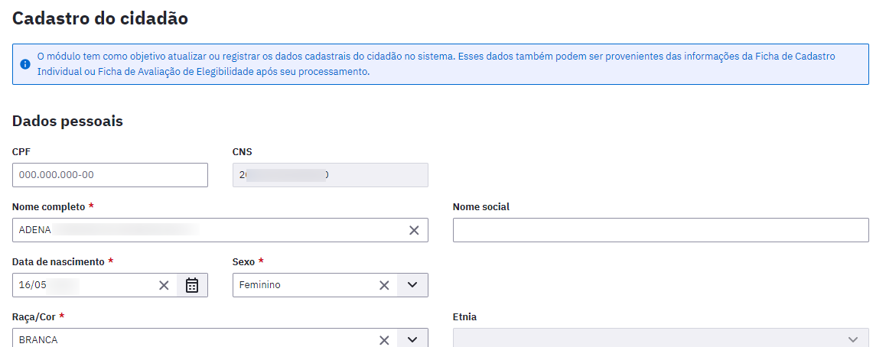

Figura 4.10 - Formulário de preenchimento do cadastro do cidadão

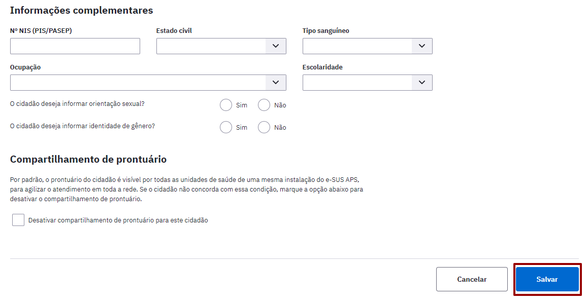

Verifique os dados e identifique atualizações necessárias, e para finalizar clique em "Salvar". Caso não haja nenhum problema na validação dos dados o sistema gravará as alterações realizadas.

{: .nota }
para mais detalhes de preenchimento do formulário, ver seção 4.4.

## 4.3.3 Adicionar um novo cidadão diretamente na base local

Após realizar a busca utilizando os métodos mostrados anteriormente, caso o indivíduo não seja localizado, será necessário incluí-lo na base.

Para cadastrar um novo cidadão, basta clicar no botão “Adicionar Cidadão” , como mostra a imagem a seguir:

Figura 4.11 - Opção "Adicionar cidadão"

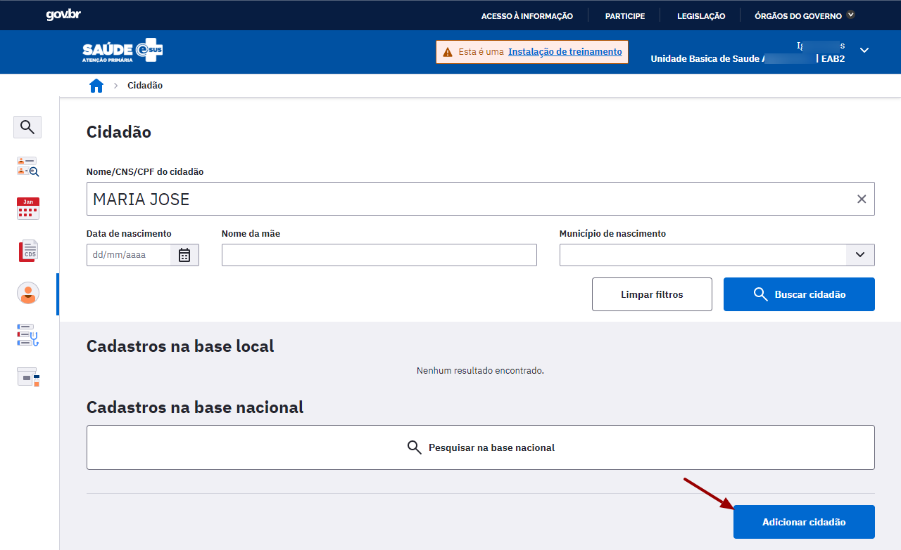

Fonte: SAPS/MS.

A página de cadastro do cidadão (Figura 4.9 e 4.10) será exibida com todos os campos a serem preenchidos. Após finalizar o preenchimento do formulário basta clicar no botão "Salvar" e o cadastro será processado automaticamente.

# 4.4 Adicionar ou alterar cidadão na base nacional

Caso haja conectividade e acesso à base nacional do CADSUS, ao realizar qualquer alteração no cadastro, o sistema mostrará a mensagem de confirmação da alteração dos dados do cidadão.

Ao adicionar um novo cidadão, após o preenchimento do formulário, caso haja sucesso nesse processo, será mostrada a confirmação da geração do cadastro, assim como o número do CNS do cidadão que foi criado.

Figura 4.12 - Tela cidadão atualizado na Base nacional

Fonte: SAPS/MS.

Caso haja algum problema de conectividade ou indisponibilidade do serviço na base nacional do CADSUS, **o cadastro** será salvo na base local, porém não será criado na base nacional. Este processo pode ser refeito até este cadastro ser aceito pela base nacional, resultando na criação do número do CNS para este cidadão.

Caso não seja possível realizar a **atualização** na base nacional, por algum motivo, será mostrado um aviso confirmando a atualização apenas na base local como mostra a imagem abaixo:

Figura 4.13 - Mensagem de erro na atualização do cadastro da Base nacional

Fonte: SAPS/MS.

# 4.5 Preenchimento do formulário de cadastro

O cadastro no módulo Cidadão é um cadastro simplificado que estende e integra os dados do cadastro do CADSUS ao Sistema e-SUS APS, por meio do número do CNS do cidadão, visando garantir um mínimo de informações sobre o cidadão que está sendo atendido na unidade de saúde.

{: .nota }
é importante realizar o cadastro completo dos cidadãos, realizado principalmente pelos agentes de saúde, utilizando as fichas do CDS ou o aplicativo e-SUS Território.

Este cadastro é formado por quatro blocos de informações:

- Dados pessoais;
- Naturalidade;
- Contatos; 
- Equipe responsável pelo cidadão;
- Dados de residência;
- Informações complementares; e
- Compartilhamento de prontuário.

### 4.5.1 Dados pessoais

O bloco de dados pessoais identifica o cidadão por meio do Cartão Nacional de Saúde (CNS) e/ou CPF, além do preenchimento dos dados obrigatórios: nome completo, data de nascimento, sexo, raça/cor, nome da mãe e nome do pai ( que pode ser registrado como informação desconhecida). Permite informar também um nome social caso o cidadão possua. 

Figura 4.12 - Tela de Cadastro do cidadão - Dados pessoais

Fonte: SAPS/MS.

### 4.5.2 Naturalidade

Este bloco envolve o preenchimento dos dados da nacionalidade e municipio de nascimento. 

Abaixo deste bloco há um campo para informar caso o cidadão tenha falecido, conforme exibido na figura 4.13. 

Figura 4.13 - Dados de naturalidade 
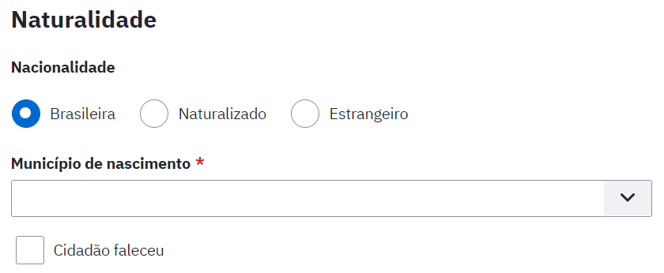
Fonte: SAPS/MS

### 4.5.3 Contatos

Este bloco tem o objetivo de coletar os dados de contatos, caso seja necessária a comunicação do serviço de saúde com o cidadão. É obrigatório o preenchimento de pelo menos um telefone (residencial, celular ou outro telefone de contato). É possível também informar um endereço de e-mail. 

Figura 4.14 - Tela de Cadastro do cidadão - Contatos

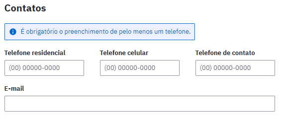

Fonte: SAPS/MS.

### 4.5.4 Equipe responsável pelo cidadão

Este recurso permite a vinculação dos cidadãos às equipes de saúde, apresentando duas formas de informar a vinculação: 

**Automática:** quando a caixa "Utilizar informação do cadastro indvidual do cidadão" é marcada, a equipe responsável será sempre a última a atualizar o cadastro individual do cidadão. 
**Manualmente:** quando a caixa "Utilizar informação do cadastro indvidual do cidadão" é desmarcada, o vínculo será sempre alterado manualmente. 

 A partir dessa vinculação a equipe será responsável pelo acompanhamento do cidadão. Caso o cidadão não esteja vinculado a nenhuma equipe este bloco irá ser apresentado da seguinte forma:

Figura 4.15 - Cidadão sem equipe vinculada

Fonte: SAPS/MS

Para vincular o cidadão, clique no botão "Vincular Equipe", que será apresentada uma lista com as equipes disponíveis.

Figura 4.16 - Vincular equipe responsável, selecionar equipe

Caso haja registro de vinculação do cidadão a uma equipe, o sistema apresentará as informações da seguinte forma: 

Figura 4.17 - Equipe responsável pelo cidadão

Fonte: SAPS/MS

Caso o cidadão opte por ser acompanhado por outra equipe, clique no botão , desmarque a opção "Utilizar a informação do cadastro individual do cidadão", selecione a equipe responsável e clique em Salvar.

Caso o cidadão tenha um cadastro individual e deseja manter o acompanhamento com a mesma equipe de cadastro individual, mantenha selecionada a opção "Utilizar a informação do cadastro individual do cidadão" e clique em Salvar.

Figura 4.18 - Vincular equipe responsável

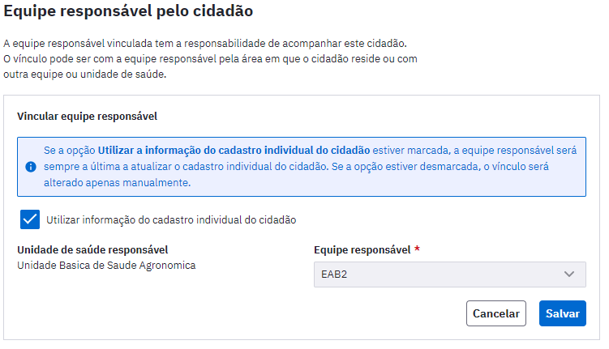

{: .atencao }
Pessoas não cadastradas na equipe podem ser atendidas normalmente, porém o acompanhamento de saúde deve ser realizado pela equipe responsável.

### 4.5.5 Residência

O bloco de residência utiliza a base de endereços da Empresa Brasileira de Correios e Telégrafos, também conhecido pelo nome Diretório Nacional de Endereços (DNE). Ao incluir um Código de Endereço Postal - CEP, o sistema automaticamente preenche os campos: estado, município, bairro e logradouro. Caso o bairro ou logradouro não esteja disponível na base dos Correios, os campos permitirão a inclusão manual das referidas informações.

Figura 4.13 - Tela de Cadastro do cidadão - Endereço

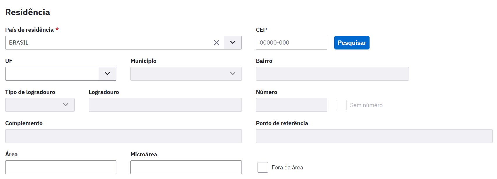

Fonte: SAPS/MS.

### 4.5.6 Informações Complementares

Este bloco visa a coleta de dados sociodemográficos complementares do cidadão.
É de preenchimento obrigatório os campos para indicar se o cidadão deseja informar a orientação sexual e/ou identidade de gênero. 

Figura 4.15 - Tela de Cadastro do cidadão - Informações Complementares

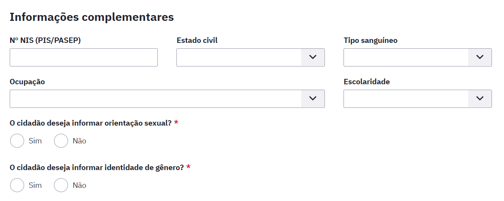

Fonte: SAPS/MS.

## 4.5.6 Compartilhamento de prontuário

Este recurso permite ao cidadão optar pela forma como seus dados clínicos ficam disponíveis para a rede de saúde. Por padrão seus dados são visíveis a todas as UBS de uma mesma instalação, pois otimiza a recuperação de informações clínicas relevantes para o cuidado. Caso o cidadão não concorde, marque a opção "Desativar compartilhamento de prontuário para este cidadão".

