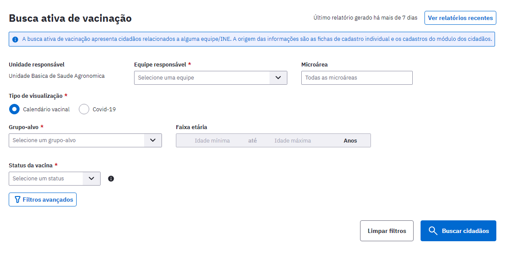

# CAPÍTULO 11 - Busca Ativa
{: .no_toc }

Este módulo visa proporcionar aos gestores de UBS e profissionais de saúde uma ferramenta que traz, de forma consolidada, relatórios da população acompanhadas pelas equipes de atenção primária à saúde, para apoia-los a fazer busca ativa no território adstrito.

## Sumário
{: .no_toc .text-delta }

- TOC
{:toc}

A busca ativa é uma das atividades da Estratégia de Saúde da Família. Ela é uma ação que pode ser realizada por todos os membros da equipe em seu território de referência, tendo o Agente Comunitário de Saúde protagonismo nessa atividade por seu vínculo com esse território.

A busca ativa está diretamente ligada a integralidade, um dos atributos da Atenção Primária à Saúde (APS), pois aproxima as ações e intervenções de saúde à necessidade da população adstrita, da comunidade e do território. Ela tem importância tanto na vigilância epidemiológica quanto na identificação das necessidades de saúde e socioeconômicas da população, na perspectiva das ações da APS ir no sentido contrário de apenas atender demanda espontânea.

No PEC, a partir da versão 5.1, está disponível o módulo de busca ativa, que pode ser acessado no menu esquerdo do prontuário. A Figura 11.1 mostra os tipos de relatórios de busca ativa disponíveis na versão.

Figura 11.1 - Tipos de relatórios de busca ativa 

{: .nota }
A Busca ativa mostrará apenas os usuários cadastrados na equipe, pois são pessoas do território, as quais a equipe tem vínculo e possibilidade de fazer intervenções de saúde.

# 10.1 Busca Ativa de Vacinação

O Brasil é internacionalmente conhecido pelo seu Programa Nacional de Vacinação e atualmente a maior parte da vacinação é feita no âmbito da Atenção Primária. 
Nessa perspectiva, este módulo instrumentaliza as equipes atuantes na APS com relatórios sobre o status de vacinação da população adscrita. Com estes relatórios os profissionais de saúde desta equipe podem acionar seus usuários, quando houver necessidade, para que se imunizem contra determinadas doenças.  

A Figura 11.2 mostra a tela inicial da Busca Ativa de Vacinação. Este módulo pode ser acessado por todos os profissionais da equipe atuante na APS.

Figura 11.2 - Tela de Busca Ativa

Fonte: SAPS/MS.

Os profissionais da equipe que acessam este módulo podem fazer o filtro por Microárea. Quando o gerente da unidade acessar o módulo, ele poderá fazer o filtro tanto por equipe quanto por microárea.

Há dois tipos de visualização: Calendário Vacinal (que mostra as vacinas de Rotina) e Covid-19, como mostra a Figura 11.3. Este é um campo de seleção obrigatório para geração do relatório.

Figura 11.3 - Tipos de Visualização

Fonte: SAPS/MS.

Em seguida há o campo obrigatório Grupo-Alvo em que podem ser selecionadas as opções Criança (0 a 9 anos) e Adolescentes (10 a 19 anos), como mostra a Figura 11.4.

Figura 11.4 - Grupos Alvo

Fonte: SAPS/MS.

{: .nota }
Novos grupos alvo serão inseridos em novas versões do PEC.

No campo obrigatório "Status da Vacina", quando o Tipo de visualização (Figura 11.3) selecionado é o "Calendário Vacinal", é possível escolher entre No Prazo e Atrasada, conforme mostra a Figura 11.5. Já quando o Tipo de visualização selecionado é Covid-19, aparecerão as vacinas aplicadas. 

Figura 11.5 - Status da Vacina

Fonte: SAPS/MS.

Os Status de vacina significam:

**No prazo:** Aquelas doses de vacinas que estão no prazo para serem aplicadas. Ou seja, é a época que o cidadão deve ser convidado à unidade para receber a vacina no tempo certo.

**Atrasada:** São as doses de vacinas que já passaram do prazo para ser aplicadas. Deve-se convidar o cidadão para regularizar sua situação vacinal o mais rápido possível.

Há disponível alguns Filtros avançados nesse módulo, conforme mostra a Figura 11.6. 

Figura 11.6 - Filtros Avançados

Fonte: SAPS/MS.

No filtro "Imunobiológico" é possível selecionar um ou mais imunobiológicos e no filtro "Dose" é possível selecionar uma ou mais doses. A exibição ocorre em ordem alfabética. Caso não apareça ao clicar o imunobiológico ou a dose que está procurando, comece a digitar o nome para que outras opções apareçam para seleção.

{: .atencao }
Ao selecionar um imunobiológico ou dose no campo Filtros avançados, o relatório mostrará todos os cidadãos com o imunobiológico e/ou dose selecionadas no filtro. Porém, como o relatório é exibido por cidadão, as outras doses atrasadas ou no prazo desse cidadão continuarão a ser exibidas. Isto é, apenas cidadãos que não tiverem os imunobiológico e/ou doses no status de vacina selecionado, deixarão de ser exibidos.

Após a seleção dos campos do módulo deve-se clicar em  para exibir em tela os cidadão naquelas condições, como mostra a Figura 11.7.

Figura 11.7 - Exibição em tela da listagem da Busca Ativa

(A) Relatório de Vacinas do Calendário Vacinal

(B) Relatório de Vacinas de Covid-19

Fonte: SAPS/MS.

É possível gerar relatório em planilha ao clicar em . Nesse formato será exibido a listagem de cidadãos, data de nascimento, idade, CPF, CNS, Telefones de contato e endereço, bem como status da vacina, imunobiológicos e doses. O Formato desse relatório pode ser visualizado na Figura 11.8.

Figura 11.8 - Relatório em CSV

Fonte: SAPS/MS.

