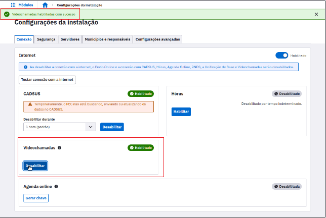
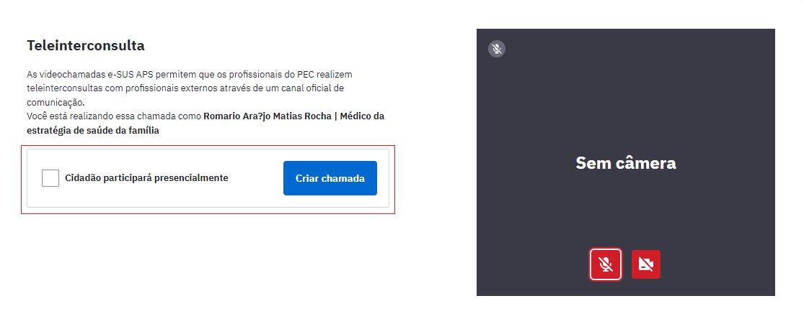
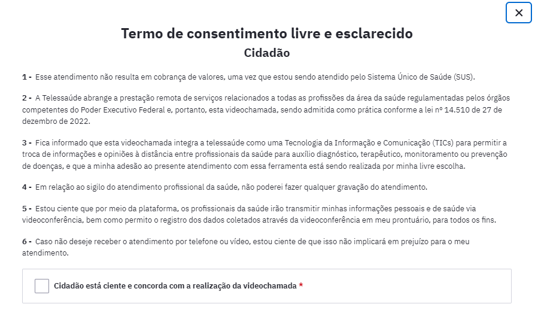

# CAPÍTULO 13 - Videochamadas
{: .no_toc }

Este módulo permite que os profissionais do PEC realizem teleinterconsultas com profissionais internos ou externos a unidade, assim essa modalidade de consulta entre dois profissionais pode agora ser feita através de um canal oficial de comunicação, com ou sem a presença do cidadão em questão.

## 11.1 Configurações de Instalação

Para utilizar essa nova funcionalidade, é necessário que o acesso à instalação seja feito utilizando o protocolo HTTPS e que o Administrador da Instalação habilite as videochamadas nas configurações de internet:

Figura 11.1 Configurações de Intalação

Após realizar habilitação para videochamadas no pec eSUS APS, será criada uma nova chamada no módulo Videochamadas

Será criado um link de acesso para o profissional com quem se deseja realizar a teleinterconsulta, seja ele usuário do PEC ou não. O profissional que receber o link consegue então acessar a teleinterconsulta após preencher seus dados.

##  11.2 Módulo Videochamada e-SUS APS

Nesta funcionalidade é possível realizar teleinterconsultas diretamente no PEC através do novo módulo Videochamadas.

Para iniciar a telechamada, primeiro o profissional que estiver realizando o atendimento deve sinalizar se o cidadão participará presencialmente da teleinterconsulta.

Figura 11.2 Tela inicial do módulo Teleinterconsulta

Fonte: SAPS/MS.

Após a confirmação se o cidadão estará participando da Teleinterconsulta, o profissional deverá habilitar microfone e câmera e clicar em (Criar chamada).

# 11.3 Termo de Responsabiliade Profissional de Saúde

Após clicar em "Criar chamada", será gerado um Termo de Responsabilidade para o profissional estar ciente das informações descritas no termo.

Figura 11.3: Termo de Responsabilidade Profissional da Saúde

O Termo de Responsabilidade do Profissional da Saúde, é o documento que informa tópicos necessários que o profissional precisa estar ciente antes de iniciar o atendimento, além de trazer informações relevantes a respeito dessa aplicação.

Ao relaizar a leitura do termo, clicar em "Continuar" para gerar o Termo de Consentimento Livre e Esclarecido do Cidadão.

# 11.4 Termo de Consentimento Livre e Esclarecido Cidadão

O Termo de Consentimento Livre e Esclarecido do Cidadão estará disponível para o cidadão presente na consulta que participará da Teleinterconsulta na companhia do profissional.

Figura 11.4 Termo de Consentimento Livre e Eclarecido Cidadão

É dever do profissional que está presente com o cidadão, realizar a leitura do Termo de Consentimento para o mesmo e pergunta-lo se há consentimento. 

Após leitura e concordancia do cidadão, clicar em " Cidadão está ciente e concorda com a realização da teleinterconsulta" e a chamada será iniciada. 

Nota: Atualmente este módulo não gera produção para agregar nos relatórios de atendimentos das equipes. Portanto faz-se necessário o registro do atendimento individual por meio da Ficha de Atendimento Individual (FAI). 
