<head>
    <style>
        p{text-align:justify};
    </style>
</head>


# Apresentação
{: .no_toc }

O e-SUS APS é uma estratégia da Secretaria de Atenção Primária (Saps) para reestruturar as informações da Atenção Primária à Saúde (APS) em nível nacional. Esta ação está alinhada com a proposta mais geral de reestruturação dos Sistemas de Informação em Saúde (SIS) do Ministério da Saúde (MS), entendendo que a qualificação da gestão da informação é fundamental para ampliar a qualidade no atendimento à população.

A Estratégia e-SUS APS faz referência ao processo de informatização qualificada do Sistema Único de Saúde (SUS) em busca de um SUS eletrônico (e-SUS) e tem como objetivo concretizar um novo modelo de gestão de informação que apoie os municípios e os serviços de saúde na gestão efetiva da APS e na qualificação do cuidado dos usuários

Nessa perspectiva, o Painel e-SUS APS emerge como uma ferramenta estratégica para aprimorar a gestão da informação, da clínica e do cuidado na APS em nível municipal. Trata-se de um software aberto e diretamente integrado à base de dados local do sistema e-SUS APS. O Painel oferece uma visão abrangente dos dados populacionais e de saúde, permitindo às equipes de saúde e gestores uma compreensão clara e atualizada da situação de saúde do território. Além disso, possibilita o acompanhamento longitudinal e integrado dos cidadãos adscritos, facilitando uma atenção mais coordenada e centrada no usuário. Novas funcionalidades relacionadas a situação sociodemográficas e de saúde serão implementadas de forma incremental no desenvolvimento do painel.

Mais do que apenas fornecer informações, o Painel e-SUS APS contribui diretamente para a melhoria dos processos de monitoramento e de tomada de decisão, permitindo que gestores e profissionais de saúde possam ajustar e otimizar suas estratégias com base em dados concretos a partir de intervenções mais precisas e oportunas.

Este manual detalha o processo de instalação, configuração, inicialização e acesso ao Painel e-SUS APS.

## Sumário
{: .no_toc .text-delta }

- TOC
{:toc}


# 1 Orientações Gerais sobre o Sistema

## 1.1 Versão do Painel e-SUS APS utilizada neste manual

Este manual foi elaborado usando como referência o Painel e-SUS APS em sua **versão 1.0.15**. As informações sobre o versionamento e a data de atualização do Painel estão visíveis em todas as telas, localizadas no rodapé, abaixo dos logotipos da Fiocruz e do Ministério da Saúde.


Figura 1 - Versionamento e a data de atualização do Painel e-SUS APS.


## 1.2 Organização e Componentes - Padrão do Painel e-SUS APS

Nesta seção, será apresentada a organização e o uso de componentes padrão encontrados em grande parte das funcionalidades do Painel e-SUS APS.

### 1.2.1 Orientações Básicas de Navegação do Painel e-SUS APS

O Painel e-SUS APS é acessado via navegadores web, utilizando conceitos de aplicação em nuvem, buscando assim conciliar a organização de aplicações desktop com os recursos mais ágeis das aplicações web. A seguir, na **Figura 2**, serão apresentados alguns itens sobre navegação e organização das telas do Painel e-SUS APS.


Figura 2 - Organização e navegação do Painel e-SUS APS.

## 1.2.2 Orientações Básicas de Utilização do Painel

Os componentes padronizados no Painel são: Caixa de seleção, Figura e Orientação, apresentados a seguir:

**Caixa de seleção:** ao digitar parte da palavra desejada, o sistema automaticamente traz todos os registros que contêm a palavra, após selecione o item desejado.


 **Orientação** (hint): ao passar o mouse sobre um campo/botão, o sistema mostrará breve descrição.

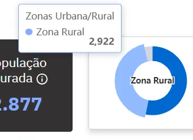

# 2 Sistema Operacional

Assim como o PEC e-SUS APS, o desenvolvimento do Painel e-SUS APS é multiplataforma, compatível com sistemas operacionais **Windows** e **Linux**.

# 3 Requisitos de sistema

Para a instalação do Painel e-SUS APS é necessário avaliar a o tamanho base de dados que será processada pelo Painel e-SUS APS, o que deve influenciar na necessidade de memória RAM e do uso de processamento do servidor. 

{: .nota }
Recomenda-se que a instalação do Painel e-SUS APS seja realizada em um servidor diferente da instalação do Prontuário Eletrônico do Cidadadão (PEC).

# 4 Instalação, Configuração, Inicialização e Acesso ao Painel

O Painel e-SUS APS foi projetado para operar em instalações centralizadas, conectando-se a um banco de dados único do PEC e-SUS APS do tipo "Prontuário". Essa configuração permite a consolidação dos dados de todo o município e de seus estabelecimentos de saúde em uma única plataforma. Contudo, na presença de instalações descentralizadas do PEC e-SUS APS, o Painel e-SUS APS pode ser instalado em cada instância local do prontuário. Essa abordagem, embora viável, limita o acesso aos dados conforme a instalação, resultando em uma visualização fragmentada das informações.

Para garantir a integridade dos dados originais, a aplicação estabelece uma conexão de leitura com o banco de dados do PEC e-SUS APS, que pode ser configurada de duas maneiras:

1. **Local**: Instalação direta do painel no servidor do PEC e-SUS APS, proporcionando acesso direto ao banco de dados.
2. **Remota**: Acesso ao banco de dados via rede interna ou internet, utilizando as credenciais de um usuário com perfil de leitura.

Este manual detalha o processo de instalação do Painel e-SUS APS para a modalidade de conexão local, onde a aplicação é instalada no mesmo servidor do banco de dados, seguindo as configurações padrão do PEC e-SUS APS.

Para a instalação remota, o Painel e-SUS APS pode ser instalado em uma estrutura distinta do servidor do banco de dados. Nesse caso, é fundamental que as configurações do Painel e-SUS APS sejam realizadas de acordo com as permissões do ambiente do banco de dados, atentando-se ao endereço do servidor, porta de acesso, nome de usuário e senha. Mais detalhes sobre a configuração serão apresentados no item **4.1.2, "Configuração do Painel"**.

## 4.1 Sistema Operacional Windows

### 4.1.1 Instalação do Painel e-SUS APS

O primeiro passo para instalar o **Painel** é realizar o download do instalador. O arquivo de instalação do *Painel e-SUS APS* é um arquivo ***.exe,*** podendo ser baixado no link a seguir:

[](https://paineis-esus-bucket-new.s3.sa-east-1.amazonaws.com/painel-esus-setup1.0.15.2.exe)

Ao clicar no link, o download do arquivo **.exe** será iniciado automaticamente no navegador. Caso o download não ocorra de imediato, clicar com o botão direito no link e selecionar a opção **"Salvar link como..."** para iniciar manualmente o processo de download.

Após a conclusão do download, o arquivo de instalação estará disponível no diretório **"Downloads"** do computador por padrão ou em outro diretório selecionado.

Com o download concluído, clicar no arquivo **.exe** para iniciar o processo de instalação. Isso abrirá o assistente de instalação do **Painel**.

Dependendo da versão utilizada do sistema operacional Windows, será exibida uma tela de "Controle de Conta de Usuário", solicitando permissão para a instalação do Painel.

A **Figura 3** ilustra um exemplo de tela no Windows 11. Para continuar com o processo de instalação, é necessário fornecer as permissões adequadas ao sistema operacional clicando em **"Sim"**.


Figura 3 - Controle de Conta de Usuário.

Após conceder as permissões solicitadas, a próxima tela, exibida na **Figura 4**, permitirá a escolha da pasta de destino onde o Painel será instalado. Por padrão, o instalador sugere um diretório, que pode ser alterado conforme a preferência. Após definir o local de instalação, clicar em **"Avançar"** para prosseguir com o processo.

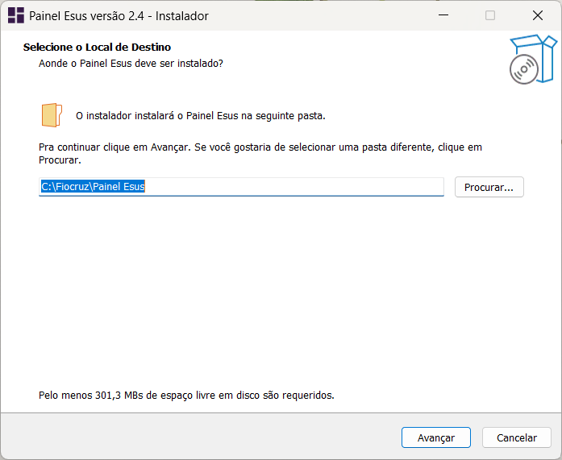
Figura 4 - Local de destino.

Na próxima tela, será exibida uma opção que permite criar um atalho na área de trabalho, assim como apresentado na **Figura 5**. Recomenda-se criar este atalho para facilitar a execução da aplicação do Painel. Depois de realizar a seleção conforme desejado, clicar em "**Avançar**".

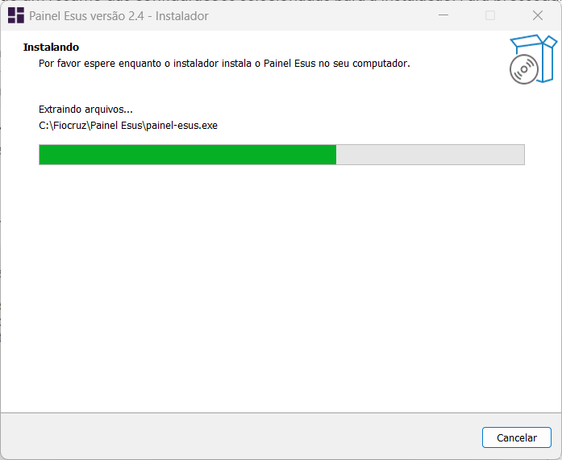
Figura 5 – Atalho na área de trabalho.

Ao avançar, será exibido um resumo das configurações selecionadas para a instalação. Para prosseguir, clicar no botão **"Instalar"**, iniciando assim o processo de instalação do Painel e-SUS APS (**Figura 6**).

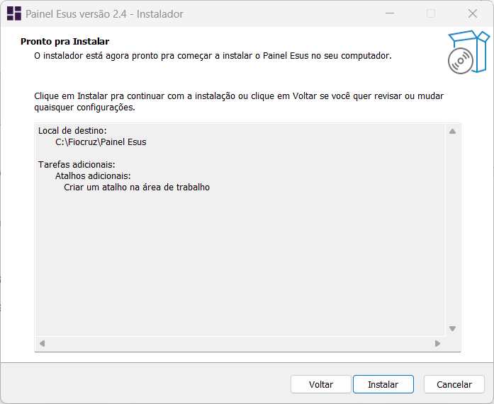
Figura 6 - Pronto para instalar.

A **Figura 7** ilustra a tela de progresso da instalação do Painel e-SUS APS. Aguardar até que o processo seja concluído completamente.


Figura 7 - Execução da instalação.

O processo de instalação poderá levar alguns minutos. Quando finalizado, será exibida uma mensagem de confirmação indicando o sucesso da instalação, conforme ilustrado na **Figura 8**.

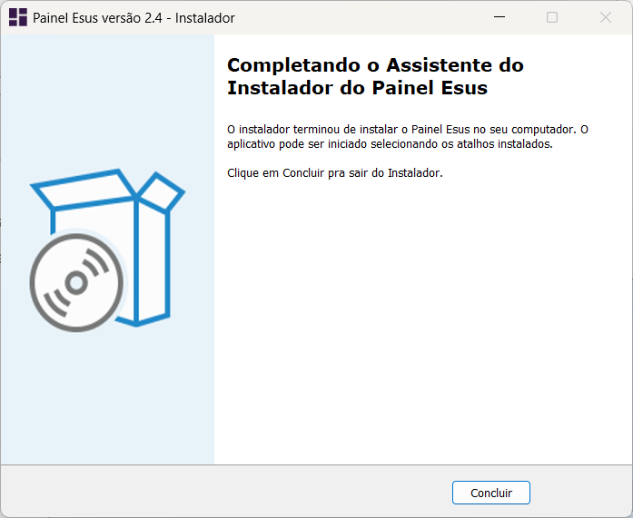
Figura 8 - Conclusão da instalação.

Para encerrar o instalador, basta clicar em **"Concluir"**. O Painel e-SUS APS estará devidamente instalado no computador e poderá ser acessado via atalho na Área de Trabalho, através do menu Iniciar ou também o diretório de destino selecionado durante o processo de instalação.

### 4.1.2 Configuração do Painel e-SUS APS

Antes de iniciar o uso do Painel e-SUS APS, é crucial configurar adequadamente as variáveis de ambiente para garantir o funcionamento correto da aplicação. Para realizar essa configuração, navegue até o diretório onde o Painel e-SUS APS foi instalado. Em seguida, abra o arquivo **config.exe** para iniciar o processo de configuração, conforme ilustrado na **Figura 9**.


Figura 9 - Arquivo de configuração.

Ao abrir o arquivo, a interface de configuração será aberta apresentando duas abas na parte superior: **"Banco de Dados"** e **"Painel e-SUS"**, conforme ilustrado na **Figura 10**.

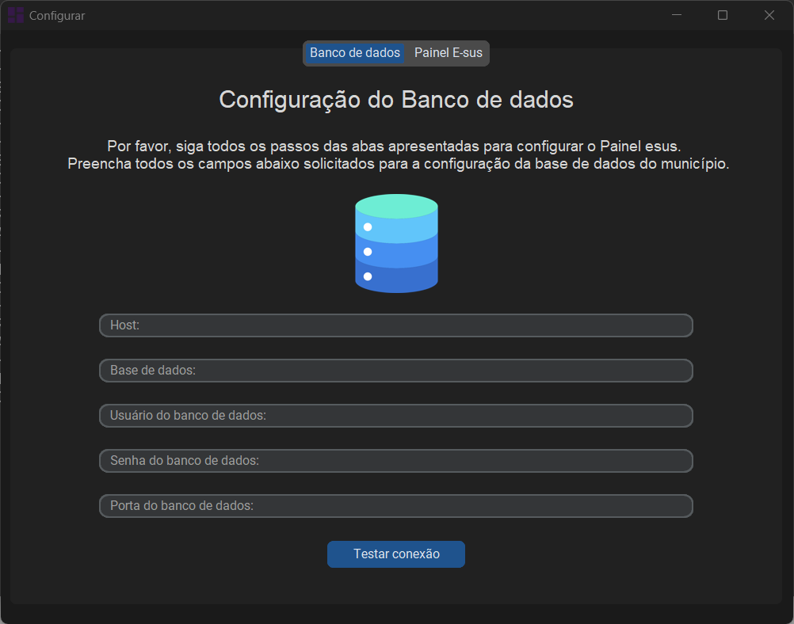
Figura 10 - Configuração do banco de dados.

{: .atencao }
**Atenção: É imprescindível preencher todos os campos de maneira correta. Para isto, é necessário o acesso ao arquivo “credenciais” presente no diretório raiz da Instalação do PEC e-SUS APS: “C:\Program Files\e-SUS\webserver\config“, conforme Figuras 11 e 12.**


Figura 11 - Diretório do arquivo “credenciais” PEC e-SUS APS.

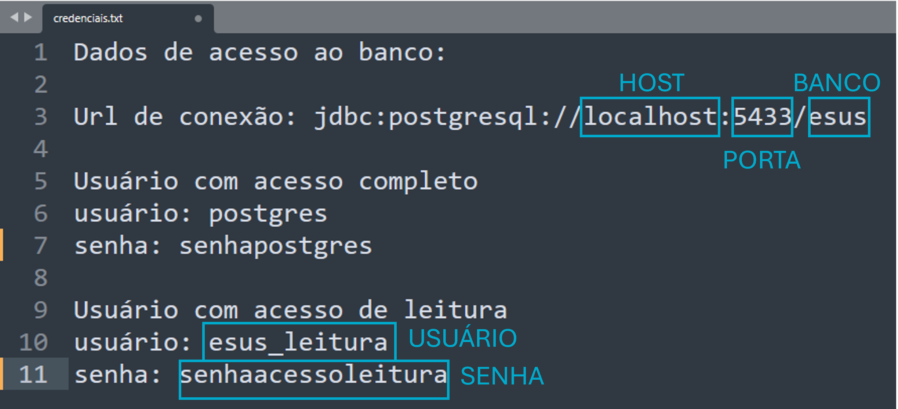
Figura 12 - Arquivo .txt “credenciais” PEC e-SUS APS.

De posse desses dados, preencher os campos da **Aba “Banco de dados”**, considerando o exemplo abaixo e Figura 13, conforme as configurações padrão da Instalação do PEC e-SUS APS:

- **Host =** host de acesso ao banco de dados da UBS. 
*Para instalações do Painel e-SUS APS diretamente no servidor, utilizar o padrão: **localhost**
- **Base de dados =** nome da base de dados da UBS.
Padrão: **esus**
- **Usuário do banco de dados =** usuário de acesso ao banco de dados da UBS. 
Utilizar por padrão o usuário **esus_leitura** ou outro que possua acesso somente leitura do banco de dados.
- **Senha do banco de dados =** senha de acesso ao banco de dados da UBS. 
Por padrão está presente no arquivo **credenciais**, conforme Figura 11.
- **Porta do banco de dados =** porta de acesso ao banco de dados da UBS.
Padrão: **5433**


Figura 13 - Configurações padrão do PEC e-SUS APS.

Após preencher todos os campos desta aba, clicar no botão "**Testar Conexão**" ao final da seção para verificar a conectividade com a base de dados do PEC e-SUS APS. Uma mensagem será exibida, sinalizando que a conexão foi estabelecida (**Figura 14**).


Figura 14 - Conexão estabelecida.

{: .atencao }
**Atenção: A execução correta do Painel depende da conexão bem-sucedida com o banco de dados.**

Uma vez confirmada a conexão, seguir para aba "Painel e-SUS" e preencher todos os campos, como demonstra a **Figura 15**. Considerar os exemplos a seguir para o preenchimento dos campos:

- **Código IBGE da Cidade** = código IBGE correspondente ao município em que o sistema está sendo instalado. O código deverá ser composto dos 7 dígitos numéricos do IBGE. Caso seja necessário maiores informações, buscar no site do IBGE: [https://www.ibge.gov.br/cidades-e-estados](https://www.ibge.gov.br/cidades-e-estados) .
- **Usuário de acesso ao painel-esus:** criar um nome de usuário para o administrador do Painel. Padrão: **admin**
- **Senha de acesso ao painel-esus:** criar uma senha do usuário administrador.
- **Url de login:** Endereço para acesso ao PEC e-SUS APS. Importante destacar que esta configuração deve estar correta para que o Painel seja acessado pelos profissionais utilizando as mesmas credenciais do PEC e-SUS APS.
    
    **Exemplos:**
    
    **http://localhost:8080** (Instalação local do PEC sem acesso externo)
    
    **http://191.10.20.30:8080** (Instalação do PEC acessada por IP público)
    
    **https://esus.municipio.uf.gov.br** (Instalação do PEC acessada por domínio com HTTPS)
    


Figura 15 - Configuração do painel.

Após completar o preenchimento desta aba, clicar no botão "Finalizar Configuração". Com a finalização dessas etapas, o Painel estará devidamente configurado e pronto para inicialização (**Figura 16**).


Figura 16 - Configuração realizada com sucesso.

### 4.1.3 Inicialização do Painel

Para iniciar o Painel, basta clicar no ícone do Painel (**Figura 17**) acessando a aplicação pelas seguintes opções:

- **Menu Iniciar**: Selecione o ícone do Painel e-SUS no menu Iniciar do computador.
- **Área de Trabalho**: Duplo clique no atalho criado na área de trabalho, caso a opção de criação de atalho tenha sido selecionada durante o processo de instalação.
- **Pasta de Instalação**: Acessar o diretório de instalação do Painel e-SUS APS e clicar no executável denominado "painel-esus".


Figura 17 - Ícone do Painel.

Ao executar a aplicação, um terminal será automaticamente aberto, como apresentado na **Figura 18**.


Figura 18 - Início do carregamento do Painel.

O processo de inicialização do Painel pode levar vários minutos, considerando o tamanho da base de dados do PEC e-SUS APS. Durante este processo, é essencial aguardar a conclusão total antes de iniciar a utilização do Painel.

Dependendo da versão do sistema operacional utilizado, ao final do processo de inicialização será necessário fornecer permissões de acesso novamente ao Painel e-SUS APS. Nesse caso, ao final do processo de inicialização do sistema, uma janela como a apresentada na **Figura 19** será exibida. Para seguir com o processo de inicialização clique no botão “**Permitir**”. 


Figura 19: Permissão Firewall Windows.

Após completo o carregamento do Painel, o terminal de execução da aplicação exibirá a seguinte mensagem, conforme a **Figura 20**.

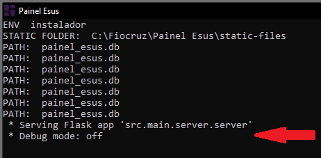

Figura 20 - Finalização do carregamento do Painel.

Destaca-se que, para que o Painel seja acessado, é necessário que este terminal permaneça em execução. Caso o terminal seja fechado, a execução da aplicação do Painel e-SUS APS é encerrada.

### 4.1.4 Acesso ao Painel e dicas de uso

Ao completar todos os passos descritos anteriormente, o Painel já se encontrará apto para acesso. Para acessá-lo, abrir em um navegador web o seguinte endereço: [http://localhost:5001/](http://localhost:5001/)**.** É possível acessar o Painel via IP público ou domínio, desde que o computador onde o Painel e-SUS APS foi instalado tenha essas possibilidades e a porta 5001 esteja devidamente configurada para acesso externo.

{: .atencao }
Durante a utilização do Painel, é importante monitorar o uso do processamento (CPU) e da memória do servidor do banco de dados do PEC e-SUS APS. Isso ajuda a garantir que a execução do Painel não comprometa a performance do prontuário, especialmente em servidores com configurações inferiores às recomendadas, conforme descrito no Manual do e-SUS APS – Apoio à Implantação - Preparar Ambiente ([LINK](https://saps-ms.github.io/Manual-eSUS_APS/docs/Apoio%20a%20Implanta%C3%A7%C3%A3o/Apoio_implantacao/))


Ao abrir a aplicação, terá o direcionamento para a tela de login. No campo **Login**, inserir o CPF do usuário e no campo **Senha**, digitar a senha correspondente. O acesso do administrador do Painel é configurado durante a instalação inicial, enquanto os profissionais de saúde utilizarão as mesmas credenciais (login e senha) do PEC e-SUS APS. Após preencher os campos, clicar no botão **Entrar** para iniciar a navegação no Painel, como ilustra a **Figura 21**.

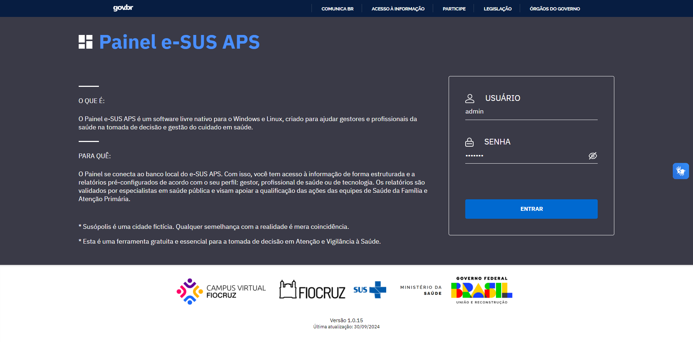
Figura 21 – Tela de acesso ao Painel e-SUS APS

## 4.2 Sistema Operacional GNU/Linux

Essa seção irá abordar o processo de instalação do Painel e-SUS em ambiente linux. Para isso, foi utilizado o Linux Mint na versão 21.12.


### 4.2.1 Instalação do Painel e-SUS APS

O primeiro passo para instalar o **Painel e-SUS APS** no ambiente Linux é realizar o download da versão mais atualizada do sistema. Diferentemente da versão windows do **Painel e-SUS APS**, a versão Linux do sistema é instalada através do arquivo **.tar.gz,** disponível para download no link abaixo: 

[](https://painel-esus-public.s3.sa-east-1.amazonaws.com/instalador/painel-esus-setup1.0.16.tar.gz)

Ao clicar no link, o download do arquivo **.tar.gz** será iniciado automaticamente no navegador. Caso o download não ocorra de imediato, clicar com o botão direito no link e selecionar a opção **"Salvar link como..."** para iniciar manualmente o processo de download.

Após a conclusão do download, o arquivo de instalação estará disponível no diretório **"Downloads"** do computador por padrão ou em outro diretório selecionado, assim como apresentado na Figura 22:

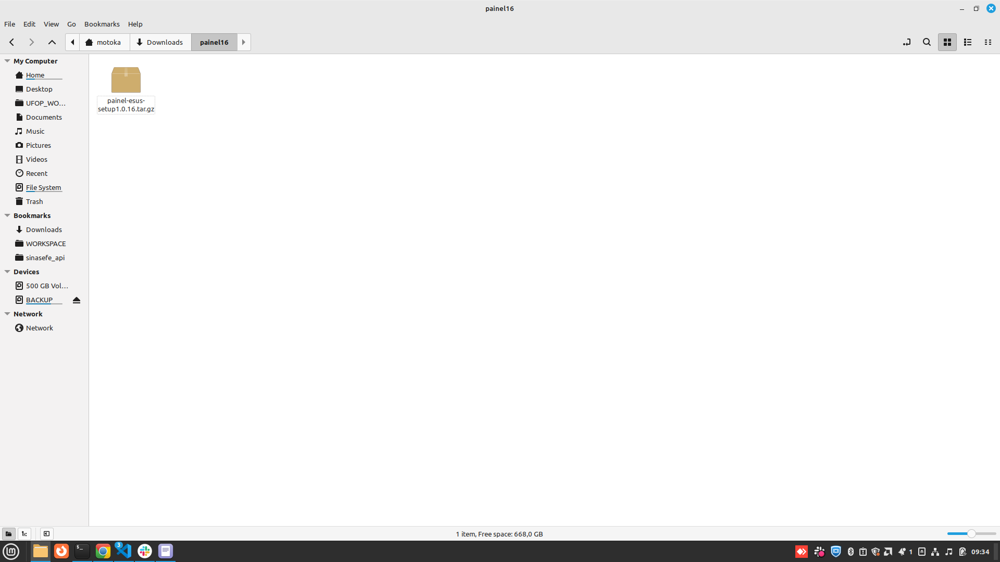
Figura 22: Pasta Downloads com versão Linux do Painel e-SUS.

Com o download concluído, clicar duas vezes sobre o arquivo **.tar.gz** para descompactar os arquivos do **Painel e-SUS** em um diretório de sua preferência, assim como apresentado na **Figura 23**.


Figura 23: Painel e-SUS descompactado.

Após descompactar o **Painel e-sus** em um diretório de preferência, a pasta de destino deve ter um resultado semelhante à **Figura 24**, apresentando as pastas “**icon**” e “**static-files**” e os arquivos “**config**”, “**ibge.csv**” e “**painel-esus**”.


Figura 24: Pasta descompactada do **Painel e-SUS**.

Com isso, o **Painel e-SUS** já se encontra devidamente instalado no sistema Linux, precisando agora apenas realizar o processo de configuração para a utilização do sistema. 

### 4.2.2 Configuração do Painel e-SUS APS em ambiente Linux

O próximo passo a ser realizado antes da utilização do Painel e-SUS em ambiente linux é a configuração das variáveis de ambiente, necessárias para a correta execução do sistema. Para realizar essa configuração, navegue até o diretório onde o Painel e-SUS foi descompactado. Em seguida, clique duas vezes sobre o arquivo **config** para iniciar o processo de configuração, conforme ilustrado na **Figura 25**.

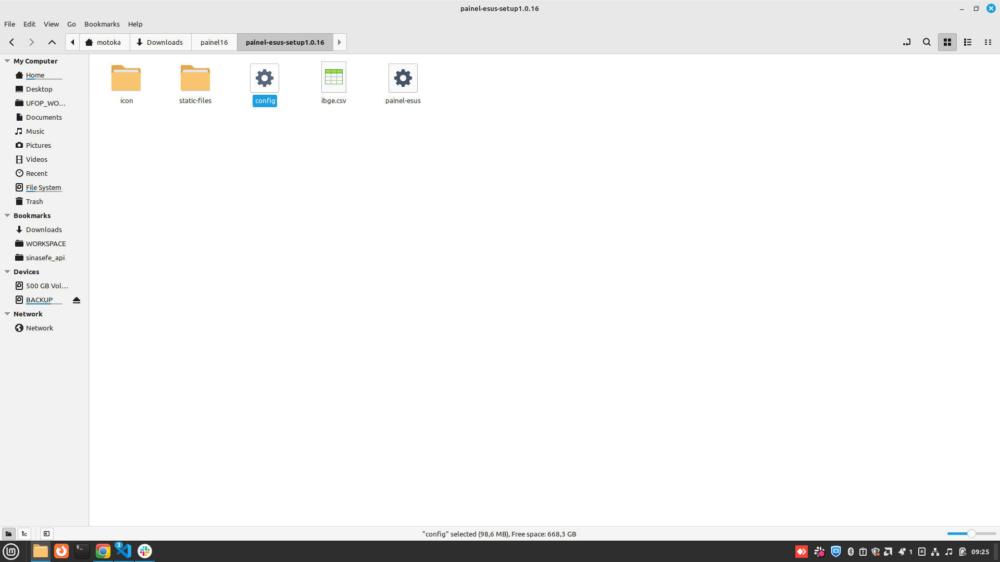
Figura 25: Execução da interface de configuração. 

Ao clicar duas vezes sobre o arquivo “**config**”, uma interface de configuração será inciada, assim como apresentado na **Figura 26**.


Figura 26: interface de configuração das variáveis de ambiente do Painel e-SUS.

O processo de configuração das variáveis de ambiente é dividido em duas etapas (assim como apresentado nas abas superiores da interface de configuração), sendo elas: 

- **Banco de Dados:** configuração de todas as variáveis de ambiente necessárias para a conexão do Painel e-SUS com o banco de dados do município.
- **Painel e-SUS:** configuração das variáveis de login no sistema.

{: .atencao }
É imprescindível preencher todos os campos de maneira correta. Para isto, é necessário o acesso ao arquivo “credenciais” presente no diretório raiz da Instalação do PEC e-SUS APS.**


De posse desses dados, preencher os campos da **Aba “Banco de dados”**, considerando o exemplo abaixo e Figura 27, conforme as configurações padrão da Instalação do PEC e-SUS APS:

- **Host =** host de acesso ao banco de dados da UBS. 
*Para instalações do Painel e-SUS APS diretamente no servidor, utilizar o **padrão: localhost***
- **Base de dados =** nome da base de dados da UBS.
***Padrão: esus***
- **Usuário do banco de dados =** usuário de acesso ao banco de dados da UBS. 
*Utilizar por padrão o usuário esus_leitura ou outro que possua acesso somente leitura do banco de dados.*
- **Senha do banco de dados =** senha de acesso ao banco de dados da UBS. 
*Por padrão está presente no arquivo credenciais, conforme Figura 11.*
- **Porta do banco de dados =** porta de acesso ao banco de dados da UBS.
*Padrão: 5433*


Figura 27 - Configurações padrão do PEC e-SUS APS.

Após preencher todos os campos desta aba, clicar no botão "**Testar Conexão**" ao final da seção para verificar a conectividade com a base de dados do PEC e-SUS APS. Uma mensagem será exibida, sinalizando que a conexão foi estabelecida (**Figura 28**).


Figura 28 - Conexão estabelecida.

{: .atencao }
**Atenção: A execução correta do Painel depende da conexão bem-sucedida com o banco de dados.**


Uma vez confirmada a conexão, seguir para aba "Painel e-SUS" e preencher todos os campos, como demonstra a **Figura 29**. Considerar os exemplos a seguir para o preenchimento dos campos:

- **Código IBGE da Cidade** = código IBGE correspondente ao município em que o sistema está sendo instalado. O código deverá ser composto dos 7 dígitos numéricos do IBGE. Caso seja necessário maiores informações, buscar no site do IBGE: [https://www.ibge.gov.br/cidades-e-estados](https://www.ibge.gov.br/cidades-e-estados) .
- **Usuário de acesso ao painel-esus:** nome do usuário administrador para acesso ao Painel. Padrão: **admin**
- **Senha de acesso ao painel-esus:** senha do usuário administrador.
- **Url de login:** Endereço para acesso ao PEC e-SUS APS. Importante destacar que esta configuração deve estar correta para que o Painel seja acessado pelos profissionais utilizando as mesmas credenciais do PEC e-SUS APS.
    
    **Exemplos:**
    
    **http://localhost:8080** (Instalação local do PEC sem acesso externo)
    
    **http://191.10.20.30:8080** (Instalação do PEC acessada por IP público)
    
    **https://esus.municipio.uf.gov.br** (Instalação do PEC acessada por domínio com HTTPS)
    


Figura 29 - Configuração do painel.

Após completar o preenchimento desta aba, clicar no botão "Finalizar Configuração". Com a finalização dessas etapas, o Painel estará devidamente configurado e pronto para inicialização (**Figura 30**).


Figura 30 - Configuração realizada com sucesso.

### 4.2.3 Inicialização do Painel em ambiente Linux

Com as variáveis de ambiente devidamente configuradas, para iniciar o sistema, basta abrir um terminal dentro do diretório onde o **Painel e-SUS** foi descompactado e executar o comando “./painel-esus” assim como ilustrado na **Figura 31.**


Figura 31: Comando para execução do Painel e-SUS em ambiente Linux.

Ao executar o comando especificado, o Painel e-SUS começará a ser executado automaticamente, apresentando um conjunto de logs no terminal, assim como apresentado na **Figura 32**.

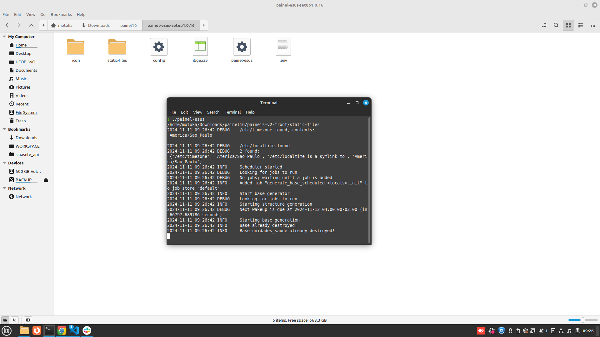
Figura 32: Logs de execução do Painel e-SUS.

O tempo de inicialização do Painel e-SUS está diretamente relacionado ao tamanho da base de dados do município, podendo demorar vários minutos até a sua conclusão. Sendo assim, espere até que todas as bases necessárias sejam criadas. 

Quando o sistema estiver pronto para acesso, será apresentado um log assim como o da Figura 33, especificando que o Painel está pronto rodando na porta 5001.

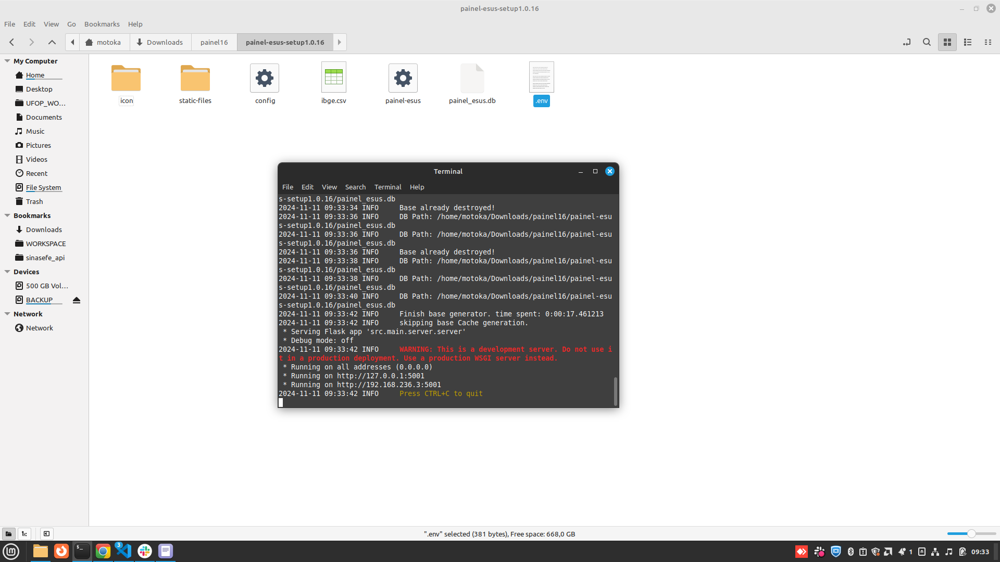
Figura 33: Fim da inicialização do Painel e-SUS em ambiente Linux.

Para acessar o Paine e-SUS, leia atentamente a seção 4.4.

## 4.3 Docker

Essa seção irá abordar o processo de instalação do Painel e-SUS via docker em ambiente Linux. Para isso, considere a versão Linux Mint na versão 21.12 como referência.


### 4.3.1 Instalação do Docker e Docker Compose

Primeiramente, é necessários abordar a instalação do docker na máquina que irá hospedar o Painel e-SUS. Se já possuir o Linux instalado, pule para a seção 4.2.2. 

Para instalar o docker no ambiente Linux, basta seguir os passos descritos abaixo: 

```jsx
//ATUALIZAÇÃO DO SISTEMA
sudo apt update

//INSTALAÇÃO DE CERTIFICADOS
sudo apt install apt-transport-https ca-certificates curl software-properties-common

curl -fsSL https://download.docker.com/linux/ubuntu/gpg | sudo apt-key add -

sudo add-apt-repository "deb [arch=amd64] https://download.docker.com/linux/ubuntu focal stable"

//INSTLAÇÃO DO DOCKER
sudo apt update
apt-cache policy docker-ce
sudo apt install docker-ce
sudo systemctl status docker
```

Caso queira executar os comandos docker sem a necessidade do “*sudo*” basta executar os seguintes comandos: 

```jsx
sudo gpasswd -a $USER docker
newgrp docker
```

Com o docker devidamente instalado, agora é necessário instalar o docker-compose para conseguir executar o Painel e-SUS a partir de um yml de configuração. 

Sendo assim, execute os comandos abaixo no seu terminal para concluir a instalação do docker-compose: 

```jsx
sudo curl -L "https://github.com/docker/compose/releases/download/1.29.2/docker-compose-$(uname -s)-$(uname -m)" -o /usr/local/bin/docker-compose

sudo chmod +x /usr/local/bin/docker-compose

sudo docker-compose --version
```

### 4.3.2 Configuração docker-compose

Com o Docker e Docker Compose previamente instalados em seu ambiente linux, é necessário criar um arquivo docker-compose.yml para configurar a inicialização do serviço do Painel e-SUS. 

Sendo assim, crie um arquivo docker-compose.yml em um diretório de sua preferência, assim como apresentado abaixo: 

```jsx
sudo touch docker-compose.yml
```

Agora, com um editor de texto de sua preferência, precisamos configurar o conteúdo do docker-compose de acordo com o modelo apresentado abaixo: 

```jsx
version: "3.3"
services:
  painel_esus:
    image: "painelsaudefiocruz/demo:backend-1.0.16"
    environment:
      RELOAD_BASE_SCHELDULE: '4:00'
      DB_HOST: ''
      DB_USER: ''
      DB_PASSWORD: ''
      DB_PORT: ''
      DB_DATABASE: ''
      CIDADE_IBGE: 
      ESTADO: ''
      ADMIN_USERNAME: ''
      ADMIN_PASSWORD: ''
      POPULATION: 20000
      SECRET_TOKEN: 111111111111111111111
      PASSWORD_SALT: 'painel'
      BRIDGE_LOGIN_URL: ''
      ENV: linux
      GENERATE_BASE: 'True'
    ports:
      - 5003:5001
```

É necessário preencher os valores das variáveis vazias no docker-compose, sendo elas: 

- **DB_HOST:** host de acesso ao banco de dados da UBS. 
*Para instalações do Painel e-SUS APS diretamente no servidor, utilizar o **padrão: localhost***
- **DB_USER:** usuário de acesso ao banco de dados da UBS. 
*Utilizar por padrão o usuário esus_leitura ou outro que possua acesso somente leitura do banco de dados.*
- **DB_PASSWORD:** senha de acesso ao banco de dados da UBS. 
*Por padrão está presente no arquivo credenciais, conforme Figura 11.*
- **DB_PORT:**  porta de acesso ao banco de dados da UBS.
*Padrão: 5433*
- **DB_DATABASE:**  nome da base de dados da UBS.
***Padrão: esus***
- **CIDADE_IBGE:**  código IBGE correspondente ao município em que o sistema está sendo instalado. O código deverá ser composto dos 7 dígitos numéricos do IBGE. Caso seja necessário maiores informações, buscar no site do IBGE: [https://www.ibge.gov.br/cidades-e-estados](https://www.ibge.gov.br/cidades-e-estados) .
- **ADMIN_USERNAME:**  nome do usuário administrador para acesso ao Painel. 
*Padrão: **admin***
- **ADMIN_PASSWORD:** senha do usuário administrador.
*Coloque uma senha forte. Ex: 7Hz4eq395O4kZtBD2D*
- **BRIDGE_LOGIN_URL:** Endereço para acesso ao PEC e-SUS APS. 
*Importante destacar que esta configuração deve estar correta para que o Painel seja acessado pelos profissionais utilizando as mesmas credenciais do PEC e-SUS APS.*

Com o docker-compose devidamente criado e configurado, agora é a hora de realmente executar o Painel e-SUS. Para isso execute o comando abaixo dentro do diretório escolhido para a criação do docker-compose.yml.

```jsx
docker-compose up -d
```

Para acessar o Paine e-SUS, leia atentamente a seção 4.4.

## 4.4 Acesso ao Painel e dicas de uso

Ao completar todos os passos descritos anteriormente, o Painel já se encontrará apto para acesso. Para acessá-lo, abrir em um navegador web o seguinte endereço: [http://localhost:5001/](http://localhost:5001/)**.** É possível acessar o Painel via IP público ou domínio, desde que o computador onde o Painel e-SUS APS foi instalado tenha essas possibilidades e a porta 5001 esteja devidamente configurada para acesso externo.

{: .atencao }
**Atenção**: Durante a utilização do Painel, é importante monitorar o uso da Unidade Central de Processamento (CPU) e da memória do servidor do banco de dados do PEC e-SUS APS. Isso ajuda a garantir que a execução do Painel não comprometa a performance do prontuário, especialmente em servidores com configurações inferiores às recomendadas, conforme descrito no Manual do e-SUS APS – Apoio à Implantação - Preparar Ambiente: LINK.

Ao abrir a aplicação, terá o direcionamento para a tela de login. No campo **Login**, inserir o CPF do usuário e no campo **Senha**, digitar a senha correspondente. O acesso do administrador do Painel é configurado durante a instalação inicial, enquanto os profissionais de saúde utilizarão as mesmas credenciais (login e senha) do PEC e-SUS APS. Após preencher os campos, clicar no botão **Entrar** para iniciar a navegação no Painel, como ilustra a **Figura 34**.


Figura 34 – Tela de acesso ao Painel e-SUS APS

## 5 Alterar configurações de ambiente

Se houver a necessidade de alterar alguma variável de ambiente anteriormente definida como uma porta do banco de dados, a senha de conexão com o banco ou o código IBGE da cidade, siga o mesmo procedimento apresentado na seção **4.1.2 Configuração do Painel e-SUS APS** (para ambiente Windows) ou **4.2.2 Configuração do Painel e-SUS APS em ambiente Linux** (para ambiente Linux), clicando sobre o executável "config” dentro da pasta “Painel Esus”. 

Neste caso, como a configuração de ambiente já foi realizada anteriormente, ao clicar sobre o executável “config”, uma nova tela irá se abrir, assim como a apresentada na **Figura 35**.


Figura 35: Reconfigurar variáveis de ambiente

O sistema irá detectar que já existe uma configuração de variáveis de ambiente anteriormente executada, apresentando duas opções de ações: 

- Testar conexão: clique no botão "Testar conexão” se quiser apenas testar a conexão com a base de dados atualmente configurada.
- Configurar novamente: ao clicar no botão “Testar conexão”, o usuário será redirecionado para a primeira tela de configuração do painel-esus, apresentada na **Figura 13.** A diferença é que os campos apresentados em tela como “Host”, “Base de dados”, “Usuário do banco de dados**“** e afins, já virão automaticamente preenchidos com os valores da última configuração realizada. Para alterar o valor de um campo pré-definido, basta clicar sobre o mesmo, inserir um novo valor e clicar sobre o botão “**Finalizar configuração**”, assim como apresentado na **Figura 15**.

## 6 Atualizando o Painel e-SUS APS

### 6.1 Atualização em ambiente Windows

O processo de atualização do painel-esus em ambiente Windows também ocorre de forma muito simples, podendo ser realizado de duas formas distintas. A primeira delas é realizando o processo de desinstalação do software (descrito na seção 7) antes de instalá-lo novamente em seu sistema operacional. Ou seja, vamos primeiramente remover a instalação já existente para depois instalar a nova versão do painel-esus.

Já na segunda forma de atualização (mais aconselhável), basta fazer a instalação da nova versão do painel-esus por cima da versão já existente. Ou seja, basta seguir novamente o processo de instalação e escolher o mesmo diretório de destino onde se encontra a versão atualmente instalada. Esse processo irá atualizar apenas os arquivos necessários no sistema, garantindo uma atualização mais rápida e eficiente. Dessa forma, o processo de instalação não causará a perda das configurações já realizadas no sistema, não havendo necessidade de realizar o processo de configuração novamente.

### **6.2 Atualização em ambiente Linux**

Para realizar o processo de atualização do sistema em ambiente Linux, basta remover a versão atual do **Painel e-SUS**, apagando a pasta onde o sistema foi descompactado, realizar o download da versão mais atualizada do Painel e seguir os mesmos passos apresentados na **Seção 4.2.**

## 7 Desinstalando o Painel e-SUS APS

### **7.1 Ambiente Windows**

A desinstalação do painel-esus pode pode ser executada de duas formas. A primeira delas é clicando duas vezes sobre o executável “unins000.exe” assim como apresentado na **Figura 36**.

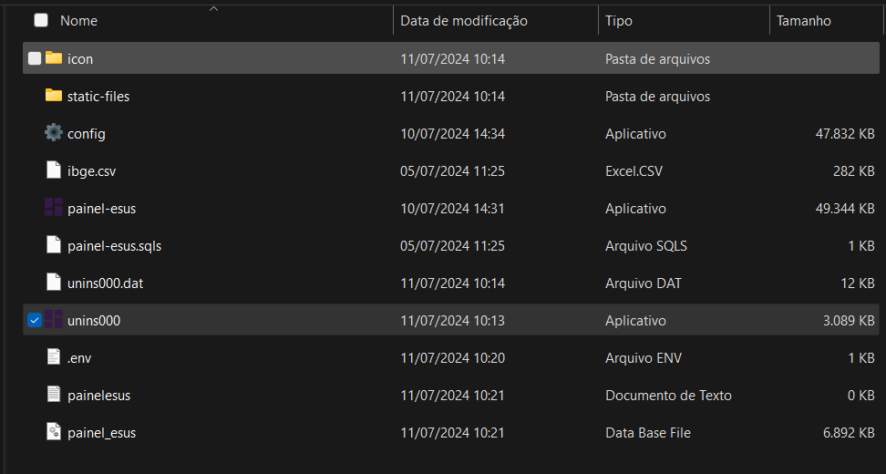
Figura 36: Arquivo para desinstalar do Painel e-SUS APS.

Ao clicar duas vezes sobre o executável o sistema operacional irá exibir uma mensagem assim como a apresentada na Figura18.


Figura 37: Mensagem de confirmação para desinstalação software.

Basta clicar em “sim” que o processo de desinstalação irá começar automaticamente. 

A segunda forma de desinstalar o painel-esus é deletando a pasta "Painel Esus" que foi criada durante no diretório escolhido durante a instalação do software. Recomendamos que você também exclua qualquer atalho que foi criado na área de trabalho durante o processo de instalação. 

### **7.1 Ambiente Linux**

A desinstalação do **Painel e-SUS** em ambiente Linux pode pode ser executada apenas removendo a pasta criada no processo de instalação da Seção **4.2.1 Instalação do Painel e-SUS APS.**
