<head>
    
</head>

# Apresentação
{: .no_toc }

O e-SUS APS é uma iniciativa da Secretaria de Atenção Primária (Saps) que visa reestruturar as informações da Atenção Primária à Saúde (APS) em todo o país. Esta ação está alinhada com a proposta mais ampla de reestruturação dos Sistemas de Informação em Saúde (SIS) do Ministério da Saúde (MS), reconhecendo que a qualificação da gestão da informação é essencial para melhorar a qualidade do atendimento à população.

A Estratégia e-SUS APS refere-se ao processo de informatização qualificada do Sistema Único de Saúde (SUS), buscando a implementação de um SUS eletrônico (e-SUS). O objetivo é estabelecer um novo modelo de gestão da informação que apoie os municípios e os serviços de saúde na gestão eficaz da APS e na qualificação do cuidado aos usuários.

Nesse contexto, o Painel e-SUS APS surge como uma ferramenta estratégica para aprimorar a gestão da informação, da clínica e do cuidado na APS em nível municipal. Trata-se de um software aberto, integrado diretamente à base de dados local do sistema e-SUS APS. O Painel e-SUS APS oferece uma visão abrangente dos dados populacionais e de saúde, permitindo às equipes de saúde e gestores uma compreensão clara e atualizada da situação de saúde do território. Além disso, possibilita o acompanhamento longitudinal e integrado dos cidadãos adscritos, facilitando uma atenção mais coordenada e centrada no usuário. Novas funcionalidades relacionadas às situações sociodemográficas e de saúde serão implementadas de forma incremental no desenvolvimento do Painel.

Mais do que apenas fornecer informações, o Painel e-SUS APS contribui diretamente para a melhoria dos processos de monitoramento e tomada de decisão, permitindo que gestores e profissionais de saúde ajustem e otimizem suas estratégias com base em dados concretos, resultando em intervenções mais precisas e oportunas. Diante disso, este Manual tem como objetivo detalhar os relatórios que compõem o Painel e-SUS APS, explicando cada componente dos relatórios temáticos. 

## Visualização em três níveis
{: .no_toc }

**Os relatórios são apresentados em três níveis de visualização: Município, Unidade Básica de Saúde (UBS) e Equipe**. 

Os diferentes níveis de visualização apresentados no Painel dialogam com o conceito de território. A concepção mais comum de território é a de um espaço geográfico delimitado por divisões administrativas, que podem dar origem a bairros, cidades, estados e países.   
Nesta aplicação do Painel e-SUS APS, a visualização por Município oferece uma visão geral, sendo útil principalmente para o gestor de saúde municipal, que poderá identificar o cenário atual do município. A visualização por Unidade Básica de Saúde detalha o território de abrangência da UBS, auxiliando majoritariamente tanto o gestor de saúde municipal quanto o gestor da própria UBS. Por fim, a visualização por Equipe tem como principal objetivo apresentar o cenário da população acompanhada pela equipe.  

## Sumário
{: .no_toc .text-delta }

- TOC
{:toc}

# Acesso ao Painel e-SUS APS

O acesso ao Painel e-SUS APS é realizado através do link fornecido pelo município. Ao abrir a aplicação, terá o direcionamento para a tela de login. O acesso do administrador do Painel e-SUS APS é configurado durante a instalação inicial, enquanto os profissionais de saúde utilizarão as mesmas credenciais (login e senha) do PEC e-SUS APS, sendo assim no campo **usuário**, inserir o CPF do usuário e no campo **senha**, digitar a senha correspondente, a mesma utilizada no PEC.

Formulário de login do Painel e-SUS APS  

Nesta página também são encontradas informações gerais sobre o Painel e-SUS APS e sua função, conforme ilustrado a seguir.  
Texto informativo sobre o Painel e-SUS APS  

Texto informativo sobre o Painel e-SUS APS  

A versão atual e a data da última atualização do Painel e-SUS APS estão disponíveis ao fim de todas as páginas do Painel e-SUS APS.  
   
Versão Painel e-SUS APS  

Caso o(a) usuário(a) do Painel e-SUS APS possua mais de um CBO cadastrado na autenticação do PEC, poderá escolher o perfil que deseja utilizar para o acesso, a exemplo da ilustração a seguir. 

Lista de perfil ativos dos profissionais de saúde  
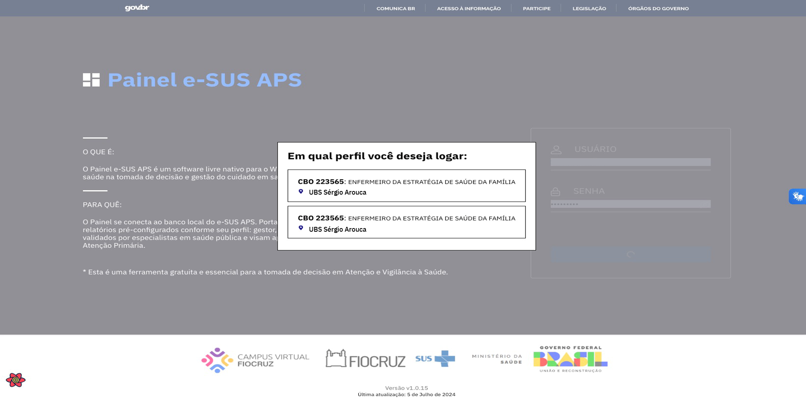

# Relatório Sociodemográfico

Após realizar o login, será possível optar por níveis de visualização das informações, considerando o perfil de lotação: **Município**, **Unidade Básica de Saúde (UBS)** ou **Equipe**. 

O Relatório Sociodemográfico conterá, portanto, o conjunto de informações sobre os cidadãos de acordo com o nível de visualização da informação escolhida. O nível de Município é o mais amplo do ponto de vista de granularidade, e contém as informações do respectivo município e suas respectivas UBS. O nível de UBS, por sua vez, contém informações da própria UBS e de todas as equipes adscritas. A visualização por Equipe representa o nível mais detalhado de informação disponível no relatório, permitindo o acesso aos dados em todos os três níveis: Município, Unidade Básica de Saúde (UBS) e Equipe.

Níveis de visualização dos dados  
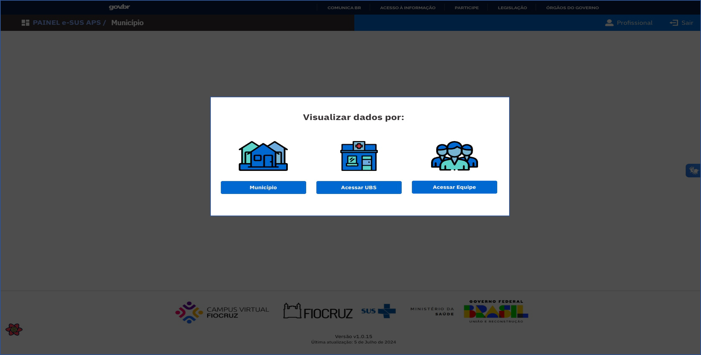

No relatório, são encontradas as informações a respeito da população apurada e dos cidadãos cadastrados com as estratificações por sexo, localização de moradia e faixa etária, ilustradas abaixo e detalhadas a seguir. 

Cidadãos Cadastrados e População Apurada
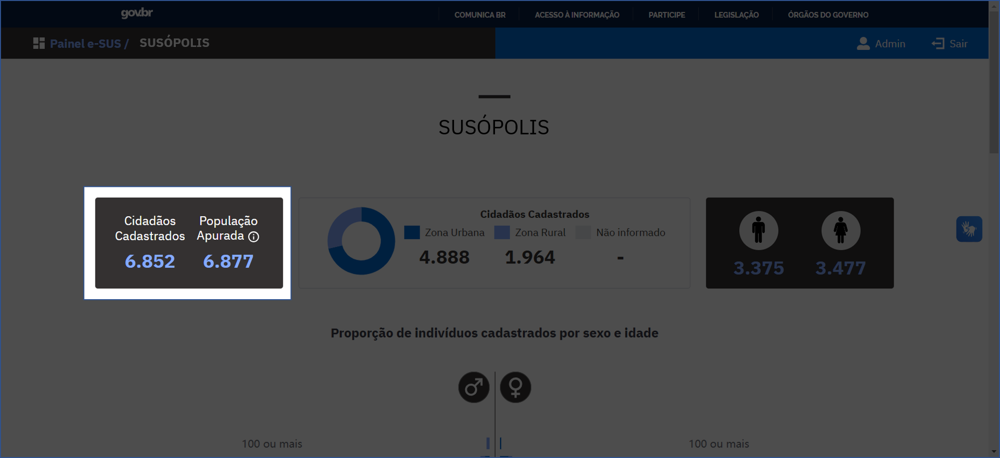

## Cidadãos Cadastrados 

Esta informação é extraída da [**Tabela de Acompanhamento de Cidadãos Vinculados**](https://integracao.esusab.ufsc.br/dw/visualizacoes/acompanhamento_cidadaos_vinculados.html), que segue a regra do relatório do “Acompanhamentos - Cidadãos vinculados” do PEC, no qual são consideradas as **Fichas de Cadastro Individual (FCI)** e o **Cadastro Simplificado do Cidadão**. Complementarmente, são utilizados os dados da **Ficha de Cadastro Domiciliar e Territorial (FCDT)** para composição de informação de endereço, microárea e estrutura do núcleo familiar. Somente são considerados cidadãos que possuem vínculo com alguma equipe em seu cadastro.

## População Apurada

**População Apurada** é o resultado do Censo Demográfico realizado pelo IBGE, representando a contagem dos habitantes do município. Essa informação foi extraída da Relação da População Municipal enviada ao TCU em 2023, pelo IBGE. A exibição da População Apurada será apresentada apenas se, durante a instalação do Painel e-SUS APS, o código IBGE completo do município (7 dígitos) tiver sido informado durante a configuração inicial, sendo mantida na visualização por Município, Unidade Básica de Saúde e Equipe.

## Tipo de localização de moradia

Esse dado é extraído da  **Ficha de Cadastro Domiciliar e Territorial (FCDT)**. Os números representam todas as pessoas que estão cadastradas nas Unidades Básicas de Saúde do Município, estratificadas por **Zona Urbana** e  **Zona Rural.** Pessoas que só possuem associação a uma FCI e não possuem associação com FCDT, são indicadas como **Não Informado**.  
A proporção de cidadãos cadastrados por tipo de localização é visualizada através de um gráfico de rosca, conforme ilustrado a seguir, e o total de pessoas em cada tipo de localização pode ser visualizado quando o(a) usuário(a) posicionar o cursor em cada parte do gráfico.

Tipo de localização de moradia  
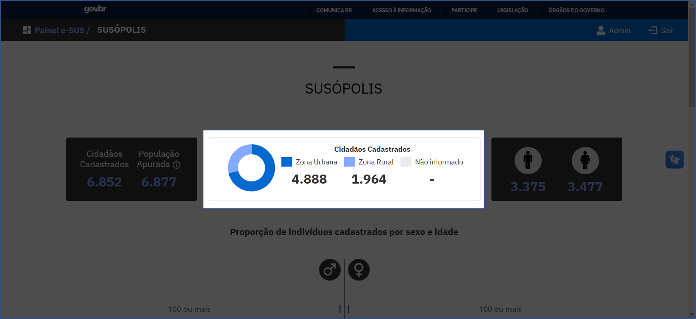

## Cidadãos cadastrados por Sexo

São todas as pessoas que estão cadastradas, estratificadas por sexo **masculino** e **feminino**.   
A visualização é identificada no Painel e-SUS APS pelos respectivos símbolos e pelo total de pessoas por sexo, de acordo com o nível de visualização escolhido.

Cidadãos cadastrados por sexo  
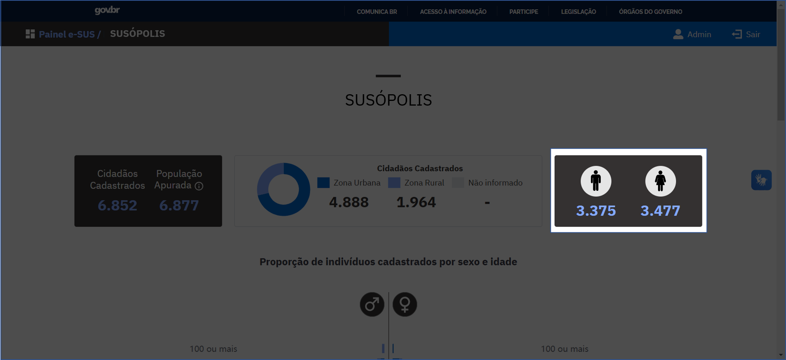

## Proporção de indivíduos cadastrados por sexo e idade 

São todas as pessoas que estão na [**Tabela de Acompanhamento de Cidadãos Vinculados**](https://integracao.esusab.ufsc.br/dw/visualizacoes/acompanhamento_cidadaos_vinculados.html)**,** que segue a regra do relatório do “Acompanhamentos - Cidadãos vinculados” do PEC, de acordo com o nível de visualização escolhido, estratificadas por **faixa etária** e  por sexo (**masculino** ou **feminino)**. Para as pessoas que possuem  **Ficha de Cadastro Domiciliar e Territorial (FCDT)**, também é demonstrada a localização do domicílio como **Zona Urbana** ou **Zona Rural.** 

As proporções estão representadas no gráfico de pirâmide etária a seguir e o total de pessoas em cada tipo de localização pode ser visualizado quando o(a) usuário(a) posicionar o cursor sobre as respectivas áreas do gráfico.

Pirâmide etária estratificada por sexo e faixa etária  
 apresentam informações sobre as pessoas de acordo com o nível de visualização selecionado, organizadas nos seguintes temas: **Diabetes**, **Hipertensão** e **Qualidade de Cadastro**.
Os RT são apresentados por meio de cards clicáveis, que exibem o **número absoluto de pessoas relacionadas a cada tema**, e de gráficos que mostram o percentual de pessoas por **tipo de localização**. A identificação da localização de moradia segue a mesma metodologia utilizada no Relatório Sociodemográfico, conforme ilustrado abaixo. Para visualizar o total de pessoas em cada tipo de localização, basta posicionar o cursor sobre as áreas correspondentes do gráfico.  
Informações detalhadas sobre cada tema são disponibilizadas no Relatório Temático correspondente, acessível ao clicar no card desejado. Essas informações são exploradas em profundidade nas próximas seções deste manual, em cada RT específico.

Relatórios Temáticos
![Relatórios Temáticos](media/relatorios-tematicos.png]

Os Relatórios Temáticos contêm informações sobre pessoas que atendem a critérios específicos, relacionados a questões de saúde ou situação de cadastro:

### **Diabetes** {#diabetes}

O número de **pessoas com Diabetes** equivale ao total de indivíduos que tiveram atendimentos realizados nos últimos 12 meses com registro do código CID-10 e/ou CIAP-2 correspondente à condição de saúde presentes na **Ficha de Atendimento Individual**, somado ao conjunto de pessoas com registro autorreferido da condição de saúde na **Ficha de Cadastro Individual**.

### **Hipertensão** {#hipertensão}

O número de **pessoas com Hipertensão Arterial** equivale ao total de indivíduos que tiveram atendimentos realizados nos últimos 12 meses com registro do código CID-10 e/ou CIAP-2 correspondente à condição de saúde presentes na **Ficha de Atendimento Individual**, somado ao conjunto de pessoas com registro autorreferido da condição de saúde na **Ficha de Cadastro Individual**.

### **Qualidade de Cadastro** {#qualidade-de-cadastro}

Este relatório temático apresenta o total de pessoas com ou sem Ficha de Cadastro Individual (FCI) e Ficha de Cadastro Domiciliar e Territorial (FCDT), considerando também a atualização e a completude das informações contidas nessas fichas.

Para visualizar cada um dos relatórios, basta clicar sobre o “card” de interesse.

# Relatório Temático de Diabetes

Este Relatório Temático se refere às informações de cuidado da pessoa com Diabetes Mellitus na Atenção Primária à Saúde, e os valores apresentados estarão sempre relacionados ao nível de visualização escolhido previamente: Município, Unidade Básica de Saúde (UBS) ou Equipe, ou seja, se uma UBS é selecionada para visualização, todos os totais e percentuais vão se referir à população acompanhada por esta UBS. 

Os dados do Relatório do tema **pessoas com diabetes** são provenientes das seguintes fichas: **Cadastro Individual** (captando diagnósticos autorreferidos), **Atendimento Individual**, **Atendimento Odontológico**, **Cadastro Domiciliar e Territorial** e **Ficha de Visita Domiciliar e Territorial**. 

## Pessoas com diabetes por faixa etária

O **total de pessoas com diabetes** e suas proporções por **faixa etária** e por **tipo de localização de moradia**, são apresentados através do gráfico ilustrado a seguir. O total de pessoas em cada tipo de localização pode ser visualizado quando o(a) usuário(a) posicionar o cursor em cada parte do gráfico.

Pessoas com diabetes por faixa etária  
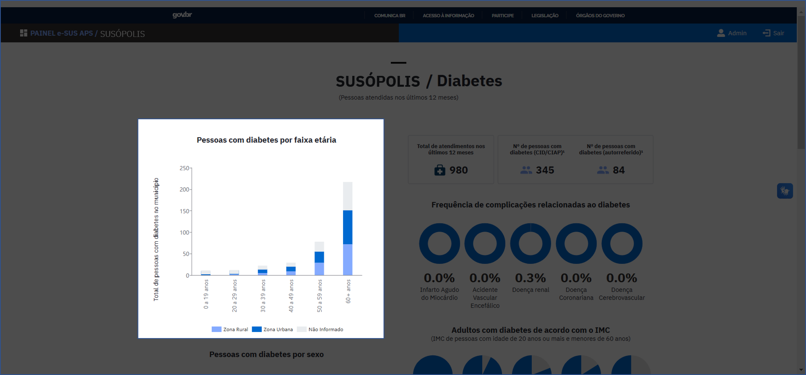

## Total de atendimentos e número de pessoas com diabetes

Nos quadros destacados das ilustrações abaixo, temos o  **total de atendimentos nos últimos 12 meses** de pessoas com diabetes, bem como o número de pessoas com diabetes identificadas através dos códigos **CID-10/CIAP-2**, e os casos **autorreferidos**.

Total de atendimentos nos últimos 12 meses de pessoas com diabetes  
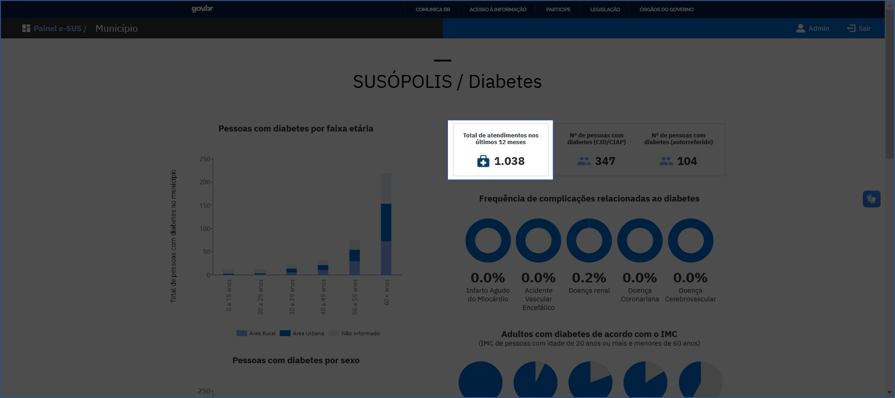

Número de pessoas com diabetes atendidas nos últimos 12 meses e número de pessoas com diabetes autorreferido  
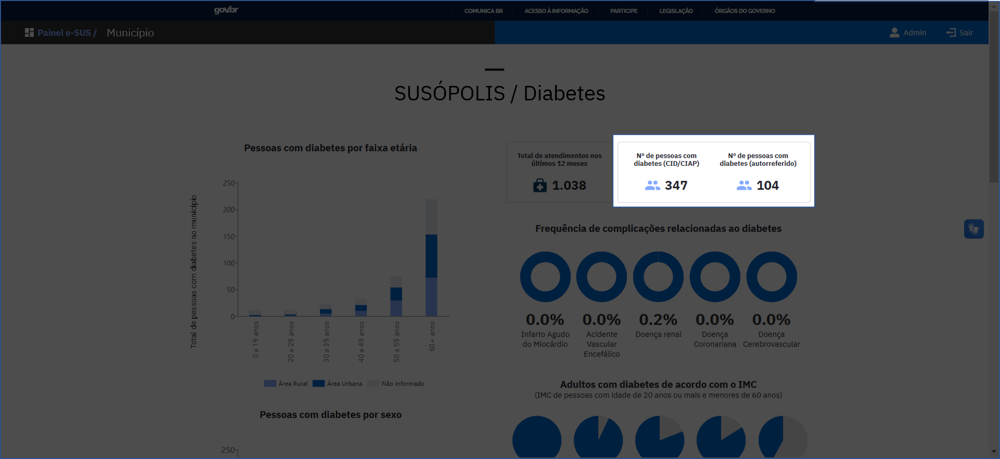

O **número de pessoas com diabetes (CID-10/CIAP-2)** equivale aos indivíduos que tiveram atendimentos individuais realizados nos últimos 12 meses com registro do código CID-10 e/ou CIAP-2 correspondente à condição de saúde na Ficha de Atendimento Individual. O **número de pessoas com diabetes (autorreferido)** refere-se aos indivíduos que declararam ter a condição de saúde na Ficha de Cadastro Individual e que não receberam o diagnóstico da condição em registro de Atendimento Individual por meio de código CID-10 ou CIAP-2.

## Frequência de complicações relacionadas ao diabetes

A frequência é ilustrada através de gráficos que especificam as porcentagens das seguintes complicações relacionadas ao diabetes: **infarto agudo do miocárdio**, **acidente vascular encefálico**, **doença renal**, **doença coronariana** e **doença cerebrovascular**. 

Frequência de complicações relacionadas ao diabetes  

## Pessoas com diabetes por sexo

O **total de pessoas** com diabetes e suas proporções por **sexo** são apresentados no gráfico abaixo, organizados em categorias de faixa etária. A quantidade de indivíduos de cada sexo dentro de cada faixa etária pode ser visualizada ao posicionar o cursor sobre as respectivas áreas do gráfico.

Pessoas com diabetes por sexo
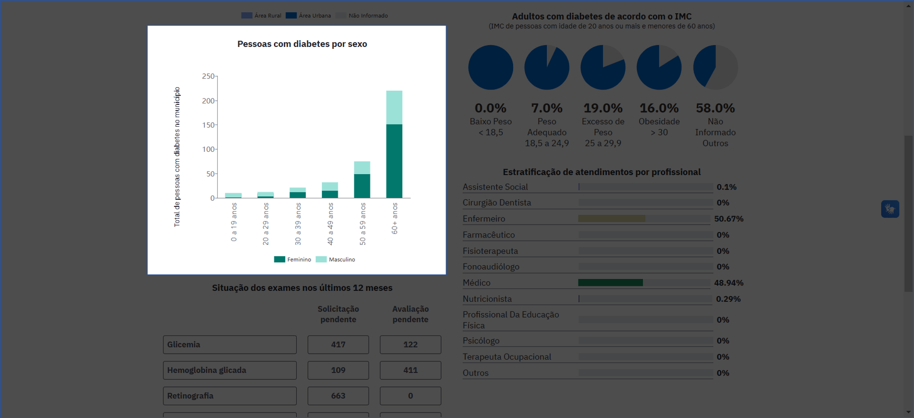

## Adultos com diabetes de acordo com o IMC

A quantidade de  **adultos (20 a 60 anos de idade) com diabetes de acordo com o IMC (Índice de Massa Corporal)** é ilustrada através de gráficos que representam o percentual dos adultos com diabetes em cada uma das categorias de classificação, baseadas nas faixas de valores de IMC: **baixo peso** (IMC menor que 18,5), **peso adequado** (IMC entre 18,5 e 24,9), **excesso de peso** (IMC entre 25 e 29,9), **obesidade** (IMC maior ou igual a 30) ou, caso a informação de peso e/ou altura não esteja disponível, foi classificado como **não informado**. O IMC é calculado utilizando-se  o último registro simultâneo de peso e altura. O percentual das pessoas com diabetes compreendidas em cada classificação pode ser visualizado quando o(a) usuário(a) posicionar o cursor em cada parte do gráfico.

Adultos com diabetes de acordo com o IMC
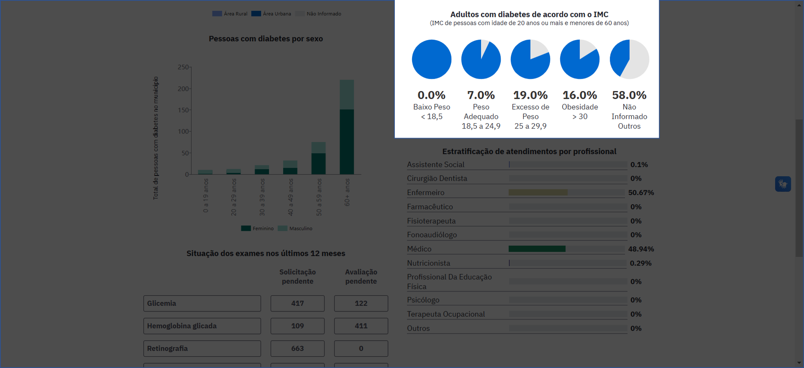

## Estratificação de atendimentos por profissional

O percentual de atendimentos realizados por pessoas com diabetes por tipo de profissional é ilustrado no gráfico de **estratificação de atendimentos por profissional.** São considerados os seguintes profissionais: **assistente social**, **cirurgião dentista**, **enfermeiro**, **farmacêutico**, **fisioterapeuta**, **fonoaudiólogo**, **médico**, **nutricionista**, **profissional da educação física**, **psicólogo**, **terapeuta ocupacional** e **outros.** 

Estratificação de atendimentos por profissional
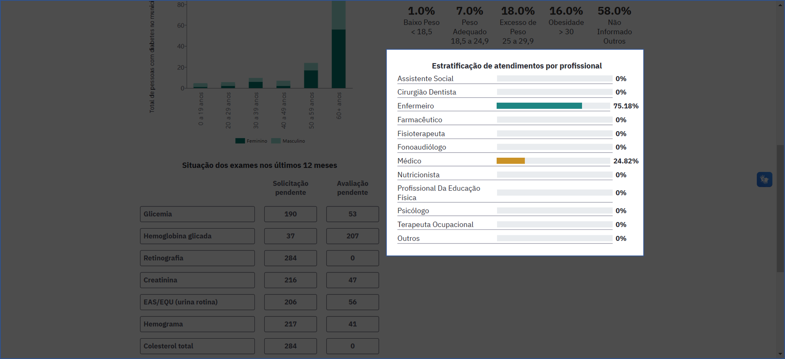

## Situação dos exames nos últimos 12 meses

Para avaliar a **situação dos exames nos últimos 12 meses** temos as indicações de quantidade de exames com **solicitação pendente** e com **avaliação pendente,** para o total de pessoas com diabetes, por tipo de exame: **Glicemia**, **Hemoglobina Glicada**, **Retinografia**, **Creatinina**, **EAS/EQU** (urina rotina), **Hemograma** e **Colesterol total**.

Situação dos exames nos últimos 12 meses  
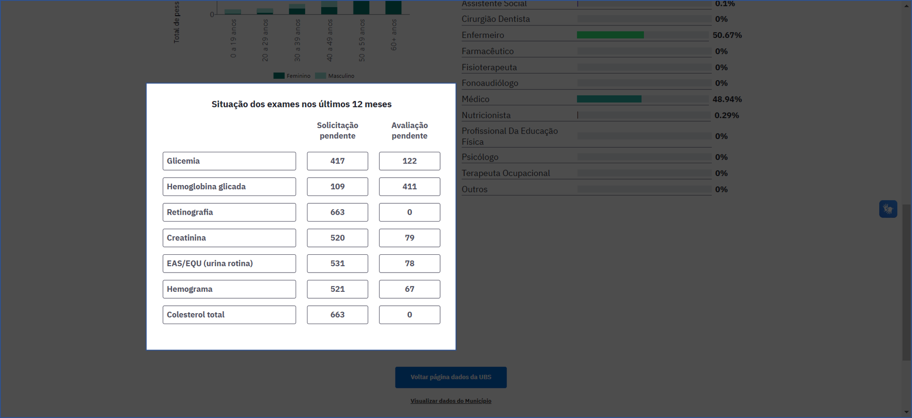

## Lista Nominal das pessoas atendidas nos últimos 12 meses 

Ao final da página do RT de Diabetes, na visualização por UBS ou equipe, há um botão clicável “Ver lista nominal”, que dá acesso à lista que relaciona individualmente cada uma das pessoas identificadas com essa condição de saúde. 

A **lista nominal** contém o número total de pessoas com diabetes (identificadas por CID-10/CIAP-2 ou autorreferidas, conforme definição de pessoa com diabetes) atendidas nos últimos 12 meses pela UBS ou equipe selecionada para visualização.

A lista possui as respectivas informações de cada pessoa: **Nome**, **CPF**, número do **Cartão Nacional de Saúde** (**CNS**), **Idade**, **Grupo/Condição**, **Sexo**, **Equipe** e **Microárea**. 

É possível realizar a busca por informações de cada cidadão através do número do CPF, na janela de busca presente na parte superior da lista nominal. 

O símbolo de **Alerta,** em vermelho, ao lado do nome do cidadão, indica situações que requerem atenção especial, por não estarem de acordo com as boas práticas preconizadas para o acompanhamento de saúde de pessoas com diabetes.

Lista Nominal das pessoas atendidas nos últimos 12 meses  
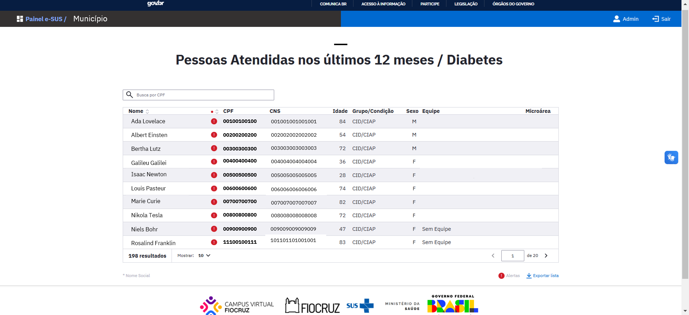

Ao clicar no nome do cidadão na lista nominal é possível visualizar, além dos dados pessoais do cidadão, informações adicionais, quando disponíveis, como: **data da última aferição de PA (pressão arterial)**, **total de consultas médicas ou de enfermagem realizadas nos últimos 12 meses**, **data da última consulta odontológica**, **data da última visita recebida do ACS (Agente Comunitário de Saúde)** e **data do último exame de Hemoglobina Glicada**. 

Card de detalhamento da pessoa e dos alertas  
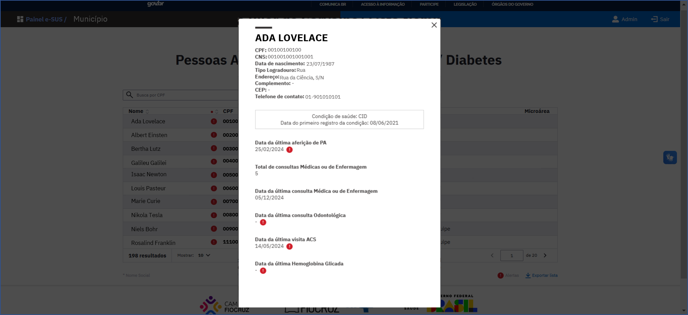

# Relatório Temático de Hipertensão

Este Relatório Temático se refere às informações de cuidado da pessoa com Hipertensão Arterial na Atenção Primária à Saúde, e os valores apresentados estarão sempre relacionados ao nível de visualização escolhido previamente: Município, Unidade Básica de Saúde (UBS) ou Equipe, ou seja, se uma UBS é selecionada para visualização, todos os totais e percentuais vão se referir à população acompanhada por esta UBS. 

Os dados do Relatório do tema **pessoas com hipertensão** são provenientes das seguintes fichas: **Cadastro Individual** (captando diagnósticos autorreferidos), **Atendimento Individual**, **Atendimento Odontológico**, **Cadastro Domiciliar e Territorial** e **Ficha de Visita Domiciliar e Territorial**. 

## Pessoas com hipertensão por faixa etária

O **total de pessoas com hipertensão** e suas proporções por **faixa etária** e por **tipo de localização de moradia**, são apresentados através do gráfico ilustrado a seguir. O total de pessoas em cada tipo de localização pode ser visualizado quando o(a) usuário(a) posicionar o cursor em cada parte do gráfico.

Pessoas com hipertensão por faixa etária  

## Total de atendimentos e pessoas com hipertensão

Nos quadros destacados das ilustrações abaixo, temos o **total de atendimentos nos últimos 12 meses** de pessoas com hipertensão, bem como o número de pessoas com hipertensão identificadas através dos códigos **CID-10/CIAP-2**, e os casos **autorreferidos**.

Total de atendimentos e pessoas com hipertensão  

O **número de pessoas com hipertensão (CID-10/CIAP-2)** equivale aos indivíduos que tiveram atendimentos individuais realizados nos últimos 12 meses com registro do código CID-10 e/ou CIAP-2 correspondente à condição de saúde na Ficha de Atendimento Individual. O **número de pessoas com hipertensão (autorreferida)** refere-se aos indivíduos que declararam ter a condição de saúde na Ficha de Cadastro Individual e que não receberam o diagnóstico da condição em registro de Atendimento Individual por meio de código CID-10 ou CIAP-2.

## Frequência de complicações relacionadas à hipertensão 

A frequência é ilustrada através de gráficos que especificam as porcentagens das seguintes complicações relacionadas à hipertensão: **infarto agudo do miocárdio**, **acidente vascular encefálico**, **doença renal**, **doença coronariana** e **doença cerebrovascular**. 

Frequência de complicações relacionadas à hipertensão 
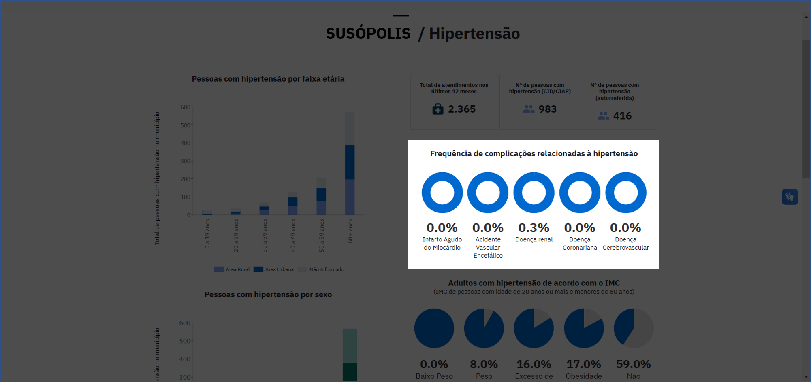

## Pessoas com hipertensão por sexo

O **total de pessoas** com hipertensão e suas proporções por **sexo** são apresentados no gráfico abaixo, organizados em categorias de faixa etária. A quantidade de indivíduos de cada sexo dentro de cada faixa etária pode ser visualizada ao posicionar o cursor sobre as respectivas áreas do gráfico.

Pessoas com hipertensão por sexo  
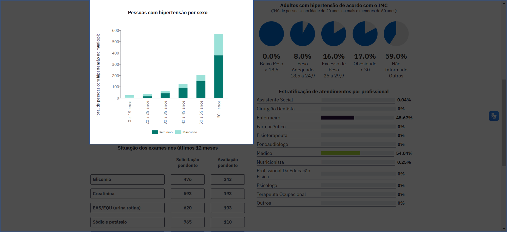

## Adultos com hipertensão de acordo com o IMC

A quantidade de  **adultos (20 a 60 anos de idade) com hipertensão de acordo com o IMC (Índice de Massa Corporal)** é ilustrada através de gráficos que representam o percentual dos adultos com hipertensão em cada uma das categorias de classificação, baseadas nas faixas de valores de IMC: **baixo peso** (IMC menor que 18,5), **peso adequado** (IMC entre 18,5 e 24,9), **excesso de peso** (IMC entre 25 e 29,9), **obesidade** (IMC maior ou igual a 30\) ou, caso a informação de peso e altura não esteja disponível, foi classificado como **não informado**. O IMC é calculado utilizando-se  o último registro simultâneo de peso e altura. O percentual das pessoas com hipertensão compreendidas em cada classificação pode ser visualizado quando o(a) usuário(a) posicionar o cursor em cada parte do gráfico.

Adultos com hipertensão de acordo com o IMC  
, **Sódio e potássio**, **Colesterol total**, **Hemograma** e **Eletrocardiograma**.

Situação dos exames nos últimos 12 meses  
 atendidas nos últimos 12 meses pela UBS ou equipe selecionada para visualização.

A lista possui as respectivas informações de cada pessoa: **Nome**, **CPF**, número do **Cartão Nacional de Saúde** (**CNS**), **Idade**, **Grupo/Condição**, **Sexo**, **Equipe** e **Microárea**. 

É possível realizar a busca por informações de cada cidadão através do número do CPF, na janela de busca presente na parte superior da lista nominal . 

O símbolo de **Alerta,** em vermelho, ao lado do nome do cidadão, indica situações que requerem atenção especial, por não estarem de acordo com as boas práticas preconizadas para o acompanhamento de saúde de pessoas com hipertensão.

Lista Nominal das Pessoas atendidas nos últimos 12 meses  
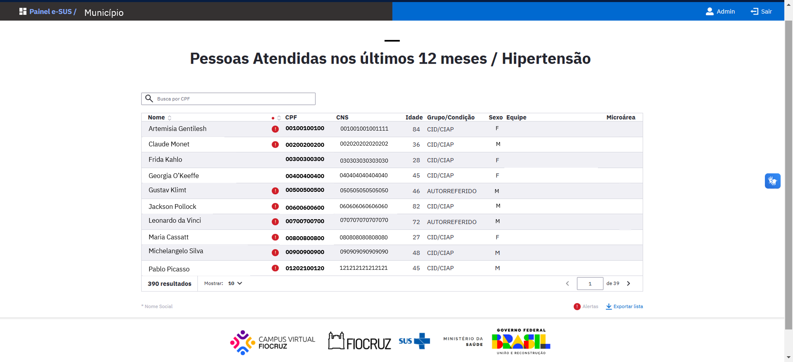

Ao clicar no nome do cidadão na lista nominal é possível visualizar, além dos dados pessoais do cidadão, informações adicionais, quando disponíveis, como: **data do último exame de creatinina, data da última aferição de PA (pressão arterial)**, **total de consultas médicas ou de enfermagem realizadas nos últimos 12 meses**, **data da última consulta odontológica** e **data da última visita ACS (Agente Comunitário de Saúde)**. 

Card de detalhamento da pessoa e dos alertas  
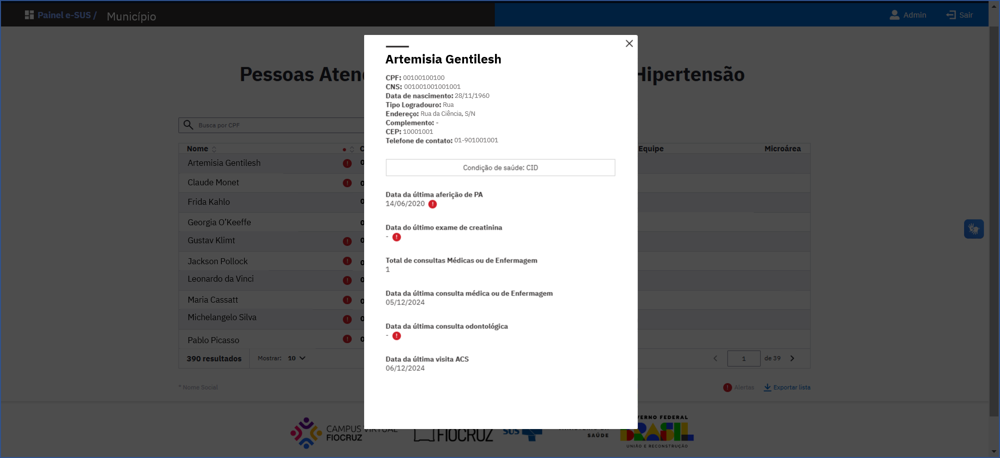

# Relatório Temático de Qualidade de Cadastro

Este Relatório Temático traz informações relacionadas ao cadastro tanto do indivíduo quanto dos domicílios acompanhados, considerando a atualização e a completude das informações contidas nas fichas de cadastro - FCI e FCDT. Os valores apresentados estarão sempre relacionados ao nível de visualização escolhido previamente: Município, Unidade Básica de Saúde (UBS) ou Equipe, ou seja, se uma UBS é selecionada para visualização, todos os totais e percentuais vão se referir à população acompanhada por esta UBS. 

Os dados do Relatório Temático de **Qualidade de Cadastro** são provenientes das seguintes fichas: **Cadastro Individual (FCI)**, **Módulo Cidadão PEC** (Prontuário Eletrônico do Cidadão), **Ficha de Cadastro Domiciliar e Territorial** (FCDT \- para as informações associadas ao tipo de localização) e a partir do dado de **Recusa de Cadastro**. 

## Informações Gerais

O **total de cadastros** registrados a partir de 2019 e a **porcentagem de cadastros atualizados** nos últimos 24 meses são apresentados conforme ilustrado no exemplo a seguir, em que o nível de visualização escolhido foi Município.

Total de cadastros e a porcentagem de cadastros atualizados nos últimos 24 meses  

## Total de cadastros de cidadãos por tipo de identificação

O percentual de cadastros por **tipo de identificação**, é apresentado no gráfico conforme a ilustração abaixo, e representa os cadastros realizados  **com CPF e/ou CNS** preenchidos ou **sem preenchimento de CPF e CNS**. 

Total de cadastros de cidadãos por tipo de identificação 
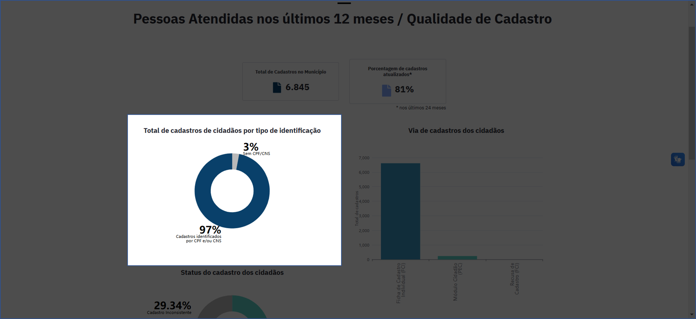

## Via de cadastros dos cidadãos

As proporções segundo **via de cadastros** pode ser visualizado no gráfico indicado na ilustração abaixo, e o total relacionado à cada categoria \- **Ficha de Cadastro Individual (FCI)**, **Módulo Cidadão PEC** ou **Recusa de Cadastro (FCI)** \- pode ser visualizado quando o(a) usuário(a) posicionar o cursor em cada coluna do gráfico.

Via de cadastros dos cidadãos 

## Total de cadastros de pessoas por raça e cor

O total de pessoas cadastradas e suas **proporções por raça e cor** são ilustradas conforme as seguintes categorias: **parda**, **branca**, **preta**, **amarela e** **sem informação**. O  total de pessoas em cada classificação pode ser visualizado quando o(a) usuário(a) posicionar o cursor em cada parte do gráfico.

Total de cadastros de pessoas por raça e cor  

## Localização dos domicílios cadastrados

O total de cidadãos cadastrados e o percentual por **localização dos imóveisdomicílios cadastrados** são informações provenientes da **Ficha de Cadastro Domiciliar e Territorial** e ilustradas através do gráfico com os seguintes tipos de localização: **Zona urbana, Zona rural** e, caso a informação não esteja disponível, **não informado**. O total das pessoas em cada classificação pode ser visualizada quando o(a) usuário(a) posicionar o cursor em cada parte do gráfico.

Localização dos domicílios cadastrados  
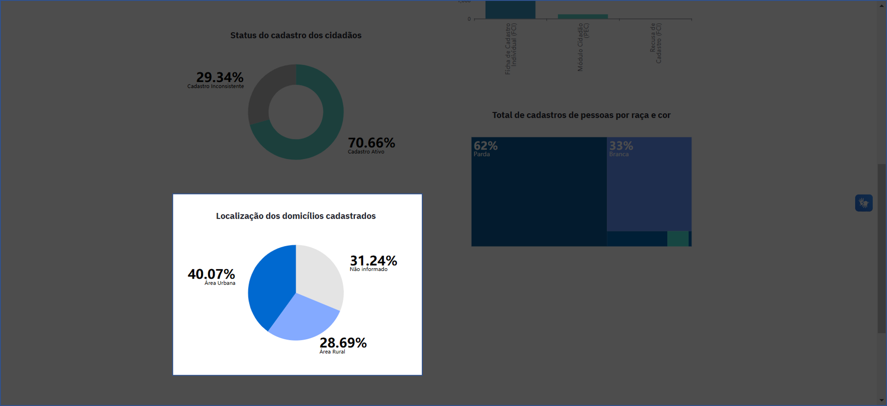

## Lista Nominal de Qualidade de Cadastro

Ao final da página do RT de Qualidade de Cadastro, há um botão clicável “Ver lista nominal”, que permite acessar a lista correspondente. 

A **lista nominal** contém o número total de **pessoas cadastradas**, considerando os registros a partir de 2019**,** e que tenham sido feitos especificamente via **Ficha de** **Cadastro Individual (FCI)**, **Módulo Cidadão PEC** e **Recusa de Cadastro**.

A lista apresenta as seguintes informações de cada pessoa: **Nome**, **CPF**, número do **Cartão Nacional de Saúde (CNS)**, **Idade**, **Sexo**, **Equipe** e **Microárea**. Ela também permite realizar buscas específicas por cidadão utilizando o número do CPF, conforme demonstrado na ilustração abaixo.. 

Lista Nominal de Qualidade de Cadastro  
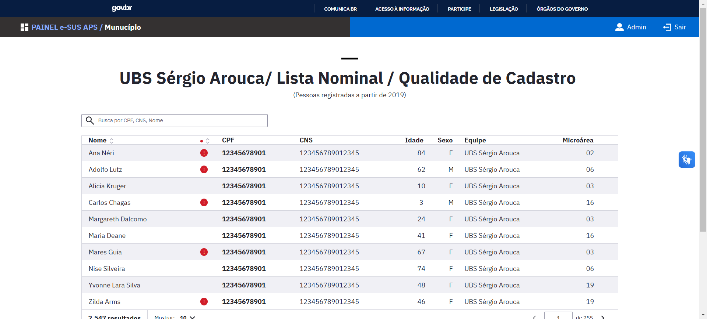

Ao clicar no nome do cidadão na lista nominal é possível visualizar, além dos dados pessoais do cidadão,  informações adicionais, quando disponíveis, como: **Data da última atualização da Ficha de Cadastro Individual** e **Data da última atualização da ficha de Cadastro Domiciliar e Territorial**.

Card de detalhamento da pessoa e dos alertas  
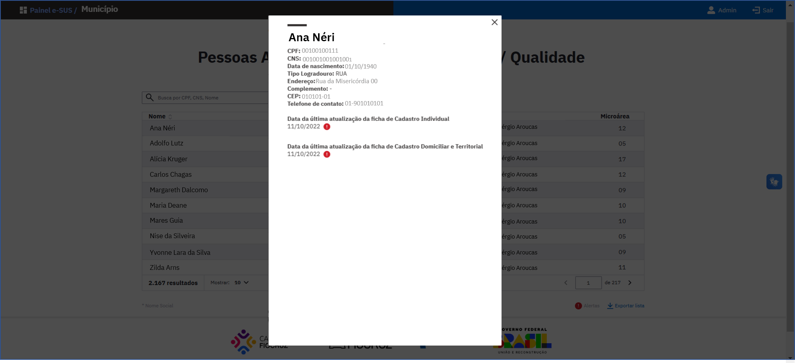

O símbolo de **Alerta,** em vermelho, indica situações que requerem atenção especial relacionadas à situação cadastral da pessoa. 