# Capítulo 3 - Como Utilizar o Aplicativo
{: .no_toc }

Neste capítulo abordaremos sobre o passo a passo para tirar maior proveito do aplicativo **e-SUS Vacinação** para agilizar as campanhas ou demais estratégias de vacinação no território ou na própria unidade de saúde. 

## Sumário
{: .no_toc .text-delta }

- TOC
{:toc}

## 3.1 Cadastrar Vacinação

Após a autenticação no aplicativo e a escolha da lotação do vacinador, agora é o momento de cadastrar uma nova vacinação ao clicar sobre o ícone com o sinal de "+", conforme a figura 3.1.

Figura 3.1 - Tela Vacinações

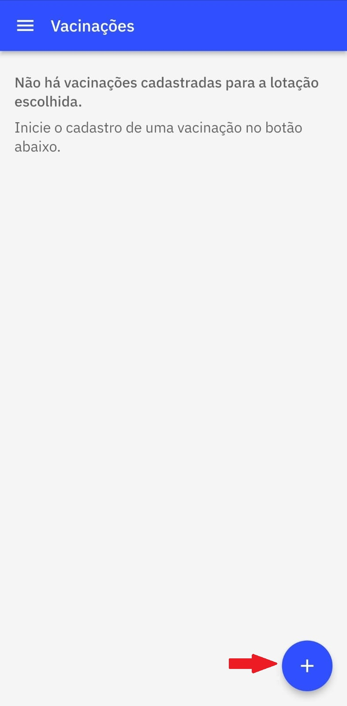

Fonte: SAPS/MS

Ao clicar no ícone será aberto outra tela em que todos os campos são **obrigatórios**. 

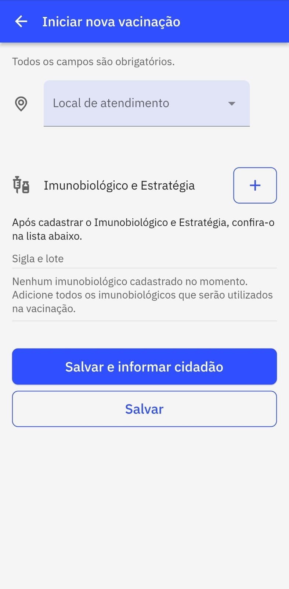

Inicialmente deve-se cadastrar o Local de atendimento, ou seja, o local que a vacinação irá ocorrer. As opções a serem selecionadas são: 
- Domicílio
- Escola/creche
- Instituição/abrigo
- Outros 
- Polo (Academia da Saúde)
- Rua
- UBS
- Unidade Móvel
- Unidade prisional ou congêneres
- Unidade socioeducativa

Em seguida deve-se cadastrar os imunobiológicos e respectivas estratégias das vacinas que serão aplicadas no local selecionado anteriormente, conforme mostra Figura 3.2. Os dados para cadastro são obrigatórios e contam com os campos:
1. **Imunobiológico:** Informar a vacina que será administrada. Este campo possui as opções de imunobiológicos do Programa Nacional de Imunização (PNI);
2.**Fabricante:** Informar o fabricante da vacina que está sendo administrada;
3. **Lote**: Informar o número do Lote do fabricante da vacina;
4. **Estratégia**: Informar a estratégia de vacinação conforme orientação do PNI. Este campo exibe as opções conforme o imunobiológico selecionado.

Figura 3.2 - Tela de cadastro de Imunobiológico e Estratégia

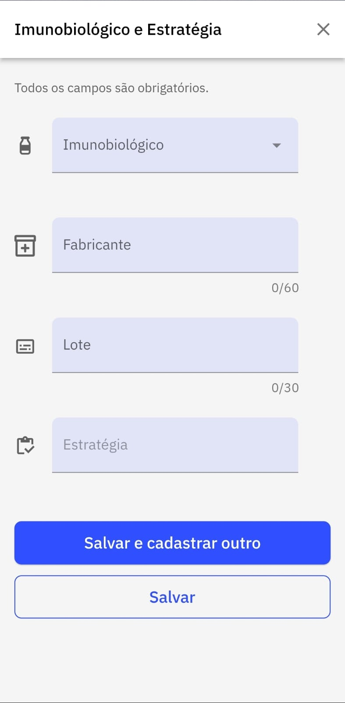

Fonte: SAPS/MS

Ao finalizar, clique em "Salvar e cadastrar outro" quando mais de um imunobiológico será aplicado naquele instante, no local indicado. Ou clique em "salvar" quando todos os imunobiológicos que serão aplicados já estão cadastrados.

Após este cadastro, todos os locais com os respectivos imunobológicos e estratégias cadastrados, ficam listados para inserção posterior dos dados do cidadão vacinado. Como mostra a Figura 3.3.

Figura 3.3 - Lista com locais e respectivos imunobiológicos e estratégias cadastrados
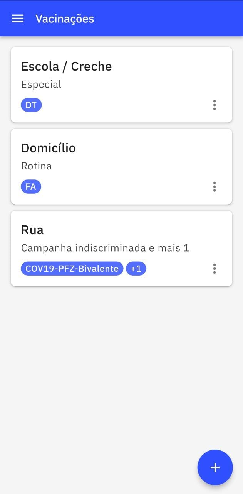

Fonte: SAPS/MS

{: .dica } 
Antes de começar a campanha ou qualquer estratégia de vacinação faça o cadastro prévio de todas as vacinas que serão administradas no dia, assim o usuário do aplicativo agiliza o processo de registro das doses aplicadas. 

{: .nota } 
Após o cadastro do imunobiológico e estratégia, todos os locais de vacinação cadastrados serão listados para posterior cadastro dos cidadão que receberão a vacina(Vide figura 3.2). 

## 3.2 Cadastrar Cidadão

Ao selecionar o local de vacinação, clique no ícone com o sinal de "+" para registrar os dados do cidadão e a dose do imunobiológico que será administrado.
O registro de doses aplicadas pode ser de todos os imunobiológicos cadastrados na primeira etapa ou só em parte dele. A Figura 3.4 mostra tela de cadastro do cidadão e as doses aplicadas.

Figura 3.4 - Tela de cadastro do Cidadão

Fonte: SAPS/MS

O registro do cidadão conta com os seguintes campos obrigatórios: Data (este dado é inserido automaticamente e não é possível a edição, por este motivo é importante conferir se o dispositivo está configurado com "data automática" nas configurações de Data e Hora); CPF/CNS do cidadão; Data de Nascimento e Sexo. O campo Condições é opcional. E o campo Dose de imunobiológicos é obrigatório que pelo menos uma das doses seja selecionada.

Após registro das informações do cidadão e as doses que foram aplicadas deve-se clicar em "Salvar e informar próximo" quando há mais cidadãos e doses a registrar e em "Salvar" quando os registros foram finalizados. 

Em seguida vão ser exibidos todos os cidadãos que foram registrados no local registrado e os imunobiológicos e as doses registradas, como mostra a Figura 3.5.

Figura 3.5 - Cidadãos com doses registradas 
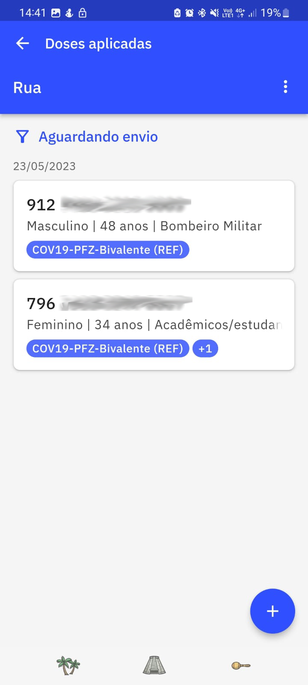

Fonte: SAPS/MS

Essa tela também permite visualizar e filtrar os status de envio das fichas para o PEC. Os status são: Aguardando envio, Enviadas, Rejeitadas e Todas, conforme mostrado na Figura 3.6.

Figura 3.5 - Cidadãos com doses registradas 
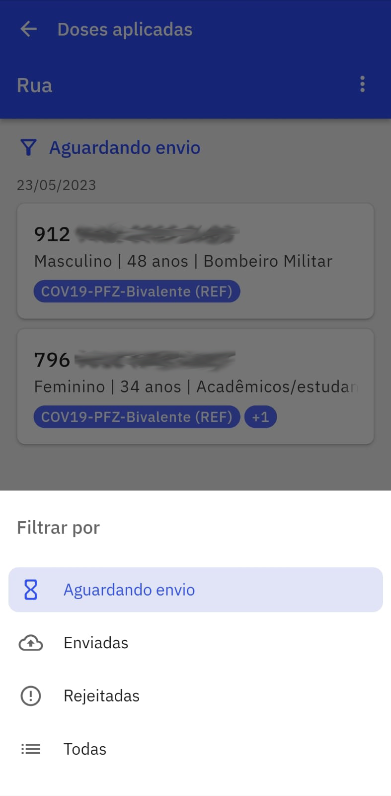

Fonte: SAPS/MS

{: .nota } 
O cadastro do cidadão também pode ser feito ao cadastrar o local de atendimento e o imunológico/estratégica. É possível clicar na mesma tela em "Salvar e informar o cidadão". Será aberto a tela de inserção de dados do cidadão, como mostra a Figura 3.4.

{: .dica }
As boas práticas dos registros de informação em saúde requer que a cada atendimento ou procedimento realizado por um profissional de saúde seja feita logo em seguida o registro. Agindo dessa forma, o profissional de saúde, reduz o risco de erro de digitação. 

---

## 3.3 Outros recursos do Aplicativo

### 3.3.1 Edição e Exclusão de registros

Os dados registrados no aplicativo e-SUS Vacinação poderão ser excluídos ou editados enquanto não forem enviados para o sistema e-SUS APS.  

Para editar ou excluir esses dados acesse o ícone  nas telas 'Vacinações' e 'Doses aplicadas' (Figuras 3.6, 3.7 e 3.8). 

Figura 3.6 - Tela Vacinações

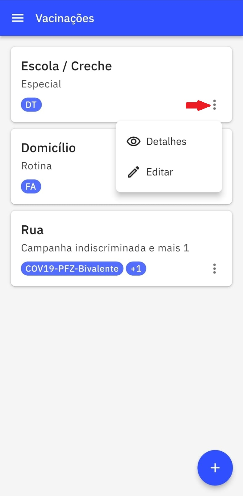

Fonte: SAPS/MS

Figura 3.7 - Tela Doses

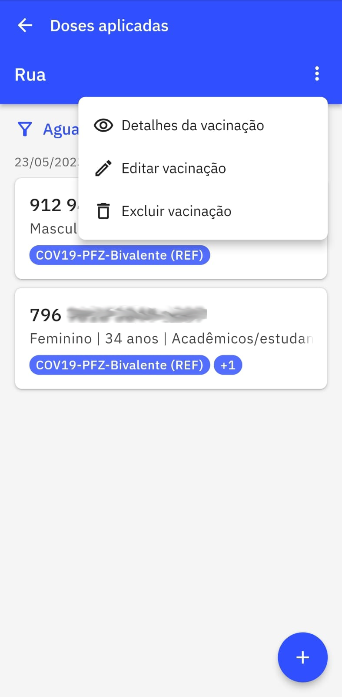

Fonte: SAPS/MS

Figura 3.8 - Tela Detalhes do cidadão vacinado

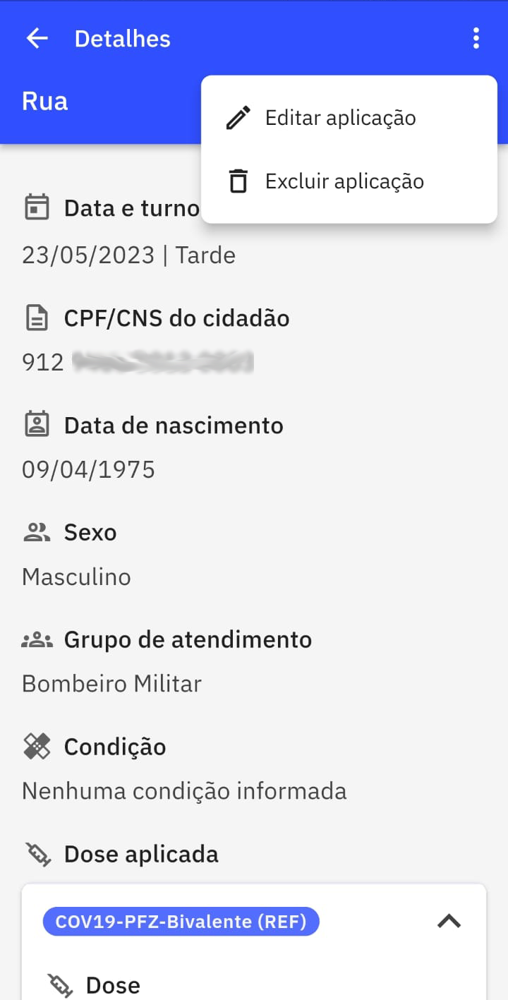

Fonte: SAPS/MS

{: .nota }
Para excluir a vacina cadastrada não deve haver nenhum cidadão cadastrado no mesmo. 

### 3.3.2 Menu

Na tela inicial do aplicativo é possível acessar um menu. Ao clicar sobre o ícone  aparecerão os seguintes recursos (Figura 3.6):

Figura 3.6 - Tela do Menu

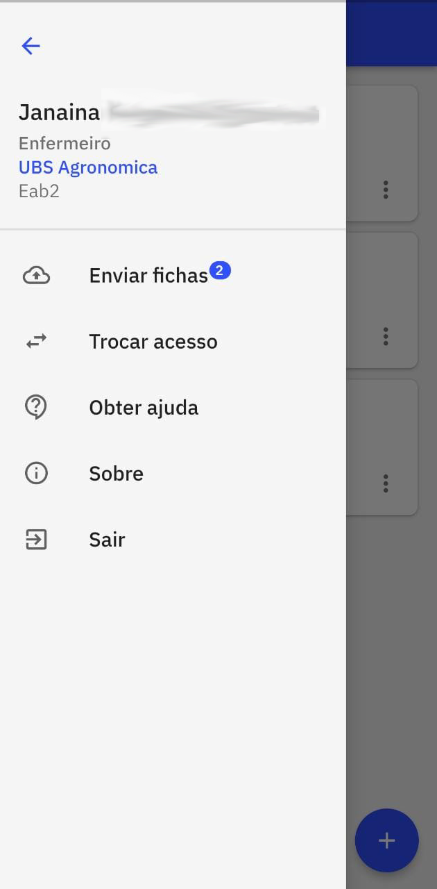

Fonte: SAPS/MS

{: .nota }
Ao lado de "Enviar fichas" terá o total de fichas que estão no aplicativo e que já poderão ser enviadas.

#### 3.3.2.1 Enviar fichas 

Esta seção é fundamental para o envio dos registros realizados no aplicativo, ao clicar sobre a palavra 'enviar fichas', abrirá uma mensagem informando a quantidade de fichas que há para enviar e as opções "Enviar" e "Cancelar". Os dados são enviados para o servidor PEC registrado na URL inserida na autenticação do aplicativo. Ao final do envio, os dados registrados da vacinação aparecerão com status 'Enviadas' (Figura 3.7 e 3.8)

Figura 3.7 - Tela de Envio

Fonte: SAPS/MS

Figura 3.8 - lista de 'Enviadas'

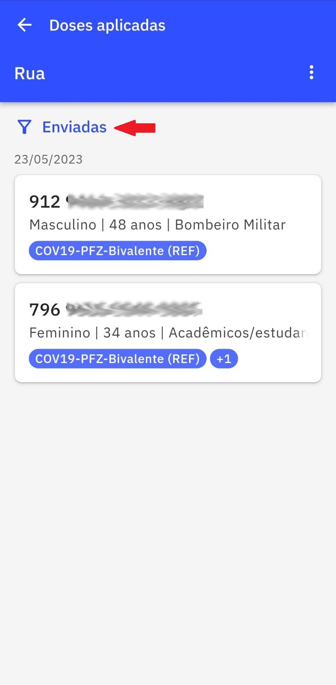

Fonte: SAPS/MS

Os registros que apresentarem inconsistências nas informações não serão enviados ao sistema e-SUS APS com PEC e serão identificadas com o símbolo . Essas inconsistências significam que os dados foram rejeitados e será exibida a mensagem de que "Não pôde ser enviado", como mostra a Figura 3.9.

Figura 3.9 - lista de 'Enviadas'

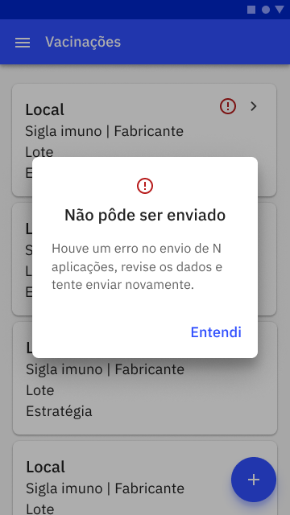

Fonte: SAPS/MS

Essas inconsistências significam que os dados foram rejeitados e os erros indicados [apresentados em uma lista, como mostra a Figura 3.10] deverão ser corrigidos para que os dados sejam enviados novamente. Se o problema persistir, realize o registro por meio do sistema e-SUS APS com Coleta de Dados em Saúde (CDS). 

Figura 3.10 - Fichas rejeitadas

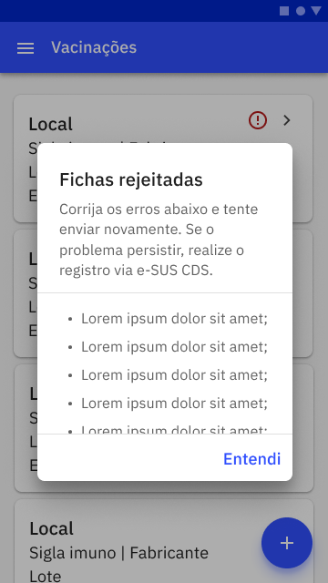

Fonte: SAPS/MS

#### 3.3.2.2 Trocar acesso 

Se o profissional possuir mais de uma lotação, esta seção permitirá a escolha de qual lotação acessar para inserir os dados. 

#### 3.3.2.3 Obter ajuda

Nesta seção é possível obter ajuda por meio de alguns materiais de apoio e do suporte do e-SUS APS. Para acessar os materiais e o suporte é necessário o acesso a internet (Figura 3.11)

Figura 3.11 - Tela 'Obter Ajuda'

Fonte: SAPS/MS

#### 3.3.2.4 Sobre

Esta seção apresenta principalmente a versão do aplicativo. Os usuários do sistema e-SUS APS devem sempre estar atento as atualizações das versões para utilizarem a versão mais atual.

Figura 3.9 - Tela 'Sobre"

Fonte: SAPS/MS

#### 3.3.2.5 Sair 

Esta seção permite ao usuário deslogar do aplicativo e sair com segurança da aplicação.  